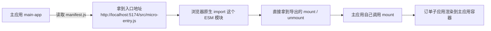
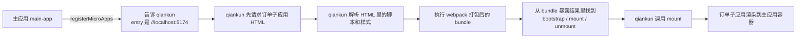
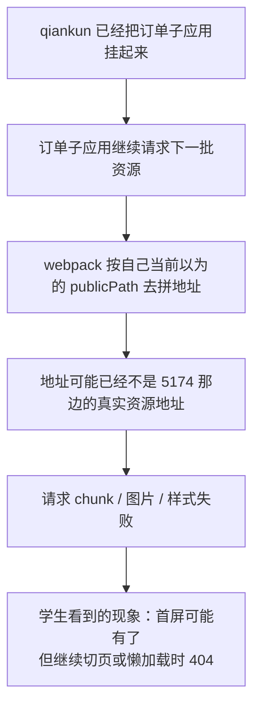
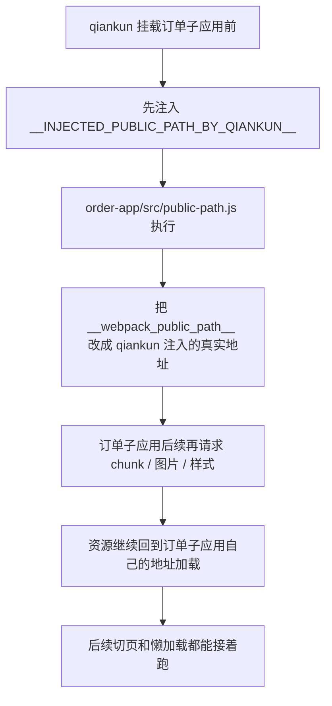
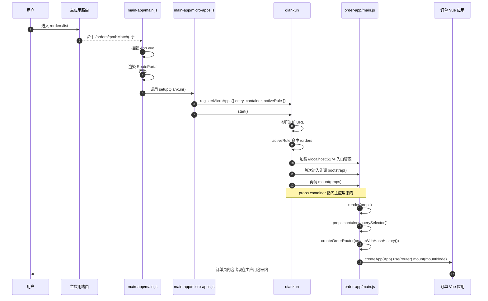

# 07_1：先放回 3 个独立系统，再一步步接入 qiankun

这一版代码故意不直接放 qiankun。

先说白话：学生要先看到 3 个项目本来就是 3 套独立系统，然后再理解“主应用为什么能把它们接进来”。

再说术语：07_1 是 qiankun 改造前的独立应用基线。

## 1. 这个目录里现在有什么

- main-app：webpack 5 + Vue 3，主应用，独立运行，路由模式是 history
- order-app：webpack 5 + Vue 3，订单系统，独立运行，路由模式是 hash
- finance-app：Vite + React 18，财务系统，独立运行，路由模式是 history

这里先不要急着接微前端。先确认一件事：这 3 个项目单独启动时，本来就是 3 个能正常工作的系统。

## 2. 先安装，再分别启动

先在 07_1 根目录执行：

```bash
cd 07_1
pnpm install
```

再开 3 个终端分别启动：

```bash
pnpm dev:main
```

```bash
pnpm dev:order
```

```bash
pnpm dev:finance
```

默认端口：

- main-app：http://localhost:5173
- order-app：http://localhost:5174
- finance-app：http://localhost:5175

建议按这个顺序看：

1. 先打开 order-app，看订单系统自己能跑
2. 再打开 finance-app，看财务系统自己能跑
3. 最后打开 main-app，看主应用当前只是普通后台，不依赖另外两个项目

## 3. 为什么这里要先停在“独立系统”

先说白话：你要教学生接线，前提是学生先知道每条线原来连的是谁。

再说术语：微前端接入之前，先确认主应用和子应用各自的独立启动边界、构建方式、路由模式，这样后面出现问题时才能判断问题到底出在主应用、子应用，还是接入层。

这一步的教学作用很明确：

- 先建立“3 个系统本来彼此独立”的认知
- 后面每加一段 qiankun 代码，都能知道它到底是在解决什么问题
- Vite 子应用失败时，学生也能先排除“是不是项目本身就跑不起来”

## 4. 第一步：先接订单子应用，先跑通 webpack 主线

这一段建议先只接 order-app，不要一上来 2 个子应用一起改。

先说白话：先挑最标准、最容易对照官方文档的一条路，把主应用接子应用这件事第一次走通。

再说术语：这一段走 qiankun 官方 getting started 的标准链路，主应用 `registerMicroApps()`，子应用导出 `bootstrap`、`mount`、`unmount`，webpack 子应用补齐 UMD 和运行时 publicPath。

### 4.0 先把这几步和第 05 课手写版对上

这一段如果只讲术语，学生会很容易断层。

因为第 05 课我们已经手写过一版“主应用接子应用”，学生心里其实已经有一套朴素理解了。现在要做的，不是把旧理解推翻，而是把它升级成 qiankun 版本。

你可以先直接告诉学生：

- 第 05 课那套手写版，没有错
- 这一课不是换一个完全不同的东西
- 这一课只是把“我们手写的接入协议”，换成 qiankun 规定好的标准协议

下面这 4 件事，最好一条条对照着讲。

#### 4.0.1 `registerMicroApps()` 到底在干嘛

先说白话：这一步其实就是把“主应用的子应用清单”和“主应用自己的切换规则”交给 qiankun。

再说术语：`registerMicroApps()` 的本质，是向 qiankun 注册微应用元数据和激活规则。

如果你想和第 05 课直接对应，可以这么对：

- 第 05 课里，主应用先看 `main-app/src/manifest.js`，知道订单和财务两个子应用的入口地址
- 然后主应用在 `main-app/src/App.vue` 里自己 `import()` 这个入口模块
- 再自己决定什么时候 `mount()`、什么时候 `unmount()`

也就是说，第 05 课手写版里，主应用自己干了 3 件事：

1. 记住“有哪些子应用”
2. 决定“当前该加载谁”
3. 自己调用子应用暴露出来的挂载和卸载方法

到了 qiankun 这里，这 3 件事没有消失，只是从“主应用自己手写调度”变成了“主应用先注册，后面的调度交给 qiankun 统一执行”。

所以你可以把它简单理解成：

- 第 05 课：主应用自己拿着清单，自己调度
- 第 07 课：主应用还是先交清单，但真正的调度员换成了 qiankun

这就是 `registerMicroApps()` 的直观意义。

#### 4.0.2 `bootstrap`、`mount`、`unmount` 为什么突然变成必需项了

先说白话：因为 qiankun 要接管子应用，它就必须知道“怎么把你启动起来”“怎么把你挂到页面上”“怎么把你从页面上拆掉”。

再说术语：这 3 个方法就是 qiankun 规定好的子应用生命周期接口。

这一步和第 05 课也能直接对上：

- 第 05 课里，订单子应用的 `src/micro-entry.js` 已经暴露过 `mount()` 和 `unmount()`
- 主应用在 `main-app/src/App.vue` 里动态 `import()` 到这个模块以后，自己去调 `remoteModule.mount()` 和 `remoteModule.unmount()`

所以这节课并不是凭空多出来一套概念，而是把我们之前“自己约定的接入方法”，换成了 qiankun 规定的统一名字。

你可以这样给学生记：

- 第 05 课手写版：我们自己约定子应用要暴露 `mount / unmount`
- qiankun 版：框架规定子应用要暴露 `bootstrap / mount / unmount`

这里多出来的 `bootstrap`，可以理解成“只在第一次初始化时执行一次的预热动作”。

也就是说：

- `bootstrap`：第一次初始化时做一次准备
- `mount`：每次真正显示到页面里时执行
- `unmount`：每次切走时执行清理

第 05 课里我们重点讲的是“能挂上去”和“能切走”，所以学生主要看到的是 `mount / unmount`。

到了 qiankun，这条接入协议被补完整了，所以才多了一个 `bootstrap`。

#### 4.0.3 为什么第 05 课没讲 UMD，这一课却突然要讲

这个点一定要讲透，不然学生会觉得像是突然冒出来一个很玄的 webpack 配置。

先说白话：第 05 课主应用是直接把子应用入口文件当成普通模块 `import()` 进来的，所以浏览器天然就知道怎么拿到导出的 `mount()` 和 `unmount()`；但 qiankun 不是这么拿的，它是先拉子应用的 HTML，再执行里面打包后的脚本，所以它需要一个更明确的“对外暴露方式”。

再说术语：UMD 是一种通用模块包装格式。qiankun 在 webpack 子应用场景里，需要通过这个包装结果稳定地拿到子应用暴露出来的生命周期函数。

把两节课直接对照起来看，区别就很清楚：

- 第 05 课：主应用拿到的是 `http://localhost:5174/src/micro-entry.js` 这种源码级 ESM 入口
- 浏览器原生模块系统会帮我们处理 `export`
- 所以主应用 `import()` 之后，自然就能拿到 `mount`、`unmount`

而 qiankun 这一课不一样：

- 主应用注册的是 `//localhost:5174` 这个子应用入口地址
- qiankun 先抓取这个地址返回的 HTML
- 再去执行 HTML 里引用的 webpack 打包产物
- 这时候它拿到的已经不是源码级 ESM 入口，而是打包后的 bundle

也正因为如此，webpack 子应用就不能只靠“浏览器自己理解源码 export”了，而是要在打包结果里把生命周期明确暴露出来。

`library.type = "umd"` 的意义，白话一点说就是：

“把这个子应用入口包成一个外部运行时也能认出来的通用模块结果，让 qiankun 在脚本执行完以后，能稳定拿到它暴露出来的生命周期。”

如果你想一句话对学生总结，可以直接说：

- 第 05 课：主应用直接导入源码模块，所以没遇到 UMD
- 第 07 课：qiankun 接的是 webpack 打包结果，所以必须让这个打包结果把生命周期清楚地暴露出来

#### 4.0.4 运行时 publicPath 又是在解决什么问题

这个点也最好和第 05 课放在一起讲。

先说白话：主应用把子应用接进来以后，子应用后面继续加载的 js、css、图片，到底该去哪个地址找？运行时 publicPath 解决的就是这个问题。

再说术语：`__webpack_public_path__ = window.__INJECTED_PUBLIC_PATH_BY_QIANKUN__` 是在运行时重写 webpack 的资源基路径，让子应用后续异步 chunk 和静态资源继续从自己的部署地址加载。

为什么第 05 课没明显遇到这个问题？

因为第 05 课里，主应用直接 `import()` 的是子应用 dev server 暴露出来的源码入口：

- 订单子应用入口是 `http://localhost:5174/src/micro-entry.js`
- 财务子应用入口是 `http://localhost:5175/src/micro-entry.jsx`

这种情况下，后续依赖解析、模块地址、开发资源地址，基本还是浏览器原生 ESM 和 Vite dev server 在接管。

但 qiankun 这一课不是这样。

这时候主应用注册的是：

- `entry: "//localhost:5174"`

也就是说，qiankun 先把子应用入口 HTML 拉过来，然后再让 webpack bundle 在主应用环境里运行。

一旦运行环境变了，webpack 默认以为的资源根路径就可能不准。最常见的问题就是：

- 首屏能出来
- 但后续懒加载 chunk、图片、样式继续请求时，地址跑偏
- 最后出现 404

所以这里要补两层：

第一层是 webpack 配置里的开发态绝对路径：

```js
publicPath: isProduction ? "/" : `//localhost:${port}/`;
```

它解决的是：开发态下，子应用自己的 js/css 至少先知道默认该回 5174 找。

第二层是 `order-app/src/public-path.js` 里的运行时代码：

```js
if (window.__POWERED_BY_QIANKUN__) {
  __webpack_public_path__ = window.__INJECTED_PUBLIC_PATH_BY_QIANKUN__;
}
```

它解决的是：真正被 qiankun 接入时，不再死认构建时那套默认路径，而是使用 qiankun 注入的当前真实资源基路径。

如果你想把这句话讲得再直白一点，可以告诉学生：

- `library.type = "umd"` 解决的是“qiankun 怎么认出你的生命周期”
- `__webpack_public_path__` 解决的是“qiankun 把你接进来以后，你后面的资源该去哪里继续找”

这两个配置看起来都像“额外工程细节”，但它们解决的不是同一个问题。

一个在解决“怎么认你”，一个在解决“怎么继续加载你的资源”。

#### 4.0.5 直接看图：第 05 课和这一课到底差在哪

如果学生到这里还是有点抽象，不要继续堆术语，直接上图。

先看第 05 课手写版。

第 05 课里，主应用拿到的是源码级入口地址：

- `http://localhost:5174/src/micro-entry.js`

也就是说，主应用不是去拿子应用首页 HTML，而是直接把子应用入口模块当普通 ESM 模块导进来。



这张图你可以直接这样翻译给学生：

- 第 05 课，主应用拿的是“模块”
- 浏览器自己就能理解这个模块的 `export`
- 所以后面没有“怎么把生命周期暴露给外部运行时”这个额外问题

再看 qiankun 这一课。

这次主应用注册的不是源码模块，而是子应用入口地址：

- `//localhost:5174`

这时候 qiankun 的动作顺序就变了。



这张图的重点只有一句话：

- 第 05 课是“主应用直接 import 源码模块”
- 这一课是“qiankun 先拿 HTML，再执行 bundle”

也正因为入口形式变了，所以才会多出两个在第 05 课里几乎感觉不到的工程问题：

1. 这个 bundle 怎么把生命周期暴露出来给 qiankun 认
2. 这个 bundle 后面继续请求资源时，该去哪个地址找

第一个问题，对应的是 UMD。

第二个问题，对应的就是运行时 publicPath。

#### 4.0.6 再单独看：运行时 publicPath 到底在救哪一步

这一块学生最容易糊涂的地方是：

- 首屏都已经出来了
- 为什么还要多写一段 `__webpack_public_path__`

原因是：首屏出来，只说明“第一批资源”找到了。

真正容易出问题的是：

- 后面继续加载的 chunk
- 图片
- 字体
- 样式里引用的静态资源

也就是说，问题通常不是“第一个页面完全起不来”，而是“起是起了，后面一继续加载就跑偏”。

先看“不加运行时 publicPath”时，问题会出在哪。



再看“加了运行时 publicPath”以后，链路是什么样。



如果你想给学生一句最直观的话，可以直接这么说：

- 第 05 课：主应用直接 import 子应用源码入口，后续模块解析基本还是浏览器和 dev server 自己在管
- qiankun 这一课：子应用 bundle 已经被放进主应用环境里执行了，所以必须重新告诉 webpack，“你后面的资源不要乱找，继续回你自己家拿”

这里的“继续回你自己家拿”，指的就是：

- 订单子应用后续资源继续回 `localhost:5174`
- 而不是误以为应该从主应用自己的地址去找

#### 4.0.7 最后用一句话把 UMD 和 publicPath 分开记

学生到这里最容易把两个概念混成一句“反正都是 qiankun 兼容配置”。

你最好强行帮他拆开记：

- UMD：解决“qiankun 执行完 bundle 以后，怎么认出你暴露的生命周期”
- 运行时 publicPath：解决“qiankun 把你接进来以后，你后面继续请求资源时该回哪里找”

也可以再压缩成更口语的一版：

- UMD 解决的是“怎么认你”
- publicPath 解决的是“怎么继续找你的资源”

### 4.1 先约定一下这份文档怎么读

- `新增文件`：07_1 当前目录里还没有这个文件，你需要手动新建
- `整文件替换`：直接覆盖整个文件，不要只摘一小段代码硬塞到原文件里
- `局部修改`：只改我点名的那一段，其他内容先别动

这一节先只接 `order-app`，故意不碰 `finance-app` 的实际接入。

这样安排的目的很简单：

1. 先把 webpack 子应用的标准链路完整跑通
2. 先让学生把 `registerMicroApps()`、生命周期、UMD、运行时 `publicPath` 这些概念吃透
3. 到第 5 步再单独接 `finance-app`，学生才能更清楚地看到“为什么同样是子应用，Vite 这里会失败”

### 4.2 这一步总共会碰哪些文件

这一步一共碰 9 个文件。

- `局部修改`：`main-app/package.json`、`order-app/webpack.config.cjs`
- `新增文件`：`main-app/src/micro-apps.js`、`main-app/src/components/RoutePortal.vue`、`order-app/src/public-path.js`
- `整文件替换`：`main-app/src/App.vue`、`main-app/src/main.js`、`main-app/src/router/index.js`、`order-app/src/main.js`

注意：这一步先不要改 `finance-app` 任何文件，也不要把 `finance-app` 注册进主应用。第 4 步的目标只有一个：先把订单子应用这条 webpack 主线讲透。

### 4.3 主应用这一步到底怎么改

#### 4.3.1 修改 `main-app/package.json`

这是 `局部修改`。

文件位置：`main-app/package.json`

修改位置：`dependencies` 对象里，紧跟在 `vue-router` 后面加上 `qiankun`

```json
"dependencies": {
  "vue": "^3.5.18",
  "vue-router": "^4.6.4",
  "qiankun": "^2.10.16"
}
```

#### 4.3.2 新建 `main-app/src/components/RoutePortal.vue`

这是 `新增文件`。

这个文件的作用只有一个：给 qiankun 提供挂载容器。

文件路径：`main-app/src/components/RoutePortal.vue`

文件内容就写最小版：

```vue
<template>
  <section>
    <article class="panel">
      <div class="subapp-host" id="subapp-viewport"></div>
    </article>
  </section>
</template>
```

#### 4.3.3 新建 `main-app/src/micro-apps.js`

这是 `新增文件`。

这个文件先写“基础注册版”，先不要上路由同步、事件广播、memory 路由那一套。那是第 6 节再加的内容。

文件路径：`main-app/src/micro-apps.js`

这一节的代码就放在这个新文件里，不要写回 `main.js`。

```js
import { registerMicroApps, start } from "qiankun";

const microApps = {
  order: {
    name: "order-app",
    label: "订单子应用",
    entry: "//localhost:5174",
    activeRule: "/orders",
    defaultPath: "/orders/list",
  },
};

let started = false;

export function getMicroApps() {
  return microApps;
}

export function setupQiankun() {
  if (started) {
    return;
  }

  registerMicroApps([
    {
      name: microApps.order.name,
      entry: microApps.order.entry,
      container: "#subapp-viewport",
      activeRule: microApps.order.activeRule,
    },
  ]);

  start({ prefetch: false });
  started = true;
}
```

这一版 `main-app/src/micro-apps.js` 先只负责注册和启动，而且只注册 `order-app`。

原因很直接：

- 第 4 步只讲 qiankun 官方主线怎么先跑通一个 webpack 子应用
- `finance-app` 留到第 5 步再单独接
- 这样到时候学生看到报错时，才会知道问题出在 Vite，而不是前面订单子应用没学明白

#### 4.3.4 替换 `main-app/src/main.js`

这是 `整文件替换`。

原因是当前 07_1 的 `main.js` 只有“独立主应用启动”逻辑，没有 qiankun 启动时机控制。

文件路径：`main-app/src/main.js`

直接整文件替换成下面这版：

```js
import { createApp, nextTick } from "vue";
import App from "./App.vue";
import { setupQiankun } from "./micro-apps";
import { createHostRouter } from "./router";
import "./style.css";

const router = createHostRouter();
const app = createApp(App);

app.use(router);

router.isReady().then(async () => {
  app.mount("#app");
  await nextTick();
  setupQiankun();
});
```

为什么这里要整文件替换，而不是只加一行 `setupQiankun()`？

因为这一步最容易漏掉的就是 `start()` 时机。容器节点还没渲染出来就启动 qiankun，很容易直接报容器不存在。

#### 4.3.5 替换 `main-app/src/router/index.js`

这是 `整文件替换`。

文件路径：`main-app/src/router/index.js`

当前 07_1 里这个文件还在处理 `/overview`、`/campaigns`、`/team`。接 qiankun 时，这整套路由要先收掉，改成给子应用让路的版本。

这里建议直接整文件替换，不要在原来的 3 条业务路由上继续补。

直接整文件替换成下面这版：

```js
import { createRouter, createWebHistory } from "vue-router";
import RoutePortal from "../components/RoutePortal.vue";

const routes = [
  {
    path: "/",
    redirect: "/orders/list",
  },
  {
    path: "/orders/:pathMatch(.*)*",
    component: RoutePortal,
    meta: {
      appName: "order",
    },
  },
  {
    path: "/finance/:pathMatch(.*)*",
    component: RoutePortal,
    meta: {
      appName: "finance",
    },
  },
  {
    path: "/:pathMatch(.*)*",
    redirect: "/orders/list",
  },
];

export function createHostRouter() {
  return createRouter({
    history: createWebHistory(),
    routes,
  });
}
```

这里一定要注意：

- `/orders/:pathMatch(.*)*` 不是可选优化，而是必须把深层子路由让出来
- `/finance/:pathMatch(.*)*` 虽然这一步还没修好财务子应用，但路由位先留好，后面第 5 步不用再返工
- `meta.appName` 这一版虽然暂时还没直接用到，但第 6 步做主子应用路由同步时会继续用到，所以这里先顺手带上，后面不用再返工一次

#### 4.3.6 替换 `main-app/src/App.vue`

这是 `整文件替换`。

文件路径：`main-app/src/App.vue`

当前 07_1 里的 `App.vue` 还是独立后台页，里面有 `pages` 对象、`currentApp` 计算属性，以及 overview/campaigns/team 的业务卡片。

这一步要把它收成“壳子 + 菜单 + RouterView”的宿主结构。

这里我建议直接整文件替换，别在原文件里零散删除，因为要删的内容很多。

直接整文件替换成下面这版：

```vue
<script setup>
import { computed } from "vue";
import { RouterLink, RouterView, useRoute } from "vue-router";
import { getMicroApps } from "./micro-apps";

const route = useRoute();
const microApps = getMicroApps();

const menuItems = [microApps.order].filter(Boolean);

const currentApp = computed(() => {
  return microApps.order;
});
</script>

<template>
  <div class="page-shell">
    <aside class="sidebar">
      <div class="menu-list">
        <RouterLink
          v-for="item in menuItems"
          :key="item.name"
          class="menu-button"
          :class="{ active: currentApp.name === item.name }"
          :to="item.defaultPath"
        >
          <strong>{{ item.label }}</strong>
        </RouterLink>
      </div>
    </aside>

    <main class="workspace">
      <RouterView />
    </main>
  </div>
</template>
```

这版代码里你只需要注意 3 件事：

1. `getMicroApps()` 是从刚才新建的 `main-app/src/micro-apps.js` 里拿菜单数据
2. `:to="item.defaultPath"` 这一步先只会跳到 `/orders/list`
3. `<RouterView />` 命中的是你刚才在 `main-app/src/router/index.js` 里配置的 `RoutePortal`

也就是说，这个 `App.vue` 自己不直接挂载子应用，它只是负责：

- 给主应用左侧菜单一个入口
- 让右侧业务区把 `RoutePortal` 渲染出来
- 剩下的注册和挂载工作交给 `main-app/src/micro-apps.js` 里的 qiankun 流程

#### 4.3.7 为什么这里故意不把 `finance-app` 放进菜单

这一版不是漏写，而是故意这样安排。

原因是：

- 第 4 步只想让学生先看到一个“完整成功”的接入过程
- 如果这一步就把财务入口一起挂上，学生会在同一时间同时看到成功和失败，注意力很容易被打散
- 等到第 5 步再把 `finance-app` 接进来，学生会更容易把报错和 Vite 的入口机制联系起来

### 4.4 订单子应用这一步到底怎么改

#### 4.4.1 新建 `order-app/src/public-path.js`

这是 `新增文件`。

文件路径：`order-app/src/public-path.js`

文件内容：

```js
if (window.__POWERED_BY_QIANKUN__) {
  __webpack_public_path__ = window.__INJECTED_PUBLIC_PATH_BY_QIANKUN__;
}
```

这一行不要写在 `main.js` 中间，必须单独新建文件，然后在 `main.js` 最顶端第一个导入它。

#### 4.4.2 替换 `order-app/src/main.js`

这是 `整文件替换`。

文件路径：`order-app/src/main.js`

当前 07_1 里的 `main.js` 只有独立启动逻辑：创建 hash 路由，然后直接 `mount("#app")`。

接 qiankun 时，这个文件最省事的写法是整文件替换成“独立态 + 微前端态双入口”。

这一节先上基础版，先不要加 memory 路由。也就是说：

- 独立运行时，继续用现在的 hash 路由
- 被 qiankun 接入时，也先让它正常 mount 起来
- 第 6 节再升级成“独立态 hash，嵌入态 memory”版本

这里的代码应该直接替换整个 `order-app/src/main.js`，不要只在底部追加 `mount()` 生命周期。

直接整文件替换成下面这版：

```js
import "./public-path";
import { createApp } from "vue";
import { createWebHashHistory } from "vue-router";
import App from "./App.vue";
import { createOrderRouter } from "./router";
import "./style.css";

let app = null;
let router = null;
let mountNode = null;

async function render(props = {}) {
  mountNode = props.container
    ? props.container.querySelector("#app")
    : document.querySelector("#app");

  router = createOrderRouter(createWebHashHistory());

  router.afterEach((to) => {
    document.title = `订单管理 - ${to.meta.title}`;
  });

  app = createApp(App);
  app.use(router);

  await router.isReady();
  app.mount(mountNode);
}

export async function bootstrap() {
  console.info("[order-app] bootstrap");
}

export async function mount(props = {}) {
  await render(props);
}

export async function unmount() {
  app?.unmount();
  app = null;
  router = null;
  mountNode = null;
}

if (!window.__POWERED_BY_QIANKUN__) {
  void render();
}
```

这版和你当前 07_1 里的独立入口相比，多出来的关键点只有 4 个：

1. 最顶部先引入 `./public-path`
2. 新增 `bootstrap`、`mount`、`unmount`
3. `render()` 里兼容 `props.container`
4. 最底部保留 `if (!window.__POWERED_BY_QIANKUN__)` 这层独立运行兜底

#### 4.4.3 修改 `order-app/webpack.config.cjs`

这是 `局部修改`。

文件路径：`order-app/webpack.config.cjs`

只改 `output` 和 `devServer` 这两块，其他不要乱动。

当前文件里：

- `publicPath` 还是 `"/"`
- 没有 `globalObject`
- 没有 `chunkLoadingGlobal`
- 没有 `library.type = "umd"`
- `devServer` 也没有跨域头

这一节虽然本质上是 `局部修改`，但为了避免学生漏改，这里直接给你“改完后的完整文件”。

你可以直接对照下面这版去改现有文件，或者干脆整文件覆盖也行。

```js
const path = require("node:path");
const HtmlWebpackPlugin = require("html-webpack-plugin");
const { VueLoaderPlugin } = require("vue-loader");

const packageName = require("./package.json").name;
const port = 5174;

module.exports = (_, argv) => {
  const isProduction = argv.mode === "production";

  return {
    entry: path.resolve(__dirname, "src/main.js"),
    output: {
      clean: true,
      filename: "js/[name].js",
      path: path.resolve(__dirname, "dist"),
      publicPath: isProduction ? "/" : `//localhost:${port}/`,
      globalObject: "window",
      chunkLoadingGlobal: `webpackJsonp_${packageName}`,
      library: {
        name: `${packageName}-[name]`,
        type: "umd",
      },
    },
    resolve: {
      alias: {
        "@": path.resolve(__dirname, "src"),
        vue$: "vue/dist/vue.esm-bundler.js",
      },
      extensions: [".js", ".json", ".vue"],
    },
    module: {
      rules: [
        {
          test: /\.vue$/,
          loader: "vue-loader",
        },
        {
          test: /\.css$/,
          use: ["style-loader", "css-loader"],
        },
      ],
    },
    plugins: [
      new VueLoaderPlugin(),
      new HtmlWebpackPlugin({
        template: path.resolve(__dirname, "public/index.html"),
      }),
    ],
    devtool: isProduction ? "source-map" : "eval-cheap-module-source-map",
    devServer: {
      allowedHosts: "all",
      historyApiFallback: true,
      hot: false,
      liveReload: true,
      port,
      client: {
        overlay: true,
      },
      headers: {
        "Access-Control-Allow-Origin": "*",
      },
    },
  };
};
```

如果你坚持按“局部修改”来做，那真正需要补的只有 3 处：

1. 文件顶部新增 `const packageName = require("./package.json").name;`
2. `output` 里补 `publicPath`、`globalObject`、`chunkLoadingGlobal`、`library`
3. `devServer` 里补 `headers: { "Access-Control-Allow-Origin": "*" }`

#### 4.4.4 主应用和订单子应用的调用流程图

到这里为止，你已经把：

- 主应用的 `registerMicroApps()` / `start()`
- 订单子应用的 `bootstrap()` / `mount()` / `unmount()`

都接好了。

这时候非常适合给学生补一张调用图，不然学生很容易停留在“代码都写了，但到底是谁调谁”这个状态。

先看完整调用链：



如果你想把它压成一句最容易讲清的话，可以直接这么说：

- 主应用负责“登记规则”
- qiankun 负责“按规则决定什么时候调用子应用生命周期”
- 订单子应用负责“在 `mount(props)` 里把自己真正渲染出来”

这里最值得单独点出来的有 4 个地方。

1. `registerMicroApps()` 不是“立刻挂载”

它只是先把下面这些信息登记给 qiankun：

- 这个子应用叫什么
- 去哪里加载它
- 什么时候激活它
- 激活后挂到主应用哪个容器里

也就是说，`registerMicroApps()` 更像“建档”，不是“马上执行 mount”。

2. 真正开始接管的是 `start()`

`start()` 之后，qiankun 才会开始监听 URL，并在路由命中时触发自己的加载流程。

所以学生要明确区分：

- `registerMicroApps()`：登记
- `start()`：开机

3. `mount(props)` 不是你自己手调的

这一步最容易让学生困惑，因为他们在代码里找不到谁写了：

```js
mount({ container: ... })
```

原因很简单：这行调用代码在 qiankun 内部。

在你的业务代码里，你只负责两件事：

- 主应用里把 `container`、`activeRule`、`entry` 配好
- 子应用里把 `export async function mount(props)` 暴露出来

到了路由命中的时刻，qiankun 会自己把两边接起来。

4. `props.container` 的来源就是主应用注册时写的 `container`

也就是主应用这里：

```js
registerMicroApps([
  {
    name: microApps.order.name,
    entry: microApps.order.entry,
    container: "#subapp-viewport",
    activeRule: microApps.order.activeRule,
  },
]);
```

会对应到订单子应用这里：

```js
mountNode = props.container
  ? props.container.querySelector("#app")
  : document.querySelector("#app");
```

白话理解就是：

- 主应用先告诉 qiankun：“以后把订单子应用挂到 `#subapp-viewport` 里”
- qiankun 真调用 `mount(props)` 时，就把这个容器节点放进 `props.container`
- 订单子应用再从这块容器里找到自己的 `#app`，把 Vue 根实例挂进去

如果你要把这一段和第 05 课手写版对应起来，可以直接这样总结：

- 第 05 课是你自己手写 `mount(container)`
- 这一课是你把“什么时候调 mount、把哪个 container 传进去”交给 qiankun 统一处理

### 4.5 这一步做完后你应该看到什么

这一步做完以后，先启动：

```bash
pnpm dev:main
pnpm dev:order
pnpm dev:finance
```

这时预期现象就是：

1. 主应用默认会进入 `/orders/list`
2. 点订单菜单，`order-app` 能正常挂上
3. 菜单里还看不到财务入口

这正是第 4 步应该有的状态：

- 主应用已经开始用 qiankun 接子应用
- 订单子应用这条 webpack 主线已经跑通
- `finance-app` 还没有开始接，留到第 5 步单独讲

### 4.6 为什么订单子应用更适合作为第一步

因为它是 webpack。

这句话不能只讲结论，得讲原因：

- qiankun 官方 getting started 对 webpack 子应用的生命周期和构建配置说明最直接
- `publicPath`、UMD、生命周期导出这套链路更容易让学生看懂
- 第一次接入先追求“标准链路跑通”，不要一上来就被 Vite dev 模式带偏

## 5. 第二步：再接财务子应用，但这次要故意先失败一次

这一段不要一上来就装插件。

更适合教学的顺序是：

1. 先按刚才接 `order-app` 的直觉，硬接一次 `finance-app`
2. 让学生亲眼看到“代码看起来差不多，但结果还是失败”
3. 再解释失败根因其实是 Vite 开发态入口机制和 qiankun HTML Entry 冲突
4. 最后再补稳定适配

这样学生会更容易接受一个事实：

- 失败不是因为你不会写生命周期
- 而是因为 Vite 这条链路本来就和 webpack 不一样

### 5.1 这一步总共会碰哪些文件

这一节实际会碰 5 个文件，其中 `finance-app/src/main.jsx` 会替换两次。

- `局部修改`：`finance-app/package.json`
- `整文件替换`：`finance-app/src/main.jsx`、`finance-app/vite.config.js`、`main-app/src/micro-apps.js`、`main-app/src/App.vue`

注意：这一步先不要改 `finance-app/src/router.jsx`。先把它接进来、看见报错、再把它修到能 mount 起来。路由冲突的问题统一放到第 6 步。

### 5.2 第一轮：先按 `order-app` 的思路硬接一次

这一轮的目标不是成功，而是让学生先看到“照着 webpack 子应用的思路改，为什么到了 Vite 就会翻车”。

#### 5.2.1 先替换 `finance-app/src/main.jsx`

这是 `整文件替换`。

文件路径：`finance-app/src/main.jsx`

这里故意先不用 `vite-plugin-qiankun`，只按“和订单子应用差不多”的直觉去改。

也就是说，我们先只做 4 件事：

1. 增加 `bootstrap`、`mount`、`unmount`
2. 在 `render(props)` 里兼容 `props.container`
3. 保留独立运行兜底
4. 先不处理 Vite 特有兼容

直接整文件替换成下面这版：

```jsx
import { createRoot } from "react-dom/client";
import { RouterProvider } from "react-router-dom";
import { createFinanceRouter } from "./router.jsx";
import "./style.css";

const routerFuture = { v7_startTransition: true };

let root = null;
let mountNode = null;

function render(props = {}) {
  mountNode = props.container
    ? props.container.querySelector("#app")
    : document.querySelector("#app");

  const router = createFinanceRouter();

  root = createRoot(mountNode);
  root.render(<RouterProvider router={router} future={routerFuture} />);
}

export async function bootstrap() {
  console.info("[finance-app] bootstrap");
}

export async function mount(props = {}) {
  render(props);
}

export async function unmount() {
  root?.unmount();
  root = null;
  mountNode = null;
}

if (!window.__POWERED_BY_QIANKUN__) {
  render();
}
```

这一步的讲法要非常明确：

- 现在不是在教“最终正确写法”
- 现在是在故意模拟学生第一反应
- 也就是：先照着刚才 `order-app` 的接法，试着把 `finance-app` 也接进去

#### 5.2.2 再把 `finance-app` 注册回主应用

这是 `整文件替换`。

文件路径：`main-app/src/micro-apps.js`

第 4 步里，这个文件只注册了 `order-app`。

现在进入第 5 步，才把 `finance-app` 正式补回来。

直接整文件替换成下面这版：

```js
import { registerMicroApps, start } from "qiankun";

const microApps = {
  order: {
    name: "order-app",
    label: "订单子应用",
    entry: "//localhost:5174",
    activeRule: "/orders",
    defaultPath: "/orders/list",
  },
  finance: {
    name: "finance-app",
    label: "财务子应用",
    entry: "//localhost:5175",
    activeRule: "/finance",
    defaultPath: "/finance/bills",
  },
};

let started = false;

export function getMicroApps() {
  return microApps;
}

export function setupQiankun() {
  if (started) {
    return;
  }

  registerMicroApps([
    {
      name: microApps.order.name,
      entry: microApps.order.entry,
      container: "#subapp-viewport",
      activeRule: microApps.order.activeRule,
    },
    {
      name: microApps.finance.name,
      entry: microApps.finance.entry,
      container: "#subapp-viewport",
      activeRule: microApps.finance.activeRule,
    },
  ]);

  start({ prefetch: false });
  started = true;
}
```

这一版和第 4 步的区别只有一个重点：

- 现在主应用开始真正注册 `finance-app` 了

也就是说，接下来点击财务菜单时，qiankun 就会真的去加载 Vite 子应用入口，而不是只停留在“路由位预留好了”的阶段。

#### 5.2.3 再把财务菜单补回主应用

这是 `整文件替换`。

文件路径：`main-app/src/App.vue`

第 4 步里我们故意只保留了订单入口。现在开始接 `finance-app`，菜单也要同步补回来。

直接整文件替换成下面这版：

```vue
<script setup>
import { computed } from "vue";
import { RouterLink, RouterView, useRoute } from "vue-router";
import { getMicroApps } from "./micro-apps";

const route = useRoute();
const microApps = getMicroApps();

const menuItems = [microApps.order, microApps.finance].filter(Boolean);

const currentApp = computed(() => {
  if (route.path.startsWith("/finance") && microApps.finance) {
    return microApps.finance;
  }

  return microApps.order;
});
</script>

<template>
  <div class="page-shell">
    <aside class="sidebar">
      <div class="menu-list">
        <RouterLink
          v-for="item in menuItems"
          :key="item.name"
          class="menu-button"
          :class="{ active: currentApp.name === item.name }"
          :to="item.defaultPath"
        >
          <strong>{{ item.label }}</strong>
        </RouterLink>
      </div>
    </aside>

    <main class="workspace">
      <RouterView />
    </main>
  </div>
</template>
```

这里不用再改 `main-app/src/router/index.js`，因为第 4 步时 `/finance/:pathMatch(.*)*` 这个路由位已经提前留好了。

#### 5.2.4 这时候你应该看到什么报错

现在再启动：

```bash
pnpm dev:main
pnpm dev:order
pnpm dev:finance
```

预期现象应该是：

1. 点订单菜单，`order-app` 仍然正常
2. 点财务菜单，qiankun 会真的去加载 `finance-app`
3. 但 `finance-app` 这时大概率还是挂不上
4. 控制台里会出现和入口脚本执行相关的报错

常见报错通常是这两类：

- `Cannot use import statement outside a module`
- `@vitejs/plugin-react can't detect preamble`

不同机器、不同版本、不同缓存状态下，报错文案可能不完全一样，但核心症状都一样：

- 主应用已经把它注册进来了
- qiankun 也开始拉它的入口了
- 但入口脚本执行阶段出问题了

### 5.3 为什么它明明也导出了 `mount()`，还是会失败

先说白话：问题不在于你有没有把生命周期写出来，而在于 Vite 开发态的入口机制，本来就不是按 qiankun 最熟悉的那套方式在跑。

再说术语：qiankun 走的是 HTML Entry 模式，它会抓取子应用 HTML，再解析并执行里面的脚本；但 Vite 开发态会往 HTML 里注入自己的开发脚本，React 插件还会再注入 preamble 和热更新逻辑。这两套机制碰到一起，就容易冲突。

也就是说，学生在这里最需要建立的认知是：

- `finance-app` 失败，不是因为 React 不行
- 也不是因为你没导出 `bootstrap`、`mount`、`unmount`
- 而是因为 qiankun 和 Vite dev server 对“入口怎么启动”这件事，各自都有自己的规则

一句话压缩就是：

- qiankun 期待的是“我来接管并执行你的入口 HTML/JS”
- Vite 开发态期待的是“HTML 继续由我自己控制，开发脚本也按我的方式注入”

两边都在碰入口，自然就容易打架。

### 5.4 第二轮：再补上 Vite 的适配层

看完上面的失败现场，再开始补 `vite-plugin-qiankun`，学生就会知道这不是“多装一个插件图省事”，而是在补 Vite 和 qiankun 之间那层适配。

#### 5.4.1 修改 `finance-app/package.json`

这是 `局部修改`。

文件路径：`finance-app/package.json`

修改位置：`dependencies` 里新增 `vite-plugin-qiankun`

```json
"dependencies": {
  "react": "^18.3.1",
  "react-dom": "^18.3.1",
  "react-router-dom": "^6.30.4",
  "vite-plugin-qiankun": "^1.0.15"
}
```

#### 5.4.2 替换 `finance-app/vite.config.js`

这是 `整文件替换`。

文件路径：`finance-app/vite.config.js`

当前 07_1 里的 `vite.config.js` 只有最普通的 React 插件和端口配置。

这里建议直接整文件替换，因为第 5 步真正关键的东西都在这个文件里：

1. `qiankun("finance-app", { useDevMode })`
2. 开发态关闭 React 插件的 dev 注入
3. 开发态补 `esbuild` 的 JSX 配置
4. 开发服务器补跨域头

直接整文件替换成下面这版：

```js
import { defineConfig } from "vite";
import react from "@vitejs/plugin-react";
import qiankun from "vite-plugin-qiankun";

const port = 5175;

export default defineConfig(({ command }) => {
  const useDevMode = command === "serve";
  const reactPlugins = useDevMode ? [] : [react()];

  return {
    plugins: [...reactPlugins, qiankun("finance-app", { useDevMode })],
    ...(useDevMode
      ? {
          esbuild: {
            jsx: "automatic",
            jsxImportSource: "react",
          },
        }
      : {}),
    server: {
      port,
      strictPort: true,
      cors: true,
      headers: {
        "Access-Control-Allow-Origin": "*",
      },
    },
    preview: {
      port: 6175,
      strictPort: true,
    },
  };
});
```

这里最值得给学生点破的一句是：

- 不是 React 插件没用了
- 而是开发态被 qiankun 接入时，React 插件的那段 dev 注入脚本要先让开

#### 5.4.2.1 先把这段 `vite.config.js` 翻译成人话

学生看到这段最容易懵的，不是 API 名字，而是：

- 为什么这里要写成一大坨条件表达式
- 为什么接入 qiankun 以后，React 插件反而像是被“关掉了”
- 为什么以前独立跑不用管跨域，现在却突然要加 CORS 头

你可以先把整段配置压成一句话：

- 开发态如果要让 `finance-app` 被 qiankun 当子应用加载，就要先让 Vite 自己那套 dev 注入和热更新脚本收一收，同时把跨域访问放开

也就是说，这段配置不是在“给 React 项目加功能”，而是在“给 Vite 开发服务器换一种运行姿势”，让它更像一个能被主应用远程接入的子应用入口。

#### 5.4.2.2 `plugins: [...reactPlugins, qiankun("finance-app", { useDevMode })]` 到底是什么意思

先看前面两行：

```js
const useDevMode = command === "serve";
const reactPlugins = useDevMode ? [] : [react()];
```

这两行先不要急着讲术语，先讲结果。

它其实是在根据当前启动方式，决定 `plugins` 数组到底长什么样：

- 如果现在是 `pnpm dev`，也就是 `command === "serve"`
  这一轮 `plugins` 会变成：`[qiankun("finance-app", { useDevMode: true })]`
- 如果现在是 `pnpm build`，也就是不是 `serve`
  这一轮 `plugins` 会变成：`[react(), qiankun("finance-app", { useDevMode: false })]`

所以这段展开写法：

```js
plugins: [...reactPlugins, qiankun("finance-app", { useDevMode })];
```

本质上只是在做一件事：

- `qiankun(...)` 这个插件始终都要有
- `react()` 这个插件只在不冲突的时候再加回来

这里 `qiankun("finance-app", { useDevMode })` 有两个关键点。

第一，`"finance-app"` 不是随便写的。

它必须和主应用 `registerMicroApps()` 里注册的 `name: "finance-app"` 对上。对不上，主应用就算能拉到资源，也认不准这是哪一个微应用。

第二，`useDevMode` 也不是“可选优化”，而是在告诉插件：

- 我现在是在 Vite 开发服务器里运行
- 这个开发服务器不是只给自己独立打开页面用的
- 它还要允许 qiankun 以 HTML Entry 的方式把我接进去

为什么开发态要把 `react()` 暂时拿掉？

因为 `@vitejs/plugin-react` 在开发态会往 HTML 里注入 React Fast Refresh / preamble 相关脚本。

独立运行时，这当然是好事。

但一旦你要让 qiankun 去抓这份 HTML、再接管里面的脚本执行顺序，这些额外注入的开发脚本就容易和 qiankun 的 HTML Entry 流程打架。

所以这里不是说 React 插件没价值，而是：

- 独立开发时，它帮你拿到更完整的 React 开发体验
- 被 qiankun 接入时，它那段开发态注入反而会妨碍子应用被正确加载

插件文档里其实已经把话说得很直白了：

- `useDevMode = true` 时，不使用热更新插件
- `useDevMode = false` 时，可以正常用热更新，但无法作为子应用加载

所以你可以直接给学生一句结论：

- 这里不是“关闭 React”
- 这里只是“为了让 qiankun 能接进来，先放弃 React 开发态那层注入和热更新体验”

#### 5.4.2.3 `...(useDevMode ? { esbuild: { ... } } : {})` 为啥这么写

先把写法翻成人话：

```js
...(useDevMode
  ? {
      esbuild: {
        jsx: "automatic",
        jsxImportSource: "react",
      },
    }
  : {})
```

这段不是在“执行 JSX”，它是在说：

- 如果开发态把 `react()` 插件拿掉了
- 那就得补一个最基础的 JSX 转换规则
- 否则 `main.jsx`、组件里的 JSX 语法没人管，开发服务器照样跑不起来

也就是说，这里是在补一个兜底：

- 正常情况下，React 插件会帮你处理 React 相关开发能力
- 但现在为了配合 qiankun，我们把 React 插件在开发态移走了
- 那 JSX 语法本身还得有人接住，于是这里交给 `esbuild`

`jsx: "automatic"` 的意思，你可以直接对白学生说成：

- 让 JSX 按 React 17 之后那套自动运行时去编译
- 组件里不用你手动每个文件都 `import React from "react"`

`jsxImportSource: "react"` 则是在明确告诉编译器：

- 这套 automatic JSX runtime 要从 React 这边拿

为什么这里要写成条件对象展开，而不是直接把 `esbuild` 永久写进去？

因为这块配置只是在“开发态拿掉 React 插件以后”的补位。

- 开发态：React 插件让开，`esbuild` 顶上
- 构建态：React 插件回来了，就不用再特别强调这块补位逻辑

#### 5.4.2.4 `cors: true` 和 `Access-Control-Allow-Origin` 为什么现在才加

这个点学生也很容易迷糊，因为前面独立运行时，看起来从来没配过这些。

先说白话：

- 以前你是直接在浏览器里打开 `http://localhost:5175`
- 现在是主应用 `http://localhost:5173` 去拉 `http://localhost:5175` 的 HTML、JS、CSS
- 这已经不是“自己打开自己”，而是“一个源去请求另一个源”

端口一变，浏览器眼里就是跨源。

所以这时候跨域规则就开始进入视野了。

再说术语：

- Vite 官方的 `server.cors` 就是开发服务器的 CORS 开关
- `server.headers` 则是让你显式补充响应头

这里：

```js
server: {
  cors: true,
  headers: {
    "Access-Control-Allow-Origin": "*",
  },
}
```

表达的是两层意思：

1. 先明确告诉 Vite：这个 dev server 允许跨源访问
2. 再把最关键的响应头显式写出来，让学生一眼能看到“主应用跨端口拉子应用资源”这件事确实需要浏览器许可

严格说，在 `localhost` 场景下，Vite 默认的 `server.cors` 对本地来源本来就已经比较宽松。

但课程里我还是建议显式写出来，原因有两个：

- 第一，学生能直接看懂“为什么现在要处理跨域”
- 第二，后面一旦不是纯 `localhost` 场景，或者换了 host / 代理，这里就不会因为默认行为变化而突然踩坑

所以更准确的讲法不是：

- “以前完全不用跨域，现在突然必须加”

而是：

- “以前独立运行时，这个问题不在学生视野里；现在主应用要跨端口拉子应用资源，就应该把这层许可显式写出来”

#### 5.4.2.5 为什么 `finance-app` 这里没有 `public-path.js`

这里不是漏写，而是两边的构建器根本不是一套东西。

先说白话：

- `order-app` 用的是 webpack，所以它认识 `__webpack_public_path__`
- `finance-app` 用的是 Vite，所以它根本不吃这一套

再说术语：

- `public-path.js` 这招，本质上是在改 webpack 运行时里的 `__webpack_public_path__`
- 这个变量是 webpack 专用的运行时能力，不是浏览器标准能力，也不是 Vite 的通用机制

所以：

- webpack 子应用需要 `public-path.js`
- Vite 子应用不应该照抄一个 `public-path.js`

如果你把下面这段：

```js
if (window.__POWERED_BY_QIANKUN__) {
  __webpack_public_path__ = window.__INJECTED_PUBLIC_PATH_BY_QIANKUN__;
}
```

硬塞进 `finance-app`，它不是“效果不好”这么简单，而是这根本不是 Vite 认识的运行时变量，甚至可能直接报未定义。

那 Vite 这边到底谁来管资源路径？

- 开发态这一步，核心矛盾不是 publicPath，而是 HTML Entry 和 Vite dev 注入脚本冲突，所以我们现在先用 `vite-plugin-qiankun` + `useDevMode` 解决“能不能被挂起来”
- 生产部署时，如果 `finance-app` 不在根路径下，Vite 官方是通过 `base` 来改资源基路径，而不是靠 `__webpack_public_path__`

你可以把它强行拆成两句记：

- webpack：用 `public-path.js` 改 `__webpack_public_path__`
- Vite：用插件解决接入问题，用 `base` 处理部署路径问题

所以第 5 步没写 `finance-app/src/public-path.js`，不是我漏了，而是这一步本来就不该照搬订单子应用那套写法。

#### 5.4.3 第二次替换 `finance-app/src/main.jsx`

这是 `整文件替换`。

文件路径：`finance-app/src/main.jsx`

刚才 5.2.1 那版，是我们故意写出来让它先失败的“直觉版”。

现在开始写真正用于 Vite + qiankun 的“适配版”。

直接整文件替换成下面这版：

```jsx
import { createRoot } from "react-dom/client";
import { RouterProvider } from "react-router-dom";
import {
  qiankunWindow,
  renderWithQiankun,
} from "vite-plugin-qiankun/dist/helper";
import { createFinanceRouter } from "./router.jsx";
import "./style.css";

const routerFuture = { v7_startTransition: true };

let root = null;
let router = null;
let mountNode = null;

function render(props = {}) {
  mountNode = props.container
    ? props.container.querySelector("#app")
    : document.querySelector("#app");

  router = createFinanceRouter();

  root = createRoot(mountNode);
  root.render(<RouterProvider router={router} future={routerFuture} />);
}

renderWithQiankun({
  bootstrap() {
    console.info("[finance-app] bootstrap");
  },
  mount(props) {
    render(props);
  },
  unmount() {
    root?.unmount();
    root = null;
    router = null;
    mountNode = null;
  },
});

if (!qiankunWindow.__POWERED_BY_QIANKUN__) {
  render();
}
```

#### 5.4.3.1 `renderWithQiankun` 和 `qiankunWindow` 到底在干嘛

这一段一定要给学生拆开讲，不然他们会误以为：

- “是不是只要 import 了这两个 helper，Vite 就 magically 能跑进 qiankun 了？”

不是。

真正要建立的是“两层分工”的认知：

1. `vite.config.js` 解决的是“Vite 开发态入口脚本怎么别和 qiankun 打架”
2. `main.jsx` 里的 helper 解决的是“既然现在已经能执行入口了，那 qiankun 怎么认你的生命周期、你自己又怎么判断当前是不是被 qiankun 接进来的”

也就是说：

- 只有 helper，没有第 5.4.2 那套配置，入口阶段照样可能先打架
- 只有第 5.4.2 那套配置，没有 helper，qiankun 又拿不到标准生命周期钩子

两边是配套关系，不是谁单独施法就够了。

先说 `renderWithQiankun()`。

你可以把它理解成一句最白的话：

- 它是在替你把这个 Vite 子应用，按 qiankun 认得的方式“登记成一个微应用入口”

看这段代码：

```js
renderWithQiankun({
  bootstrap() {
    console.info("[finance-app] bootstrap");
  },
  mount(props) {
    render(props);
  },
  unmount() {
    root?.unmount();
  },
});
```

它本质上是在做一层桥接：

- 你把自己的 `bootstrap`、`mount`、`unmount` 写进去
- 插件再把这套生命周期和 qiankun 的接入方式接起来

所以它解决的是：

- qiankun 怎么在 Vite 子应用里找到并调用这几个生命周期

再看 `qiankunWindow`。

它也别讲玄了，直接说作用：

- 它就是插件给你的“qiankun 运行环境窗口对象”访问口

你在这里主要用它做两件事：

1. 判断当前是不是被 qiankun 接入
2. 如果后面真要碰全局变量，尽量通过这层对象去碰，而不是到处直接写 `window.xxx`

所以这段：

```js
if (!qiankunWindow.__POWERED_BY_QIANKUN__) {
  render();
}
```

意思其实和 webpack 子应用里那句：

```js
if (!window.__POWERED_BY_QIANKUN__) {
  render();
}
```

逻辑是同一个逻辑，只是 Vite + 这个插件场景下，更推荐你通过 `qiankunWindow` 去判断。

插件文档里还特别提醒了一件事：

- 由于 ESM 加载方式和 qiankun 实现方式有冲突，这类 Vite 子应用并没有完全运行在 qiankun 的 js 沙箱里

所以这里把 `qiankunWindow` 单独拿出来讲，是有必要的。

最后把这两个 helper 的分工压缩成两句：

- `renderWithQiankun()`：把你的 React 入口桥接成 qiankun 能调用的生命周期入口
- `qiankunWindow`：让你知道自己是不是在 qiankun 里运行，也让你尽量通过插件提供的环境对象去碰全局

#### 5.4.3.2 为什么加了这两个 helper 以后，Vite 就能正确加载

更准确的说法不是“只因为这两个 helper，所以就能正确加载”。

正确理解应该是：

1. `vite.config.js` 那部分先把 Vite 开发态和 qiankun HTML Entry 的冲突压下去
2. `renderWithQiankun()` 再把 `bootstrap`、`mount`、`unmount` 这几个生命周期接给 qiankun
3. `qiankunWindow.__POWERED_BY_QIANKUN__` 再帮你把“独立运行”与“被接入运行”这两种启动模式区分开

只有这三层一起到位，`finance-app` 才算真的从“普通 Vite 页面入口”变成“既能独立跑，又能被 qiankun 调起的微应用入口”。

所以第 5 步最推荐你给学生的一句总结是：

- `vite.config.js` 解决“能不能被加载进来”
- `renderWithQiankun()` 解决“加载进来以后，qiankun 怎么调你”
- `qiankunWindow` 解决“你自己怎么知道现在该走独立启动，还是等主应用来调 mount”

#### 5.4.3.3 一张图看懂：Vite 原始开发链路为什么会和 qiankun 冲突，插件介入后又是怎么把链路掰正的

这张图最适合放在你刚讲完 `vite.config.js` 和 `main.jsx` 之后。

因为学生到这里最容易卡住的问题不是“代码抄不抄”，而是：

- 为什么同样是子应用，webpack 那套直觉到了 Vite 这里就不灵了
- 为什么这里不是只加一个 helper 就行，而是配置和入口文件要一起改

先直接看两条链路的对比：

```mermaid
flowchart TD
  subgraph A[不加插件时的原始 Vite 开发链路]
    A1[主应用命中 /finance] --> A2[qiankun 抓取 finance-app 的 HTML Entry]
    A2 --> A3[Vite 开发态 HTML 里带有 React dev 注入脚本 / preamble]
    A3 --> A4[qiankun 继续按自己的 HTML Entry 流程接管并执行脚本]
    A4 --> A5[入口脚本执行顺序与模块语义开始打架]
    A5 --> A6[常见现象：Cannot use import statement outside a module<br/>或 can't detect preamble]
  end

  subgraph B[插件介入后的掰正链路]
    B1[主应用命中 /finance] --> B2[qiankun 抓取 finance-app 的 HTML Entry]
    B2 --> B3[useDevMode 先让 React 开发态注入脚本退出冲突现场]
    B3 --> B4[esbuild 补上 JSX 基础编译兜底]
    B4 --> B5[vite-plugin-qiankun 把入口桥接成 qiankun 能识别的微应用入口]
    B5 --> B6[renderWithQiankun 暴露 bootstrap / mount / unmount]
    B6 --> B7[qiankunWindow 区分当前是独立运行还是被接入运行]
    B7 --> B8[qiankun 可以按生命周期正常调用 mount 并传入 props]
    B8 --> B9[finance-app 最终挂进主应用容器]
  end
```



这张图你最好替学生点破 3 件事。

1. 左边的问题出在“入口阶段就已经打架了”

也就是说，很多时候还没轮到 `mount(props)` 真正开始执行，HTML Entry 和 Vite 开发态注入脚本之间就已经冲突了。

所以这里不能只盯着生命周期函数本身看。

2. 右边不是“某一个 API 单独修好了一切”

真正把链路掰正的是两组东西一起配合：

- `vite.config.js` 先把入口冲突压下去
- `main.jsx` 再把生命周期和运行模式桥接给 qiankun

少任意一边，都不完整。

3. 第 5 步修好的，其实只是“能正确挂载”

这一步并没有顺手把主子应用路由冲突也一起解决。

所以这张图的终点应该让学生记成：

- 现在 `finance-app` 终于能被 qiankun 正常接进来了
- 但“接进来以后多个应用怎么共享 URL”这个问题，还要留到第 6 步再解

这一版先只做两件事：

1. 让 `finance-app` 能被 qiankun 正常调起
2. 继续保留独立运行兜底

先不要在这里处理 memory router、主子应用双向路由同步。这是第 6 步的内容。

#### 5.4.4 这次再启动，你应该看到什么

这一轮改完以后，再次启动：

```bash
pnpm dev:main
pnpm dev:order
pnpm dev:finance
```

这次预期现象应该变成：

1. 点订单菜单，`order-app` 仍然正常
2. 点财务菜单，`finance-app` 能被挂上
3. 但如果继续在主应用和财务子应用之间来回切页，后面还会碰到路由同步问题

这就自然引出第 6 步：

- 第 5 步解决的是“Vite 子应用为什么连挂载都挂不上”
- 第 6 步解决的是“能挂上以后，为什么路由还会打架”

### 5.5 `vite-plugin-qiankun` 到底在干嘛

先说白话：它相当于帮 Vite 应用补了一层“翻译层”，让 qiankun 知道怎么启动它、卸载它、判断它是不是在主应用里运行。

再说术语：它做的事情主要是这几类：

- 给 Vite 应用补 qiankun 需要的生命周期接入方式
- 提供 `renderWithQiankun()` 和 `qiankunWindow` 这类辅助能力
- 在开发态通过 `useDevMode` 处理 Vite HTML 注入和 qiankun HTML Entry 的冲突

但它不是“把 qiankun 换掉了”。主流程没有变：

1. 主应用通过 `registerMicroApps()` 注册子应用
2. qiankun 拉取子应用 HTML
3. qiankun 解析 HTML 里的脚本和样式
4. 执行子应用入口
5. 调用子应用暴露出来的 `bootstrap`、`mount`、`unmount`

插件只是把 Vite 这套 ESM 启动方式，桥接到 qiankun 这条生命周期链路上。

### 5.6 还要额外提醒学生一点

`vite-plugin-qiankun` 的说明里明确提到：因为 ESM 加载方式和 qiankun 实现方式有冲突，这类 Vite 子应用不是完全运行在 qiankun 的 js 沙箱里。

这句话学生通常会懵，所以要翻译一下：

先说白话：如果你在 Vite 子应用里随手往 `window` 上挂全局变量，副作用要比 webpack 子应用更值得警惕。

再说术语：插件建议通过 `qiankunWindow` 来感知和操作 qiankun 环境，避免直接把全局状态写得太散。

## 6. 第三步：为什么主应用和子应用都能跑了，切路由还是会出问题

这一段一定要讲，因为学生最容易以为“能挂载成功”就等于“微前端接完了”。

实际不是。

### 6.1 这一步具体再改哪些文件

这一轮是“路由冲突修复轮”，一共碰 4 个文件。

- `整文件替换`：`main-app/src/micro-apps.js`、`order-app/src/main.js`、`finance-app/src/main.jsx`、`finance-app/src/router.jsx`

为什么这一步建议直接整文件替换？

因为这里改的不是一两行，而是控制链路本身：

- 主应用要开始接管浏览器地址栏
- 子应用要开始切分独立态和嵌入态
- finance-app 的路由工厂也要从单一 `browser router` 升级成双模式

这一层零碎改，最容易漏。

这一步最省事的方式，就是直接对照 `07` 目录里这 4 个同名文件：

- `07/main-app/src/micro-apps.js`
- `07/order-app/src/main.js`
- `07/finance-app/src/main.jsx`
- `07/finance-app/src/router.jsx`

### 6.2 先说你会看到什么现象

常见现象是：

1. 先在订单子应用里切到某个内部页
2. 再切到财务子应用
3. 再切回订单子应用

然后就可能出现：

- URL 变了，但页面不动
- 切回去以后卡住
- 控制台出现 `replaceState`、`pushState`、`SecurityError` 一类错误

### 6.3 再说根因是什么

先说白话：几个系统轮流共用一个浏览器地址栏，大家都想自己改地址，最后就容易互相覆盖。

再说术语：主应用、订单子应用、财务子应用如果都直接操作浏览器 `history` 或 `history.state`，它们会在同一个页面上下文里争用同一份浏览器路由状态。

尤其是：

- main-app：history
- finance-app：history
- order-app：哪怕你独立运行时用 hash，被接入后如果还想和主应用做深层同步，也会碰到状态协同问题

### 6.4 然后落回到哪几个文件

#### 6.4.1 替换 `main-app/src/micro-apps.js`

这一步不是只补一两个 `props`，而是把第 4 步那版基础注册文件升级成“主应用负责 URL”的版本。

替换后的文件里，至少要出现这 3 类代码：

1. `props.getHostPath`
2. `props.onChildRouteChange`
3. `router.afterEach()` 里广播主应用最新路径

#### 6.4.2 第二次替换 `order-app/src/main.js`

第 4 步里你写的是“先能挂起来”的基础版。

第 6 步这里要把它升级成双模式：

- 独立运行：继续 `createWebHashHistory()`
- 被 qiankun 接入：切到 `createMemoryHistory()`

也就是说，当前文件里原来固定写死的 hash 路由入口，这一步要改掉。

#### 6.4.3 替换 `finance-app/src/router.jsx`

当前 07_1 里的 `router.jsx` 只有 `createBrowserRouter()`。

第 6 步这里要把它改成“根据运行环境返回不同 router”的工厂函数。

也就是把：

```js
export function createFinanceRouter() {
  return createBrowserRouter(routes);
}
```

升级成：

```js
export function createFinanceRouter({
  poweredByQiankun = false,
  initialPath = defaultFinancePath,
} = {}) {
  if (poweredByQiankun) {
    return createMemoryRouter(routes, {
      initialEntries: [initialPath],
    });
  }

  return createBrowserRouter(routes);
}
```

#### 6.4.4 第二次替换 `finance-app/src/main.jsx`

第 5 步里它只是“能被 mount 的 Vite 子应用”。

第 6 步这里要继续升级成：

1. mount 时读取主应用路径
2. 子应用内部切页时回告主应用
3. 主应用 URL 变化时，子应用自己的 memory router 也跟着更新

### 6.5 稳定解法是什么

这一课建议直接教稳定解，不教侥幸解。

稳定解法是 4 步：

1. 主应用统一维护浏览器地址栏
2. 子应用在被接入时切到 memory 路由
3. 子应用内部切页后，通过 props 回告主应用当前路径
4. 主应用地址变化后，再把最新路径同步回子应用

先说白话：浏览器 URL 只让主应用一个人负责写，子应用只负责告诉主应用“我现在切到哪了”。

再说术语：独立运行和嵌入运行要分模式处理。独立运行保留原来的 hash/history；被 qiankun 接入后，用 `memory history` 或 `memory router` 隔离子应用自己的内部路由状态。

## 7. 主应用 history，订单 hash，财务 history，这种混搭到底要不要处理

要处理，但要分场景讲。

### 7.1 独立运行时，要不要统一

不用。

这 3 个项目现在本来就是 3 套独立系统，所以完全可以这样：

- main-app：history
- order-app：hash
- finance-app：history

独立运行阶段，它们互不影响。

### 7.2 被接入 qiankun 后，要不要统一

建议统一处理“嵌入态”，但不是强迫它们在独立态也一样。

也就是：

- 独立态：保持各自原本的路由模式
- 嵌入态：根据 qiankun 环境切到另一套路由策略

最常见的判断方式就是：

- webpack 子应用：`window.__POWERED_BY_QIANKUN__`
- Vite 子应用：`qiankunWindow.__POWERED_BY_QIANKUN__`

### 7.3 如果订单继续用 hash，被主应用接入后还能不能跑

能跑，但要知道边界。

如果主应用用 `location.pathname` 的 `/orders` 来匹配订单子应用，那订单子应用内部继续用 hash，简单场景通常能工作，因为：

- 主应用激活看的是 pathname
- 订单子应用内部切页改的是 hash

这两层不是一回事。

但问题在于：

1. 主应用天然看不见 hash 子路由里的完整业务状态
2. 地址会变成类似 `/orders#/orders/detail/2048` 这种形式，可读性一般
3. 你如果还想做“切走再切回恢复上次页”“主应用统一回放 URL”“跨应用路由同步”，复杂度会明显上升

所以课程里更稳的做法是：

- 订单子应用独立运行时继续用 hash
- 但被 qiankun 接入后，也切到 memory 路由

### 7.4 财务子应用为什么更需要处理

因为它独立运行本来就是 history。

它一旦被接进一个同样使用 history 的主应用里，如果还继续自己直接改浏览器地址栏，就更容易和主应用互相打架。所以财务子应用通常比订单子应用更早暴露路由冲突问题。

## 8. 给学生的接入顺序建议

建议就按这个顺序讲，不要跳：

1. 先确认 07_1 里的 3 个项目都是独立系统
2. 先接 order-app，跑通 qiankun 官方主线
3. 明确告诉学生：webpack 子应用为什么这一步最容易成功
4. 再接 finance-app，让学生看到 Vite 开发态为什么会失败
5. 再补 `vite-plugin-qiankun` 和 `useDevMode`
6. 最后处理主子应用路由冲突和嵌入态 memory 路由

这样学生脑子里的顺序会非常清楚：

- 先会接
- 再知道为什么 Vite 特殊
- 最后再补“为什么路由还要多做一层兼容”

## 9. 这一版代码你接下来主要会改哪些文件

这一节不再重复讲原理，只做一个施工汇总。

第 4 步：先让订单子应用单独接入成功

- `局部修改`：`main-app/package.json`、`order-app/webpack.config.cjs`
- `新增文件`：`main-app/src/micro-apps.js`、`main-app/src/components/RoutePortal.vue`、`order-app/src/public-path.js`
- `整文件替换`：`main-app/src/App.vue`、`main-app/src/main.js`、`main-app/src/router/index.js`、`order-app/src/main.js`

第 5 步：先让财务子应用按直觉接入并失败，再补 Vite 适配

- `局部修改`：`finance-app/package.json`
- `整文件替换`：`main-app/src/micro-apps.js`、`main-app/src/App.vue`、`finance-app/src/main.jsx`、`finance-app/vite.config.js`

第 6 步：统一处理主子应用路由冲突

- `整文件替换`：`main-app/src/micro-apps.js`、`order-app/src/main.js`、`finance-app/src/main.jsx`、`finance-app/src/router.jsx`

如果你照着做时，发现自己开始纠结“这段代码到底插哪”，优先判断这一步是不是我已经明确写了 `整文件替换`。如果写了，就别再局部拼接，直接覆盖整个文件。

## 10. 最后补一条容易漏掉的部署认知

独立运行时：

- order-app 用 hash，刷新一般没服务器重写问题
- main-app 和 finance-app 用 history，生产环境刷新需要服务器兜底到各自的 `index.html`

被 qiankun 接入后：

- webpack 子应用还要关注 `publicPath`
- history 子应用还要关注 `base` 或 `basename`
- 如果部署到非根目录，`entry`、`publicPath`、路由基路径必须一起看，不能只改一处

这一点和 qiankun cookbook 的部署章节是完全一致的，后面做生产部署演示时要单独展开。
