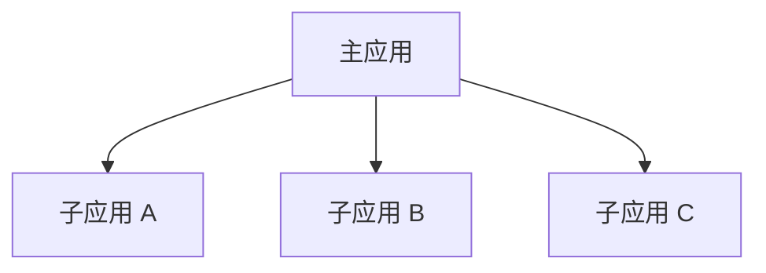
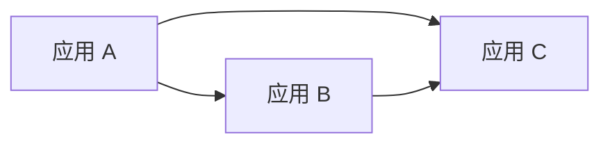

# 第 26 课：模块联邦——Vue 主应用加载 Vue 与 React 子应用组件

> 本课只完成一个目标：先跑通 Vue 加载 Vue，再看跨到 React 后为什么需要适配层。
>
> 案例包含一个 Vue Host、一个 Vue Remote 和一个 React Remote。

---

## 一、模块联邦到底是什么

> 模块联邦(Module Federation)是 Webpack 5 提供的一套运行时模块加载机制。它让一个独立构建的前端应用，可以在浏览器运行时加载另一个应用暴露的 JavaScript 模块。

把“模块联邦”四个字拆开就容易理解了。

### 什么是“模块”

能够被 `import` 的代码，都可以叫模块。例如：

```js
import { formatMoney } from "./money.js";
import UserCard from "./UserCard.vue";
```

所以模块可以是：

- 一个函数；
- 一个 Vue 或 React 组件；
- 一个工具文件；
- 一个业务功能。

### 什么是“联邦”

主应用和业务应用仍然是两个独立项目：

```text
host-app          独立开发、独立构建、独立部署
vue-remote-app    独立开发、独立构建、独立部署
react-remote-app  独立开发、独立构建、独立部署
```

它们没有被合并成一个项目，只是约定：

```text
vue-remote-app：我愿意对外提供 UserCard 模块
react-remote-app：我愿意对外提供 React 卡片挂载模块
host-app：运行时按需使用这两个模块
```

这种“项目保持独立，但允许交换模块”的关系，就是这里所说的联邦。

### 它和普通 import 有什么不同

普通导入：

```js
import UserCard from "./UserCard.vue";
```

Webpack 构建主应用时，就会找到 `UserCard.vue`，并把它打进主应用产物。

模块联邦导入：

```js
const module = await import("vueRemote/UserCard");
```

这个模块不在主应用项目中。浏览器执行到这里时，才会从 `vue-remote-app` 的服务器加载它。

因此，模块联邦最核心的变化是：

```text
普通 import
构建时找到本地模块，再打进当前应用

模块联邦 import
运行时找到远程应用，再加载远程模块
```

### 这和发布 npm 公共包有什么区别

这里很容易想到：**共享代码，发布成 npm 包不也可以吗？**

可以。两者都能共享代码，真正的区别是：**引用方应用什么时候拿到这段代码。**

使用 npm 包时，代码在构建前安装到引用方应用：

```text
npm 包发布新版本
        ↓
引用方应用升级并安装依赖
        ↓
引用方应用重新构建、重新发布
```

使用模块联邦时，引用方应用在浏览器运行时加载远程模块：

```text
Remote 独立发布远程模块
        ↓
引用方应用不需要重新构建
        ↓
浏览器运行时加载远程模块
```

板书只需要记住：

```text
npm 包             构建前安装，更新后引用方应用要重新构建发布
Module Federation  运行时加载，Remote 可以独立更新发布
```

npm 包用来共享业务模块时，主要有三个问题：

1. 公共包更新后，引用方应用不会自动获得新代码；
2. 每个引用该包的应用都要升级版本、重新构建、重新发布；
3. 引用它的应用越多、业务模块更新越频繁，升级成本越高，还可能出现版本不一致的情况。

npm 包并不是不好，它更适合稳定的工具函数、基础组件和公共类型；Module Federation 更适合需要频繁更新、独立发布的业务模块。

所以模块联邦真正解决的是：

> 多个独立构建、独立部署的应用，怎样在运行时共享代码。

---

## 二、模块联邦和微前端是什么关系

先给结论：

> 微前端是一种架构思想，模块联邦是一种运行时模块加载技术。模块联邦可以用来实现微前端，但用了模块联邦不一定就是微前端。

### 为什么它可以实现微前端

微前端希望把大型前端系统拆成多个可以独立开发、构建和发布的业务单元，再由主应用把它们组合起来。

模块联邦正好可以完成其中的“运行时组合”：

```text
订单团队独立构建 order-app
        ↓
order-app 暴露订单组件
        ↓
主应用运行时加载订单组件
        ↓
多个团队的模块组成一个页面
```

如果这些 Remote 按业务边界拆分，并由不同团队独立交付，就可以形成一种模块级微前端方案。

### 为什么用了模块联邦不一定就是微前端

假设一个项目只是通过模块联邦共享了一个普通按钮：

```text
ui-app 暴露 Button
host-app 加载 Button
```

这只能说明它使用了远程模块加载，还不能说明系统已经按照业务和团队边界拆成微前端。

所以要分清：

```text
微前端
    关注系统怎样按业务拆分、独立交付和重新组合

模块联邦
    关注不同构建产物怎样在运行时共享模块
```

### 它和前面框架最大的区别：加载单位不同

前面课程中的 qiankun、MicroApp 和无界，主要把一个完整子应用接入主应用：

```text
完整子应用
├─ HTML
├─ 根组件
├─ 路由
├─ 页面状态
└─ 生命周期
```

模块联邦主要加载一个模块：

```text
远程模块
├─ 一个函数
├─ 一个组件
└─ 一个业务功能
```

可以先记成：

```text
qiankun / MicroApp / 无界
    -> 应用级接入

Module Federation
    -> 模块级共享
```

### 中心化和去中心化

如果要一句话简单理解，qiankun等微前端处理方式是中心化的处理，而模块联邦是去中心化的，当然也能定一个主应用，说得更专业一点：

> qiankun、MicroApp、无界更偏向主应用集中编排；Module Federation 更偏向多个构建之间分布式引用模块。

**图一：qiankun 等框架——主应用统一接入子应用**



所有子应用都由主应用统一接入。

**图二：Module Federation——应用之间可以直接引用**



应用之间可以直接建立引用关系，不必全部经过一个固定中心。

```text
qiankun 等框架        主应用统一接入子应用
Module Federation    应用之间可以直接引用
```

Module Federation 仍然可以有主应用，所以更准确的说法是“更偏去中心化”，而不是“完全去中心化”。

### 实际项目怎样选择

先问自己要加载什么：

```text
要接入一个带路由、页面和状态的完整系统
    -> 更适合 qiankun、MicroApp、无界等应用级方案

只想共享一个业务组件或函数
    -> 可以考虑 Module Federation
```

两者也可以组合

---

## 三、为什么这节课使用 Webpack

先纠正一个错误概念：

> 不是“模块联邦只能用 Webpack”，而是 Module Federation 最初作为 Webpack 5 的原生能力出现。

Webpack 5 自带：

```js
webpack.container.ModuleFederationPlugin
```

因此使用 Webpack 时，不需要再引入第三方联邦插件。

现在 Rspack、Rsbuild、Vite 等工具也有模块联邦实现或插件，但配置方式、功能边界和兼容情况不完全相同。

选择 Webpack 的原因只有三个：

1. 它是这项能力的原生实现，概念最直接；
2. 不需要先解释第三方插件；
3. 学会 `exposes`、`remotes` 和远程 `import()` 后，再迁移到其他构建工具也更容易。

---

## 四、先看 Vue 加载 Vue

案例有三个应用：

```text
├─ host-app/          Vue 主应用，端口 5300
├─ vue-remote-app/    Vue 子应用，端口 5301
└─ react-remote-app/  React 子应用，端口 5302
```

启动：

```bash
pnpm install
pnpm dev
```

先打开 `http://localhost:5300`，只看页面中的第一部分。

### 第一步：子应用先写好要共享的组件

`vue-remote-app/src/UserCard.vue` 就是普通单文件组件，有 `props`，也会触发事件。它不需要为主应用增加特殊的生命周期函数。

现在这个组件只属于 Vue 子应用。主应用既不知道它的地址，也不能直接导入它。接下来要用 Module Federation 把它公开。

### 第二步：子应用决定“对外叫什么”

在 `vue-remote-app/webpack.config.js` 中配置：

```js
new ModuleFederationPlugin({
  name: "vueRemote",
  filename: "remoteEntry.js",
  exposes: {
    "./UserCard": "./src/UserCard.vue",
  },
});
```

逐项看这段配置。

Module Federation 把 Remote 对外提供的这一组模块叫作“容器”。`name` 是这个容器在运行时使用的名字：

```text
name: "vueRemote"
      └── 这个远程容器叫 vueRemote
```

`filename` 是 Webpack 要生成的联邦入口文件名：

```text
filename: "remoteEntry.js"
          └── 启动或构建 Vue 子应用后，由 Webpack 自动生成
```

我们不需要手写 `remoteEntry.js`。运行 `pnpm dev` 时，Webpack Dev Server 会在内存中生成并提供它：

```text
http://localhost:5301/remoteEntry.js
```

运行 `pnpm build` 时，它会出现在 Vue 子应用的 `dist/` 中。

`exposes` 决定哪些本地文件允许外部使用：

```js
exposes: {
  "./UserCard": "./src/UserCard.vue",
  //     ↑                  ↑
  // 对外公开名          子应用中的真实文件
}
```

左边的 `"./UserCard"` 是开发者自己取的公开名，右边才是真实源码路径。公开名不要求和文件名一致。例如下面的写法仍然暴露同一个文件：

```js
exposes: {
  "./Profile": "./src/UserCard.vue",
}
```

此时外部使用的是 `Profile`，不是 `UserCard`。

### 第三步：主应用记录 Remote 的地址

在 `host-app/webpack.config.js` 中配置：

```js
remotes: {
  vueRemote: "vueRemote@http://localhost:5301/remoteEntry.js",
}
```

这一行可以拆成三部分：

```text
vueRemote: "vueRemote@http://localhost:5301/remoteEntry.js"
    ①           ②                         ③
```

1. 左边的 `vueRemote`：Host 中使用的导入别名；
2. `@` 前面的 `vueRemote`：远程容器名，要和 Remote 配置中的 `name` 对应；
3. `@` 后面的地址：Webpack 到哪里获取 Remote 生成的 `remoteEntry.js`。

这里两个 `vueRemote` 写成了一样，所以看起来像重复。实际上它们的作用不同。Host 的导入别名可以改，例如：

```js
remotes: {
  userApp: "vueRemote@http://localhost:5301/remoteEntry.js",
}
```

如果这样配置，Host 就要通过 `userApp/...` 导入。

### 第四步：组合出 Host 使用的模块名

当前案例中有两个关键名字：

```text
Host 的 remotes 左侧别名     vueRemote
Remote 的 exposes 公开名     ./UserCard
```

组合时去掉 `./` 中的点，使用斜杠连接：

```text
vueRemote + ./UserCard
     ↓
vueRemote/UserCard
```

所以 `vueRemote/UserCard` 的来源是：

> Host 的远程别名 + Remote 的模块公开名。

它不是 `name` 加上 `UserCard.vue` 的文件名。只是本案例把容器名、Host 别名和文件名取得比较接近，容易让人误以为 Webpack 在根据文件名自动推导。

如果前面把公开名改成 `"./Profile"`，导入就要写成：

```js
import("vueRemote/Profile");
```

### 第五步：主应用加载并渲染组件

点击“加载 Vue 组件”时，`host-app/src/App.vue` 执行：

```js
const module = await import("vueRemote/UserCard");
vueCard.value = markRaw(module.default);
```

执行到 `import()` 时，Webpack 会按照 `remotes` 找到 5301 的 `remoteEntry.js`，再通过它加载真正包含 `UserCard` 代码的 JavaScript 文件，也就是业务 chunk。

Vue 单文件组件编译后是**默认导出**，所以真正的组件是 `module.default`。`markRaw()` 表示不把组件定义转换成响应式对象。

拿到组件后，模板通过 Vue 的动态组件语法渲染：

```vue
<component
  :is="vueCard"
  :name="name"
  @confirm="handleVueConfirm"
/>
```

这里的三处对应关系是：

```text
:is="vueCard"                    要渲染哪个组件
:name="name"                    Host 向远程组件传递 props
@confirm="handleVueConfirm"     Host 接收远程组件 emit 的事件
```

这里的 `props`、事件和组件销毁都按 Vue 原来的方式工作。对主应用来说，它和本地 Vue 组件的用法几乎一样，区别只是组件代码来自 5301。

---

## 五、再看 Vue 加载 React

点击页面中的“加载 React 组件”，主应用会从 5302 加载 React 模块。

### 为什么不能照搬前面的写法

React 子应用中也有一个正常组件：

```jsx
export function HelloCard({ name, onConfirm }) {
  return (
    <article>
      <h2>你好，{name}</h2>
      <button onClick={() => onConfirm?.("操作完成")}>确认收到</button>
    </article>
  );
}
```

但是 Vue 不会渲染 React 组件，下面这样写没有意义：

```vue
<HelloCard />
```

Module Federation 只负责把模块送过来，不负责把 React 组件翻译成 Vue 组件。

### React 子应用提供挂载适配器

`react-remote-app/src/mountHelloCard.jsx` 把 React 的渲染过程包装成三个操作：

```jsx
export function mountHelloCard(container, initialProps) {
  const root = createRoot(container);
  let currentProps = initialProps;

  const render = () => root.render(<HelloCard {...currentProps} />);
  render();

  return {
    update(nextProps) {
      currentProps = { ...currentProps, ...nextProps };
      render();
    },
    unmount() {
      root.unmount();
    },
  };
}
```

这段代码不是把 React 转换成 JavaScript。JSX 本来就会在构建阶段由 Babel 和 Webpack 编译成浏览器能执行的 JavaScript；即使没有 `mountHelloCard`，Module Federation 也能加载一个 React 模块。

`mountHelloCard` 真正解决的是：Vue 拿到 React 组件后，不知道怎样渲染它。因此 React 子应用提供一个普通函数作为跨框架适配接口：

```text
container       Vue 提供的 DOM 容器
createRoot()    React 接管这个容器内部
render()        第一次渲染 HelloCard
update()        Host 传来新参数时重新渲染
unmount()       页面销毁时清理 React Root
```

React 组件并没有变成 Vue 组件，最终仍然由 React 运行时渲染。Vue 只负责提供容器并调用这几个普通 JavaScript 函数。

React 子应用暴露的不是 `HelloCard` 本身，而是这个挂载模块：

```js
new ModuleFederationPlugin({
  name: "reactRemote",
  filename: "remoteEntry.js",
  exposes: {
    "./HelloCard": "./src/mountHelloCard.jsx",
  },
});
```

这里的名字和前面的 Vue 案例采用同一套规则：

```text
Remote 容器名          reactRemote
exposes 公开名         ./HelloCard
真实源码文件           ./src/mountHelloCard.jsx
```

`./HelloCard` 只是挂载模块的公开名，并不是 Webpack 根据 `HelloCard.jsx` 自动生成的。它右边实际对应的是 `mountHelloCard.jsx`。

React 子应用启动或构建后，Webpack 根据 `filename` 生成自己的 `remoteEntry.js`：

```text
http://localhost:5302/remoteEntry.js
```

主应用也要记录这个地址：

```js
remotes: {
  reactRemote: "reactRemote@http://localhost:5302/remoteEntry.js",
}
```

Host 别名 `reactRemote` 加上公开名 `./HelloCard`，得到导入名：

```text
reactRemote/HelloCard
```

### Vue 提供容器，React 负责容器内部

主应用准备一个普通 DOM：

```vue
<div ref="reactSlot"></div>
```

加载模块后，把这个 DOM 交给 React：

```js
const { mountHelloCard } = await import("reactRemote/HelloCard");

reactControls = mountHelloCard(reactSlot.value, {
  name: name.value,
  onConfirm(message) {
    reactStatus.value = message;
  },
});
```

这里也有两个不同层次的名字：

```text
reactRemote/HelloCard    Module Federation 用来找到远程模块
mountHelloCard           该模块在源码中 export 出来的函数
```

前者由 `remotes + exposes` 决定，后者由 `mountHelloCard.jsx` 中的 `export function mountHelloCard` 决定。

姓名变化时主动调用 `update`，Vue 页面销毁时调用 `unmount`：

```js
watch(name, (nextName) => reactControls?.update({ name: nextName }));
onBeforeUnmount(() => reactControls?.unmount());
```

这就是跨框架时多出来的工作：双方要约定怎样挂载、更新、传递事件和卸载。

### 两种接法放在一起看

| 对比项 | Vue 主应用 + Vue 子应用 | Vue 主应用 + React 子应用 |
| --- | --- | --- |
| Remote 暴露什么 | Vue 组件 | 挂载适配器 |
| Host 怎样渲染 | `<component :is="...">` | 提供 DOM，调用 `mount()` |
| 数据更新 | Vue props 自动更新 | 主动调用 `update()` |
| 子应用通知 Host | Vue emit | 回调函数 |
| 销毁 | Vue 组件生命周期处理 | 主动调用 `unmount()` |

两边使用同一种框架时最自然；跨框架也能做，只是需要明确的适配协议。

---

## 六、remoteEntry.js 在这里做了什么

现在有两个地址：

```text
http://localhost:5301/remoteEntry.js    Vue Remote
http://localhost:5302/remoteEntry.js    React Remote
```

`remoteEntry.js` 不是业务组件打包后的单个文件。它是 Remote 的联邦入口，负责告诉 Host：公开了哪些模块，以及怎样继续加载对应的 chunk。

```text
remoteEntry.js = 远程模块入口
exposes        = Remote 的公开清单
remotes        = Host 的远程地址簿
import()       = Host 真正开始使用模块
```

---

## 七、为什么 Vue 要配置 shared

Host 和 Vue Remote 都安装了 Vue。如果各用各的，页面中就可能出现两份 Vue：

```text
Host 使用 Vue A
Remote 组件使用 Vue B
```

这不仅会重复加载 Vue，还可能造成组件上下文、`provide/inject` 和生命周期等功能不一致。

因此两边都配置：

```js
shared: {
  vue: {
    singleton: true,
    requiredVersion: "3.5.41",
  },
}
```

它的意思是：

```text
vue                         共享 Vue
singleton: true             页面中尽量只使用一份 Vue
requiredVersion: "3.5.41"  要求 Vue 的版本满足 3.5.41
```

Webpack 会在运行时选择一份符合版本要求的 Vue，让 Host 和远程 Vue 组件共同使用。

```text
没有 shared    两边可能各用一份 Vue
配置 shared    两边尽量共用同一份 Vue
```

### 为什么入口还要拆成 main.js 和 bootstrap.js

配置 `shared` 后，Webpack 要先选出双方共同使用的 Vue，再启动应用。

所以 `main.js` 只做动态导入：

```js
import("./bootstrap.js");
```

真正的启动代码放在 `bootstrap.js`：

```js
import { createApp } from "vue";
import App from "./App.vue";

createApp(App).mount("#app");
```

```text
动态 import()
      ↓
Webpack 先准备共享依赖
      ↓
执行 bootstrap.js，启动 Vue
```

`bootstrap.js` 本身没有特殊作用，关键是动态 `import()` 留出了准备共享依赖的时间。

---

## 八、最后再回答四个问题

### 1. 模块联邦为什么能导入另一个项目的模块

浏览器原本不知道 `vueRemote/UserCard` 是什么。真正让这个写法生效的是 Host 和 Remote 两次构建产生的联邦运行时代码。

Remote 构建时，Webpack 根据 `exposes` 建立一张公开模块表：

```text
公开名 ./UserCard
        ↓
对应 src/UserCard.vue 编译后的模块
```

`remoteEntry.js` 是这张公开表的运行时入口。它对外提供两个核心能力，可以先简单理解成：

```text
init()    接收并初始化 shared 共享作用域
get()     根据公开名取得远程模块
```

Host 构建时，Webpack 看到：

```js
import("vueRemote/UserCard");
```

不会把它当作本地文件查找，而是根据 `remotes` 生成一段远程加载代码。浏览器运行到这里时，大致经历：

```text
1. 加载 http://localhost:5301/remoteEntry.js
2. 取得名为 vueRemote 的远程容器
3. 初始化 shared 共享作用域
4. 调用容器的 get("./UserCard")
5. 加载 UserCard 需要的 JavaScript chunk
6. 执行模块工厂，得到 Vue 组件
```

所以模块联邦不是让浏览器直接读取另一个项目的 `.vue` 源文件。Remote 先把源码编译成浏览器能执行的 JavaScript，Host 再通过 `remoteEntry.js` 和联邦运行时取得编译后的模块。

### 2. 远程模块还引用了其他代码或数据，会不会有问题

先看代码依赖。假设 `UserCard.vue` 中继续导入：

```js
import { formatUser } from "./formatUser.js";
import avatarUrl from "./avatar.png";
import "./card.css";
```

Webpack 构建 Vue Remote 时，会从 `UserCard.vue` 出发递归分析这些依赖：

```text
UserCard.vue
├─ formatUser.js
├─ avatar.png
└─ card.css
```

这些内容会被打进同一个 chunk，或者拆成额外的 chunk 和资源文件。Host 不需要把它们逐个配置进 `exposes`；加载 `UserCard` 时，Remote 自己的 Webpack 运行时知道它还缺哪些文件，并继续加载。

本例的 Remote 配置了：

```js
output: {
  publicPath: "auto",
}
```

`output.path` 决定构建文件写到磁盘的哪个目录；`output.publicPath` 决定浏览器通过什么 URL 加载这些文件。设置为 `auto`，表示让 Webpack 根据当前正在执行的脚本地址自动推断 URL 前缀。

例如 Host 先加载：

```text
http://localhost:5301/remoteEntry.js
```

Webpack 就会推断 Vue Remote 的资源基础地址是：

```text
http://localhost:5301/
```

后续需要 `UserCard` 的 chunk 时，仍然会去 5301 请求，而不会错误地去 Host 的 5300 请求。如果生产环境把 `remoteEntry.js` 部署到 CDN，`auto` 也会根据 CDN 上的脚本地址推断后续资源位置。

需要注意：`publicPath` 只影响 Webpack 生成的 chunk、图片、字体等资源地址，不会修改代码中的 `fetch()`、Axios 接口地址或手写的运行时字符串。

但“读取数据”需要分情况：

> 通过 `import`、`require` 或 `new URL(..., import.meta.url)` 进入 Webpack 依赖图的资源，通常由 Remote 的 Webpack 负责生成地址和继续加载；只是写在 `fetch`、Axios、`window` 等运行时代码中的字符串地址，Webpack 通常不会处理，要按照 Host 页面所在的浏览器环境判断。

判断标准不是路径前面有没有 `/`，而是这个路径有没有被 Webpack 当作构建依赖。例如：

```js
// 构建依赖：Webpack 会分析并处理
import data from "./data.js";
const avatarUrl = new URL("./avatar.png", import.meta.url);

// 运行时地址：由浏览器在 Host 页面中解析
fetch("./api/users");
fetch("/api/users");
fetch("https://api.example.com/users");
```

前两种“构建依赖”也不是绝对不会失败，它们仍然要求 Remote 的产物部署完整、`publicPath` 正确，并允许 Host 跨域加载。区别在于 Webpack知道这些依赖的存在，能够生成对应的 chunk 或资源地址。

Template 和 CSS 也按同样的方法判断：静态相对地址，例如 ``、CSS 的 `url("./bg.png")`，通常会被 `vue-loader` 或 `css-loader` 收进 Webpack 依赖图；动态绑定中的手写地址、根路径地址，则通常按照 Host 页面环境解析。具体转换规则受 loader 配置影响，本课不再展开。

| 远程组件中的操作 | 通常结果 | 原因或注意点 |
| --- | --- | --- |
| `import data from "./data.js"` | 正常 | 属于构建依赖，会进入 Remote 的产物 |
| `import("./detail.js")` | 正常 | 会生成异步 chunk，由 Remote 运行时继续加载 |
| Template、CSS 中的静态相对地址 | 通常能加载 | 通常会被 loader 转换成 Webpack 依赖 |
| 动态绑定或根路径中的手写地址 | 可能请求错位置 | 保留到运行时后，通常按照 Host 页面地址解析 |
| `fetch("https://api.example.com/users")` | 可以请求 | 仍需处理 CORS、Cookie、Token 和权限 |
| `fetch("/api/users")` | 可能请求错服务 | 相对地址以当前 Host 页面域名为准，不是 Remote 的域名 |
| 读取 `localStorage`、`window` | 读取的是 Host 页面环境 | Module Federation 默认没有 iframe 或 JS 沙箱 |

最容易误解的是相对接口地址。远程组件虽然来自 5301，但它最终运行在 5300 的页面中：

```js
fetch("/api/users");
```

实际请求通常是：

```text
http://localhost:5300/api/users
```

不会自动变成：

```text
http://localhost:5301/api/users
```

真实项目通常使用明确的 API Base URL、环境变量，或者让 Host 把请求客户端、Token 和配置作为参数传给远程模块。

因此结论不是“远程模块的所有依赖都一定没问题”，而是：

> `import`、Template 静态相对地址、CSS 相对地址等构建依赖，通常由 Remote 的 Webpack 负责；动态绑定中的手写地址、接口、Cookie、路由和浏览器全局环境，则要按照 Host 的运行环境处理。

### 3. Remote 和 Remote 能不能互相引用

可以。一个项目可以同时扮演两种角色：

```text
对外使用 exposes     它是其他项目的 Remote
对内使用 remotes     它又是其他 Remote 的 Host
```

例如订单 Remote 也想使用用户 Remote：

```js
// order-app/webpack.config.js
new ModuleFederationPlugin({
  name: "orderRemote",
  exposes: {
    "./OrderCard": "./src/OrderCard.vue",
  },
  remotes: {
    userRemote: "userRemote@http://localhost:5401/remoteEntry.js",
  },
});
```

订单模块中就可以使用：

```js
const { default: UserCard } = await import("userRemote/UserCard");
```

Host 同时引用 `orderRemote` 和 `userRemote`，不会因为引用关系出现就自动混乱。每个模块都通过“Host 别名 + exposes 公开名”定位，Webpack 会维护各自的容器和模块加载状态。同一个页面中，如果使用的是相同 URL、相同容器实例，已经加载的脚本和 chunk 通常也会被复用。

真正需要避免的是配置和架构上的混乱：

- 每个 `ModuleFederationPlugin.name` 应保持唯一；
- 每个构建的 `output.uniqueName` 应保持唯一；
- 同一个 Remote 不要同时配置多个含义不清的别名和地址；
- 公共依赖的 `shared` 版本要求要能够兼容；
- 不要让 Remote 之间形成随意的双向业务依赖。

Webpack 技术上允许嵌套容器，甚至允许循环依赖，但“允许”不等于“适合”。例如：

```text
orderRemote 依赖 userRemote
userRemote 又依赖 orderRemote
```

这种结构会让加载顺序、故障排查和独立发布都变得困难。更容易维护的方向是：

```text
Host
├─ orderRemote
├─ userRemote
└─ commonRemote

orderRemote ─┐
             ├─> commonRemote
userRemote  ─┘
```

或者把真正稳定的公共代码发布成 npm 包。兄弟 Remote 需要通信时，也可以由 Host 负责传递参数和事件，避免它们彼此知道太多。

### 4. Vue 加载 Vue 和 Vue 加载 React，究竟是谁在运行

先记住共同点：

```text
Remote 源码
    ↓ Webpack 编译
JavaScript
    ↓ Module Federation 加载
在 Host 页面中执行
```

#### Vue 加载 Vue

```text
Host 加载远程 Vue 组件
        ↓
共享的 Vue 负责渲染
        ↓
组件进入 Host 的 Vue 组件树
```

#### Vue 加载 React

```text
Host 加载 React 挂载模块
        ↓
Host 提供 DOM 容器
        ↓
React 在容器中创建 React Root
```

一句话区别：

> Vue 加载 Vue，是把远程组件加入同一棵 Vue 组件树；Vue 加载 React，是让 React 在 Host 提供的容器中管理自己的组件树。

---

## 参考资料

- [qiankun：快速上手](https://qiankun.umijs.org/zh/guide/getting-started/)
- [Webpack：Module Federation](https://webpack.js.org/concepts/module-federation/)
- [Webpack：ModuleFederationPlugin](https://webpack.js.org/plugins/module-federation-plugin/)
- [Webpack：依赖图](https://webpack.js.org/concepts/dependency-graph/)
- [Webpack：Public Path](https://webpack.js.org/guides/public-path/)
- [Module Federation 官方快速开始](https://module-federation.io/guide/start/quick-start)
