# 从简单登录到企业级认证架构的处理

## 一、要解决什么问题

微前端把多个前端应用组合成一个系统，但“拆分应用”不等于“每个应用都重新做一套登录”。

本节需要先建立三个结论：

1. qiankun 负责应用的加载、挂载和卸载，不负责用户登录。
2. 当前项目采用“统一入口”模式：用户登录主应用，再由主应用嵌入子应用。
3. 企业如果允许多个应用使用不同域名独立访问，通常会接入统一身份认证平台，而不是由前端自己传递 Token。

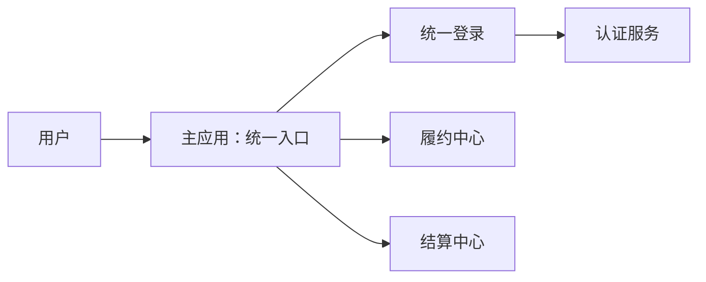

---

## 二、先理解浏览器中的 Origin

浏览器用 Origin 区分不同的网站运行空间：

```text
Origin = 协议 + 域名 + 端口
```

以下地址属于不同 Origin：

```text
http://localhost:5173
http://localhost:5174
http://localhost:5175
```

虽然它们的域名都是 `localhost`，但端口不同，因此 Origin 不同。

### 1. localStorage 按 Origin 隔离

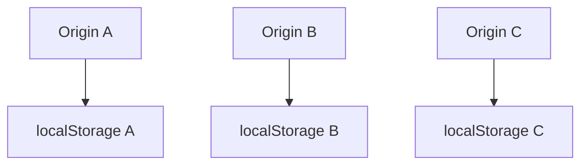

在 Origin A 保存的数据，Origin B 默认无法读取。这是浏览器的安全边界，不是 qiankun 的限制。

### 2. 子应用嵌入主应用后，运行环境发生了变化

子应用单独打开时，页面属于子应用自己的 Origin；被 qiankun 嵌入后，子应用代码运行在主应用页面中，读取的是主应用页面的 `window` 和 `localStorage`。

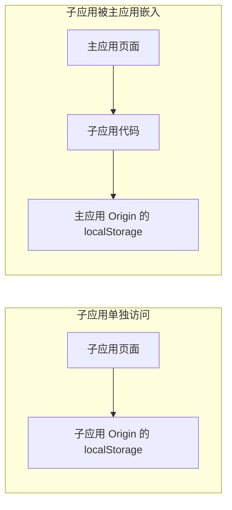

这正是当前项目能够保持登录状态的关键：登录信息只保存在主应用 Origin；子应用最终也回到主应用页面中运行。

---

## 三、当前项目选择的登录方式

当前项目把主应用作为唯一正式入口：

```text
单独访问子应用
      ↓
子应用始终跳转到主应用认证入口
      ↓
主应用判断自己的登录状态
      ↓
未登录：显示登录页；已登录：直接进入目标业务路由
      ↓
主应用通过 qiankun 嵌入对应子应用
```

注意：登录成功后不会再跳回子应用的独立地址，而是进入主应用中的 `/fulfillment` 或 `/settlement` 路由。

### 为什么这样设计

- 登录入口只有一个，流程清楚。
- 不需要在不同端口之间复制 Token。 
- 用户、退出登录和权限入口由主应用统一展示。
- 子应用仍可独立启动，方便开发调试，但独立地址不是正式业务入口。
- 该模式也适合生产环境中的“统一门户”产品形态。

---

## 四、从代码看完整流程

### 1. 公共会话工具

代码位置：

```text
packages/auth-session/src/index.ts
```

这里集中处理：

- 保存 Token 和用户展示信息；
- 判断本地是否存在 Token；
- 清除本地登录信息；
- 生成安全的登录跳转地址。

核心判断很简单：

```ts
export function hasSession(): boolean {
  return Boolean(getAccessToken())
}
```

它只适合做前端页面的快速判断，不能证明用户真的有权限。Token 是否有效，最终必须由后端判断。

### 2. 子应用在渲染前确认运行环境和登录状态

代码位置：

```text
apps/fulfillment-app/src/auth.ts
apps/settlement-app/src/auth.ts
```

核心流程：

```ts
export function ensureAuthenticated() {
  // 独立地址不是正式入口，始终回到主应用。
  if (!window.__POWERED_BY_QIANKUN__) {
    redirectToPortalLogin(PORTAL_ORIGIN, getPortalPath())
    return false
  }

  // 嵌入主应用后，再读取主应用运行环境中的登录信息。
  if (hasSession()) return true

  redirectToPortalLogin(PORTAL_ORIGIN, getPortalPath())
  return false
}
```

上面是履约中心的写法。结算中心使用 `qiankunWindow.__POWERED_BY_QIANKUN__` 完成同样的判断。

`getPortalPath()` 得到的是主应用中的业务路由，而不是子应用独立地址。

因此，即使子应用端口的 localStorage 中残留了旧 Token，直接访问子应用时也不会独立显示业务页面。它仍然要回到主应用，由主应用决定是显示登录页还是直接进入嵌入态。

例如，访问履约中心的独立页面后，会跳转成类似下面的地址：

```text
主应用登录页?redirect=/fulfillment/订单页面
```

### 3. 检查发生在创建页面之前

代码位置：

```text
apps/fulfillment-app/src/main.ts
apps/settlement-app/src/main.tsx
```

```ts
function render() {
  if (!ensureAuthenticated()) return

  // 通过检查后才创建和挂载应用
}
```

这样可以避免未登录用户先看到业务页面，然后才被跳走。

### 4. 主应用如何决定“显示登录页”还是“直接进入系统”

代码位置：

```text
apps/portal-shell/src/router/index.ts
```

先看一个具体地址：

```text
/login?redirect=/fulfillment/orders
```

它的意思是：现在先进入登录入口，认证完成后继续访问 `/fulfillment/orders`。

子应用跳到这个地址后，主应用的路由守卫会检查主应用自己的登录状态：

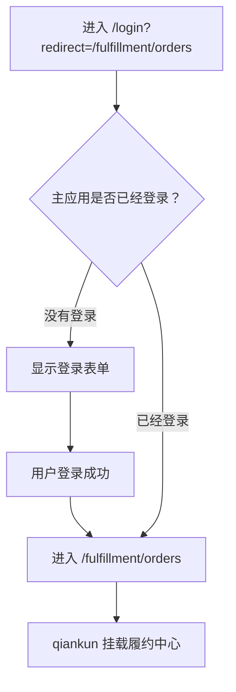

所以，访问 `/login` 不一定真的会看到登录表单：

- 主应用没有登录信息时，路由守卫允许进入登录页；
- 主应用已经登录时，路由守卫读取 `redirect`，直接进入目标业务路由。

路由守卫还会保护主应用业务路由。比如未登录时直接访问 `/settlement`，它会把访问改成：

```text
/login?redirect=/settlement
```

代码中的 `meta.public` 用来标记“不登录也能访问”的页面。目前登录页和注册页属于公开页面，首页、履约中心和结算中心属于需要登录的页面。

### 5. 主应用完成登录并继续访问

代码位置：

```text
apps/portal-shell/src/views/LoginView.vue
apps/portal-shell/src/services/auth.ts
```

登录成功后：

```ts
persistSession(await login(username, password))
await router.push(getSafeRedirect(route.query.redirect))
```

如果原目标是 `/fulfillment/orders`，主应用就进入这个路由，然后 qiankun 挂载履约中心。

### 6. 请求接口时携带 Token

代码位置：

```text
packages/api-client/src/index.ts
```

```ts
const token = options.getAccessToken?.()

if (token) {
  headers.set('Authorization', `Bearer ${token}`)
}
```

完整请求链路如下：

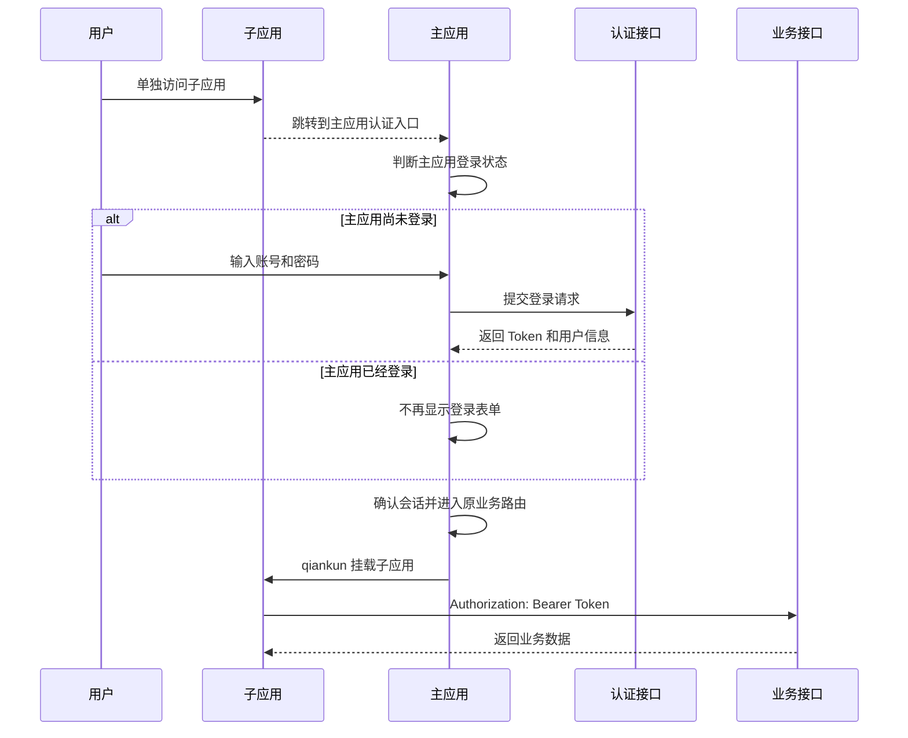

### 7. 后端仍然是最终安全边界

即使前端判断“已经登录”，后端仍要校验：

- Token 是否真实；
- Token 是否过期；
- 用户是否被禁用；
- 用户是否有当前接口的权限；
- 用户是否能访问当前组织的数据。

接口返回 `401 Unauthorized` 时，前端清理无效会话并重新进入统一登录流程；返回 `403 Forbidden` 时，表示身份有效但权限不足。

---

## 五、当前方案属于企业级方案吗

答案要分产品形态讨论。

### 形态 A：统一门户是唯一入口

如果企业规定所有业务都从一个门户进入，子应用不提供独立的正式访问入口，那么当前的整体方向是成立的：

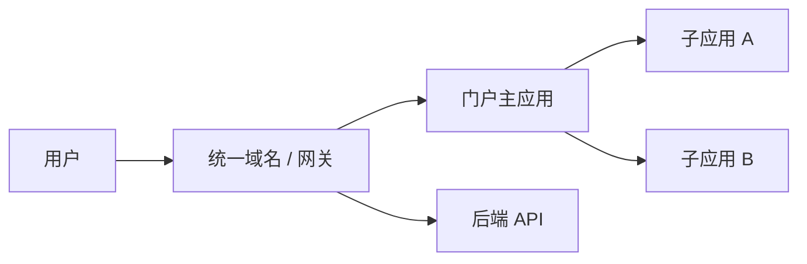

企业部署时通常会通过网关把它们暴露在同一个域名下：

```text
https://supply.example.com/
https://supply.example.com/fulfillment/
https://supply.example.com/settlement/
https://supply.example.com/api/
```

服务器可以分别部署在不同机器上。用户看到的域名由网关统一，并不要求所有服务真的在同一台服务器。

不过，生产项目通常还会把浏览器中的 Token 改为更安全的服务端会话。

### 形态 B：每个应用都要使用不同域名独立访问

“独立访问”指的是：用户可以直接打开任意一个应用的地址并正常使用，不要求先打开门户，也不要求这个应用必须被 qiankun 嵌入。

例如：

```text
https://portal.example.com
https://fulfillment.example.com
https://settlement.example.net
```

用户直接打开履约中心时，履约中心需要知道这个用户是谁；直接打开结算中心时，结算中心也需要知道这个用户是谁。

问题在于这些应用属于不同 Origin，无法直接读取彼此的 `localStorage`。因此，身份确认不能再依赖“读取主应用保存的 Token”。

企业的解决思路不是让应用之间传递 Token，而是让所有应用共同信任一个统一认证中心：

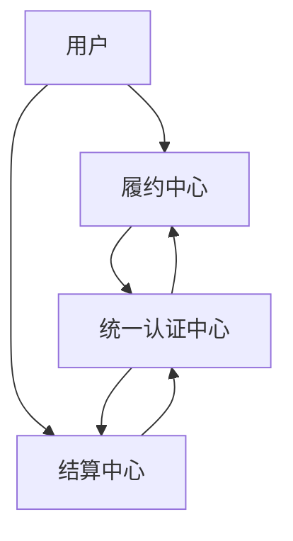

这个统一认证中心就叫身份提供方（Identity Provider，简称 IdP）。应用与 IdP 之间通常使用 OpenID Connect（OIDC）等标准协议。

实际效果是：

1. 用户第一次访问履约中心时，被跳转到 IdP 登录；
2. 登录成功后回到履约中心，履约中心建立自己的会话；
3. 用户随后访问结算中心，结算中心也跳转到同一个 IdP；
4. IdP 已经认识该用户，因此通常不再要求输入密码，直接让用户回到结算中心；
5. 结算中心再建立自己的会话。

这就是单点登录：各应用不共享 localStorage，也不互相复制 Token，但用户通常只需输入一次账号密码。

因此，这种形态的最终结论是：

```text
不同域名的应用需要独立访问
        ↓
共同接入统一身份提供方 IdP
        ↓
通过 OIDC 等标准协议实现单点登录
        ↓
每个应用建立并管理自己的安全会话
```

---

## 六、企业常见方案一：统一门户 + BFF

BFF 是 Backend for Frontend，即“专门服务于前端的后端”。

在这种架构中，浏览器不长期保存访问令牌，而是保存由服务端设置的会话 Cookie。

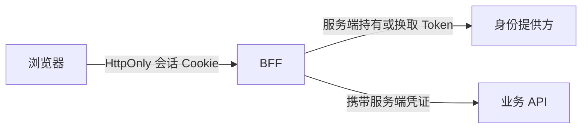

### 登录流程

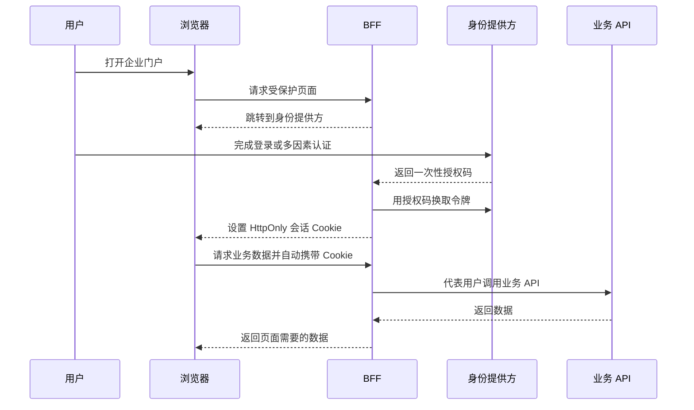

### 为什么比 localStorage Token 更适合生产环境

设置了 `HttpOnly` 的 Cookie 不能被普通 JavaScript 读取，可以降低 XSS（ **Cross-Site Scripting**（跨站脚本攻击）） 直接窃取令牌的风险。常见配置包括：

```text
HttpOnly
Secure
SameSite=Lax 或 SameSite=Strict
合理的 Domain、Path 和过期时间
```

采用 Cookie 后，还需要配套 CSRF 防护、会话轮换、超时控制、服务端注销和异常会话审计。

### 微前端如何获取当前用户

各子应用不需要读取 Token，而是调用统一接口：

```http
GET /api/session
```

服务端可以返回：

```json
{
  "authenticated": true,
  "user": {
    "id": "u1001",
    "displayName": "张三"
  },
  "permissions": ["order:read", "settlement:approve"]
}
```

前端用这些信息控制菜单和交互；后端仍对每次请求重新执行权限校验。

---

## 七、企业常见方案二：统一身份平台 + OIDC

如果多个应用必须使用不同域名独立访问，通常使用 OpenID Connect（OIDC）实现单点登录。

每个应用都信任同一个身份提供方：

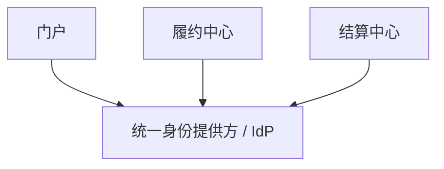

### 单点登录并不是共享 localStorage

单点登录的含义是：身份提供方已经认识用户，因此第二个应用再次跳转到身份提供方时，通常不必重新输入密码。

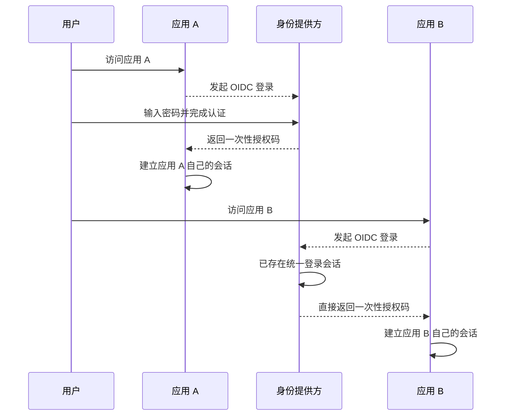

应用 A 和应用 B 不需要互相读取存储，也不需要互相复制 Token。它们通过身份提供方确认“是不是同一个用户”。

浏览器应用通常采用 Authorization Code + PKCE。URL 中传递的是短时、一次性的授权码，而不是长期访问令牌。

#### Authorization Code 是什么

Authorization Code 可以理解成“一次性兑换券”。

用户在 IdP 完成登录后，IdP 不会把长期使用的 Token 直接放进浏览器地址，而是让浏览器带着一个短时、一次性的 `code` 返回应用：

```text
https://fulfillment.example.com/callback?code=abc123
```

应用再拿这个 `code` 到 IdP 的后端接口兑换 Token。兑换成功后，`code` 立即失效。

```text
用户登录成功
    ↓
IdP 返回一次性 code
    ↓
应用用 code 兑换 Token
    ↓
code 失效
```

这样可以避免把真正的访问令牌直接暴露在 URL、浏览器历史记录和访问日志中。

#### PKCE 是什么

如果一次性 `code` 在跳转途中被别人截获，攻击者可能抢先兑换。PKCE 就是为这张“兑换券”再增加一份只有原应用知道的校验信息。

登录开始前，应用生成一个随机字符串：

```text
code_verifier：应用临时保存的随机密码
code_challenge：根据随机密码计算出的摘要
```

随后按以下流程认证：

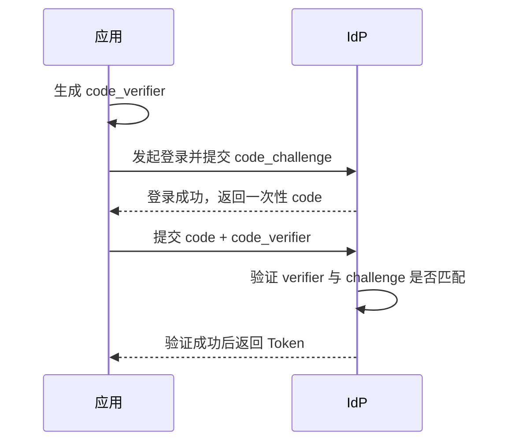

截获者即使拿到了 `code`，没有原应用保存的 `code_verifier`，也无法完成兑换。

因此可以把两个概念记成：

```text
Authorization Code：一次性兑换券
PKCE：兑换券对应的临时校验密码
```

如果系统采用 BFF，通常由 BFF 完成授权码兑换并安全保存 Token，浏览器最终只得到 HttpOnly 会话 Cookie。

### 统一退出为什么更复杂

清除某个应用自己的数据，只能退出这个应用。企业级统一退出通常包括：

1. 清除当前应用的服务端会话；
2. 通知身份提供方结束统一登录会话；
3. 按产品要求通知其他应用清理各自会话；
4. 对已签发的令牌设置较短有效期，必要时撤销刷新令牌。

因此，真正的跨域登录与退出应交给认证平台和后端会话体系，而不是依赖前端页面之间互相感知。

---

## 八、两种企业方案如何选择

| 场景 | 推荐方案 | 子应用独立访问 |
|---|---|---|
| 所有业务必须从统一门户进入 | 统一域名 + 网关 + BFF | 不作为正式入口 |
| 多个系统有独立域名，但希望一次登录 | OIDC + 每个应用自己的 BFF/会话 | 支持 |
| 公司已有统一身份平台 | 对接现有 IdP | 由产品要求决定 |
| 仅用于课堂演示微前端接入 | 主应用统一登录并嵌入子应用 | 仅保留开发能力 |

选择架构时要先问产品问题，而不是先问“Token 怎么传”：

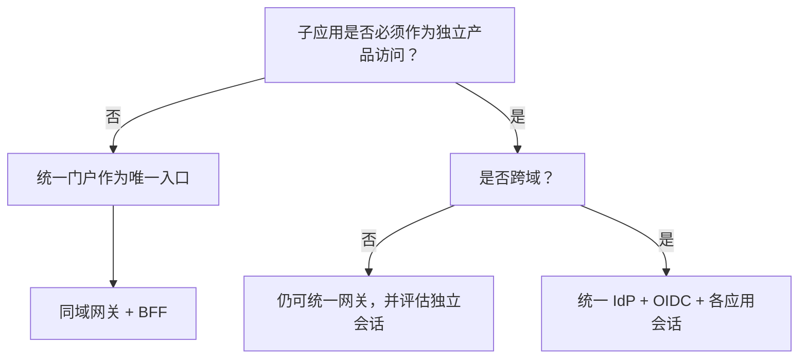

---

## 九、生产环境必须具备的能力

企业级不是某一段前端代码，而是一整套安全与治理能力：

- 全站 HTTPS；
- 统一身份提供方；
- OIDC/OAuth 2.0 标准流程；
- 多因素认证和账号风险控制；
- HttpOnly、Secure、SameSite Cookie；
- 防 XSS、CSRF 和开放重定向；
- 短时访问令牌与安全的刷新机制；
- 服务端鉴权和细粒度授权；
- 会话超时、撤销和统一退出；
- 登录、失败、越权与高风险操作审计；
- 网关限流、监控与告警；
- 密钥轮换和配置集中管理。

前端路由守卫只负责用户体验，不能代替后端鉴权。

---

## 十、本节结论

```text
qiankun 解决应用组合，不解决身份认证。

当前教学项目：
直接访问子应用 → 主应用认证入口 → 未登录时登录/已登录时直接继续 → qiankun 嵌入子应用。

统一门户型企业项目：
统一域名/网关 → BFF → HttpOnly 服务端会话。

跨域独立应用：
统一身份提供方 → OIDC Authorization Code + PKCE → 每个应用自己的安全会话。
```

不要为了让不同 Origin 的前端代码“看见同一份 Token”而发明私有传递技巧。生产系统应让认证服务确认身份，让后端会话和接口鉴权形成真正的安全边界。

---

## 参考资料

- [OWASP：HTML5 Security Cheat Sheet](https://cheatsheetseries.owasp.org/cheatsheets/HTML5_Security_Cheat_Sheet.html)
- [OWASP：Session Management Cheat Sheet](https://cheatsheetseries.owasp.org/cheatsheets/Session_Management_Cheat_Sheet.html)
- [IETF：OAuth 2.0 for Browser-Based Applications](https://datatracker.ietf.org/doc/html/draft-ietf-oauth-browser-based-apps)
- [OpenID Connect Core 1.0](https://openid.net/specs/openid-connect-core-1_0.html)
- [OpenID Connect RP-Initiated Logout 1.0](https://openid.net/specs/openid-connect-rpinitiated-1_0.html)
