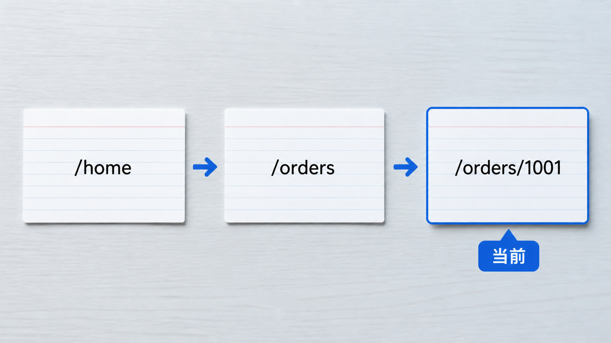

# 第 01 课：浏览器地址与历史栈

## 先记住一个模型

把浏览器历史理解成一叠卡片，浏览器始终指向其中一张：



```text
[/home] → [/orders] → [/orders/1001]
                         ↑ 当前页面
```

每张卡片至少包含：

```text
URL
当前条目的 state
浏览器内部信息
```

## 四个基本动作

| 动作           | 卡片发生什么变化                 |
| -------------- | -------------------------------- |
| `pushState`    | 在当前卡片后新增一张，并移动过去 |
| `replaceState` | 替换当前卡片，不新增卡片         |
| `back()`       | 向左移动一张                     |
| `forward()`    | 向右移动一张                     |

如果回退后再执行 `pushState`，原来的“前进记录”会被丢弃：

```text
A → B → C
    ↑ 回退到 B

在 B push D

A → B → D
        ↑ C 不再可前进
```

## 两个容易误解的地方

### `history.length` 不是当前下标

它表示当前标签页会话中的历史条目数量，但浏览器没有公开当前完整历史列表，也没有公开当前指针下标。

### JavaScript 不能读取所有访问历史

案例页面展示的历史栈是自己维护的“影子历史栈”，只用于帮助学习，不是浏览器向网页开放了完整历史。

## 动手实验

打开[案例 01：History 可视化实验](./案例/01-History可视化实验/index.html)，观察页面顶部的：

- 当前 URL；
- `history.length`；
- `history.state`；
- 影子历史栈；
- 事件日志。

依次执行：

```text
push 页面 A
push 页面 B
浏览器回退
push 页面 C
尝试浏览器前进
```

## 本课结论

```text
浏览器 History 是“历史条目 + 当前指针”，不是一个普通数组。
网页可以新增、替换和移动，但不能读取用户的完整浏览历史。
```
