# 自定义封装micro-router路由适配

**勘误：**

> 补充说明一下前面关于 qiankun 路由冲突的表述。  
>
> 我们讲到，不同路由库写入的 `history.state` 结构不同，React 子应用导航以后，主应用 Vue Router 可能读取不到自己需要的 `current`，最终生成 `undefined/`。这个核心分析是成立的，在 [Vue Router PR #1219](https://github.com/vuejs/router/pull/1219) 中有几乎相同的复现和源码分析。  
>
> 但需要收紧适用范围：这不是说所有 Vue、React 子应用接入 qiankun 都必然报错，也不是说 qiankun 完全不能处理路由。
>
> 更准确地说是 qiankun/single-spa 路由调度与 Vue Router 4、React Router 共享 History 时的兼容问题，并非所有 qiankun 基础接入都会发生。

## 一、这节课要解决什么问题

主应用、Vue 子应用和 React 子应用组合到同一个页面以后，共享的是同一个浏览器地址栏和同一套 History。

这会带来四个连续的问题：

```text
问题一：三个 Router 都操作 history.state，会不会互相覆盖？
问题二：再次进入子应用时，怎样回到上次访问的业务页面？
问题三：切走子应用以后，怎样保留表单和组件内存状态？
```

最终系统需要做到：

```text
路径互不污染
+ history.state 互不覆盖
+ 浏览器前进、后退正确
+ 主动进入应用时恢复最后路由
+ 切换应用时保留组件实例
+ 退出登录时清理旧用户状态
```

完整结构如下：

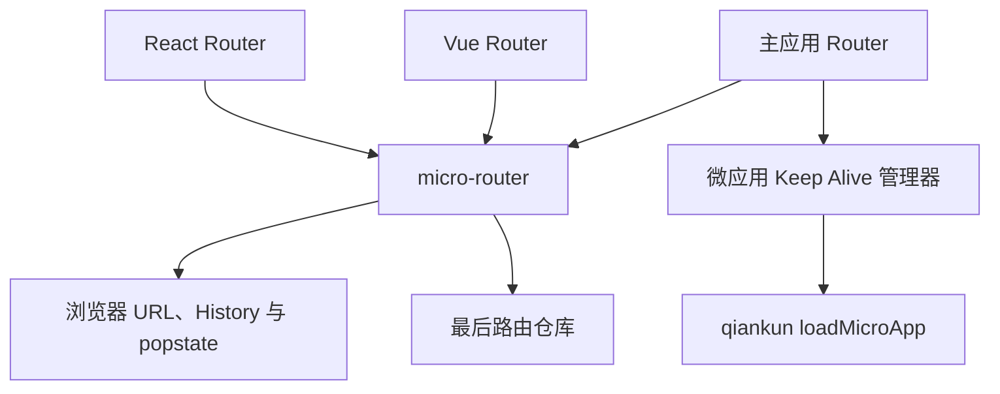

micro-router 解决路由适配、状态隔离和路由同步；Keep Alive 管理器解决应用实例的加载、隐藏、复用与淘汰。

---

## 二、先理解浏览器 History

### 1. 浏览器历史记录不是一个字符串

用户每访问一个新地址，浏览器历史栈就会增加一条历史记录。

一条历史记录至少可以这样理解：

```text
历史记录
├─ URL
└─ state
```

例如：

```text
第 1 张：/fulfillment
第 2 张：/fulfillment/orders
第 3 张：/settlement
第 4 张：/settlement/batches
```

浏览器的前进和后退，就是在这些历史记录之间移动。


### 2. pushState、replaceState 和 popstate

路由库最终都要使用浏览器 History API。理解这三个 API 时，不要把它们看成三个互相触发的函数，而要先把浏览器历史想成：

```text
多张历史卡片 + 一个指向当前卡片的指针
```

其中：

```text
pushState、replaceState：主动写历史记录
popstate：指针在已有历史记录之间移动后的通知
```

#### pushState

```ts
history.pushState(state, "", "/fulfillment/orders");
```

作用：

```text
创建一条新的历史记录
+ 修改地址栏
+ 保存这一条记录的 state
```

例如当前有一张 `/fulfillment`：

```text
执行前：[/fulfillment]

pushState("/fulfillment/orders")

执行后：[/fulfillment] [/fulfillment/orders]
                              ↑ 当前卡片
```

地址栏会立即变化，但浏览器不会刷新页面，也不会自动触发 `popstate`。页面内容是否变化，由发起这次跳转的 Router 自己处理。

#### replaceState

```ts
history.replaceState(state, "", "/fulfillment/orders");
```

作用：

```text
修改当前历史记录
不新增历史记录
```

例如：

```text
执行前：[/fulfillment]

replaceState("/fulfillment/orders")

执行后：[/fulfillment/orders]
                  ↑ 仍然只有一张卡片
```

它同样会立即修改地址栏和当前卡片的 state，但不会刷新页面，也不会自动触发 `popstate`。

#### popstate

`popstate` 是一个事件。

用户点击浏览器前进、后退，或者代码调用 `history.back()`、`history.forward()`、`history.go()` 时，浏览器会在已有历史卡片之间移动。移动完成后，浏览器触发 `popstate`，通知页面：

```text
当前历史卡片已经换了
URL 和 state 也已经换了
```

Router 收到通知后，才会读取目标卡片的 URL 和 state，恢复对应页面。

```text
[/fulfillment] [/fulfillment/orders]
                         ↑ 当前卡片

用户点击后退

[/fulfillment] [/fulfillment/orders]
       ↑ 当前卡片
       ↓
浏览器触发 popstate
```

所以三者的关系是：

| 操作             | 对历史记录做什么                 | 是否立即修改 URL | 是否自动触发 `popstate` |
| ---------------- | -------------------------------- | ---------------- | ----------------------- |
| `pushState`      | 新增一张卡片，并把指针移到新卡片 | 是               | 否                      |
| `replaceState`   | 替换当前卡片                     | 是               | 否                      |
| 前进、后退、`go` | 把指针移到已有卡片               | 是               | 是                      |

### 3. 一个 Router 怎样使用这三个能力

只看 API 定义，很容易觉得 `pushState`、`replaceState` 和 `popstate` 是割裂的。把它们放回 Router 的一次完整导航中，关系就清楚了。

Router 需要处理两类导航。

#### 第一类：应用主动导航

例如用户点击页面里的“订单列表”：

```text
用户点击链接
→ Router 决定进入 /orders
→ Router 更新自己的当前路由和页面
→ Router 调用 pushState 写入浏览器历史
```

这次导航是 Router 自己发起的，所以 Router 已经知道目标地址，不需要再等一个 `popstate` 告诉自己。

如果这次导航要新增一条历史记录，Router 使用 `pushState`；如果只是重定向、初始化或修正当前记录，Router 使用 `replaceState`。

#### 第二类：浏览器前进或后退

用户点击浏览器后退按钮时，不是 Router 决定要去哪里，而是浏览器把历史指针移动到上一张卡片：

```text
浏览器移动到上一张历史卡片
→ URL 和 history.state 变成目标卡片的数据
→ 浏览器触发 popstate
→ Router 收到通知
→ Router 读取新的 URL 和 state
→ Router 恢复对应页面
```

这时 Router 必须依赖 `popstate`，因为这次导航不是它主动发起的。这里的“依赖”不是指 Router 在 `popstate` 回调中再次调用 `pushState`，而是指 Router 在初始化时注册一个 `popstate` 监听器：浏览器完成前进或后退后，监听器读取新的 URL 和 state，再更新 Router 的内部当前路由和页面。

可以把它理解成下面的简化代码：

```ts
window.addEventListener("popstate", (event) => {
  const nextPath = window.location.pathname;
  const nextState = event.state;

  // 读取浏览器已经切换好的地址和 state，恢复 Router 和页面。
  router.restore(nextPath, nextState);
});
```

#### 放到微前端里会发生什么

浏览器原生的 `pushState` 和 `replaceState` 不会触发 `popstate`，但 qiankun 底层的 single-spa 会代理这两个方法。

子应用调用 `pushState` 或 `replaceState` 并改变 URL 后，single-spa 为了重新判断哪些微应用应该激活，会主动创建一次模拟的 `popstate`，并调用页面中已经登记的路由监听器。

```text
子应用 Router 调用 pushState
→ 浏览器 URL 和 history.state 被更新
→ single-spa 发现 URL 变化
→ single-spa 模拟一次 popstate
→ 主应用和其他 Router 的监听器也可能被调用
```

这就是它和微前端路由冲突的直接关系。

例如 React 子应用写入：

```ts
{
  usr: null,
  key: "react-key",
  idx: 1,
}
```

主应用 Vue Router 4 收到 single-spa 模拟的 `popstate` 后，可能把这份 state 当成自己的导航状态。但 Vue Router 需要的是 `current`、`position`、`back` 等字段。下一次主应用执行 `router.push()` 时，`currentState.current` 就可能是 `undefined`，最终生成错误地址。

```text
React Router 写入 React state
→ single-spa 模拟 popstate
→ 主应用 Vue Router 4 收到 React state
→ Vue Router 所需字段缺失
→ 下一次导航出现 undefined URL
```

因此，后面的 micro-router 主要处理两件事：

```text
state 分槽：不同 Router 不再互相覆盖 history.state
事件过滤：只让应该响应的 Router 处理这次路由变化
```

## 三、为什么微前端会出现路由冲突

### 1. 问题出现的前提

普通单页应用通常只有一个 Router。它发起导航、写入 `history.state`，也负责处理 `popstate`，所以读写的是同一套数据。

微前端场景不同：

```text
主应用 Vue Router 4 始终运行
履约中心和结算中心拥有自己的 Router
Keep Alive 可能让非激活子应用继续保留实例
所有 Router 共享同一份 window.history
```

浏览器不会为每个应用分别提供 URL、History 和 `history.state`。因此，需要明确每个 Router 可以读写哪些数据，以及哪些路由事件应该由它处理。

这不是说所有 qiankun 项目都会发生路由冲突。这里讨论的是当前 Router 版本、Keep Alive 和路由使用方式组合后实际复现的问题。

### 2. Vue Router 4 为什么会受到影响

Vue Router 4 会在 `history.state` 中保存 `current`、`position`、`back` 等导航信息，并假定自己收到的路由状态是有效的。

如果另一个 Router 发起导航，写入了不同结构或不同语义的 state，主应用 Vue Router 4 又接收并保存了这次外部导航状态，下一次执行 `router.push()` 时就可能读不到所需字段：

```text
子应用 Router 修改 URL 和 history.state
→ qiankun / single-spa 执行全局路由协调
→ 主应用 Vue Router 4 收到外部导航
→ history.state 不符合主应用 Router 的预期
→ current 等字段缺失
→ 导航可能生成 undefined URL
```

React Router 的 state 结构与 Vue Router 明显不同，因此容易暴露这个问题；但问题不只取决于框架是否不同。多个 Vue Router 实例共享 History 时，也可能因为路径语义、state 内容或监听范围不同而发生误响应。

### 3. 需要处理的三个边界

#### 边界一：state 不能互相覆盖

主应用和每个子应用都需要保留自己的路由状态，不能把整份 `history.state` 当作自己的私有空间。

#### 边界二：路由变化需要同步

浏览器原生的 `pushState` 和 `replaceState` 不会自动触发 `popstate`。子应用修改 URL 后，主应用 Router 的内部位置仍然需要按约定同步。

#### 边界三：Router 只能处理属于自己的事件

浏览器前进、后退以及 qiankun / single-spa 的路由协调都可能让多个监听器收到通知。非激活应用或路径不属于当前 base 的 Router 不应该更新自己的路由状态。

## 四、整体解决方案：在 Router 和浏览器之间增加适配层

micro-router 位于框架 Router 与浏览器之间：

```text
Vue Router / React Router
            ↓
        micro-router
            ↓
浏览器 URL、history.state、popstate
```

它主要解决四件事：

| 能力       | 作用                                       |
| ---------- | ------------------------------------------ |
| 路径转换   | 在子应用内部路径与浏览器完整路径之间转换   |
| state 分槽 | 每个 Router 只读写自己的 state             |
| 框架适配   | 分别适配 Vue Router 和 React Router        |
| 主应用同步 | 子应用导航后，让主应用 Router 跟上真实 URL |


> micro-router 是放在 Vue Router、React Router 和浏览器 History 之间的一层适配器。因为浏览器只有一个 URL、一套历史栈和一份 `history.state`，多个 Router 直接使用时会争抢这些共享资源。micro-router 一方面负责转换子应用内部路径和浏览器完整路径，另一方面在 `history.state` 中按应用名进行分槽，让每个 Router 只读写自己的状态；同时，它还会适配不同框架的 Router，并把子应用导航同步给主应用。最终效果是：每个 Router 看起来都像在独立运行，实际上由 micro-router 协调它们安全地共享同一个浏览器 History。

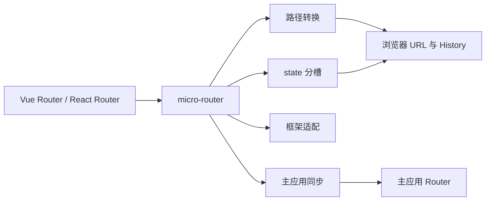

### 代码分层

| 层次       | 关键文件              | 主要职责                            |
| ---------- | --------------------- | ----------------------------------- |
| 通用核心   | `path.ts`             | 路径转换和 base 边界判断            |
| 通用核心   | `scoped-state.ts`     | 读取、合并和写入应用 state          |
| 通用核心   | `navigation-event.ts` | 定义主应用与子应用之间的路由消息    |
| 通用核心   | `route-store.ts`      | 保存每个应用最后访问的地址          |
| Vue 适配   | `native-history.ts`   | 向 Vue Router 提供 RouterHistory    |
| React 适配 | `native-window.ts`    | 向 React Router 提供隔离后的 window |
| 主应用适配 | `vue.ts`              | 同步主应用 Router                   |
| 应用管理   | `micro-apps.ts`       | 加载、隐藏、复用和淘汰微应用        |

这些文件不是八套互不相关的逻辑，而是在回答：

```text
路径怎么转换？        path.ts
state 怎么隔离？       scoped-state.ts
子应用怎样通知主应用？ navigation-event.ts
主应用怎样跟上 URL？   vue.ts
实例怎样保活？         micro-apps.ts
```

---

## 五、业务应用怎样接入 micro-router

业务路由表不需要添加主应用前缀，只替换 Router 的创建入口。

### 1. Vue 履约中心

履约中心的路由创建代码：

**代码文件：履约中心 `router.ts`**

```ts
import { createMicroVueHistory } from "@supply-chain/micro-router/vue";
import { createRouter, createWebHistory } from "vue-router";

export function createFulfillmentRouter() {
  return createRouter({
    history: createMicroVueHistory({
      appName: "fulfillmentApp",
      base: "/fulfillment",
      standalone: () => createWebHistory(),
    }),
    routes: [
      {
        path: "/",
        children: [
          { path: "", component: HomeView },
          { path: "orders", component: OrdersView },
          { path: "orders/:id", component: OrderDetailView },
        ],
      },
    ],
  });
}
```

Vue Router 内部仍然使用：

```text
/
/orders
/orders/1001
```

嵌入主应用后，浏览器显示：

```text
/fulfillment/
/fulfillment/orders
/fulfillment/orders/1001
```

`createMicroVueHistory` 接收三个关键参数：

| 参数         | 含义                              |
| ------------ | --------------------------------- |
| `appName`    | 当前应用名称，也是 state 槽位名称 |
| `base`       | 当前应用占用的浏览器路径范围      |
| `standalone` | 非嵌入环境使用的原生 Vue History  |

它会根据运行环境返回：

```text
独立运行：createWebHistory()
嵌入运行：micro-router 的 native history
```

当前产品仍以主应用为统一入口；这里保留独立 History，是路由适配器的工程能力，不代表独立地址一定是正式业务入口。

### 2. React 结算中心

结算中心的路由创建代码：

**代码文件：结算中心 `router.tsx`**

```tsx
import { createMicroReactRouter } from "@supply-chain/micro-router/react";
import { qiankunWindow } from "vite-plugin-qiankun/dist/helper";

export function createSettlementRouter() {
  return createMicroReactRouter({
    appName: "settlementApp",
    base: "/settlement",
    routes,
    embedded: Boolean(qiankunWindow.__POWERED_BY_QIANKUN__),
    window: qiankunWindow as unknown as Window,
    standalone: "hash",
  });
}
```

React Router 内部仍然使用：

```text
/
/batches
/batches/1001
```

嵌入主应用后，浏览器显示：

```text
/settlement/
/settlement/batches
/settlement/batches/1001
```

独立运行时配置为 Hash Router；嵌入运行时使用 Browser Router。

Vite 子应用还显式传入 `qiankunWindow`。这样即使模块在卸载后被缓存，再次挂载时仍能使用插件捕获的运行时窗口。

### 3. 主应用只管理应用级路由

主应用只需要声明：

**代码文件：主应用路由模块的 `index.ts`**

```ts
{
  path: '/fulfillment/:pathMatch(.*)*',
  meta: { microApp: true },
}

{
  path: '/settlement/:pathMatch(.*)*',
  meta: { microApp: true },
}
```

主应用知道：

```text
/fulfillment 属于履约中心
/settlement 属于结算中心
```

主应用不需要理解 `/orders` 和 `/batches` 的业务含义。

---

## 六、micro-router 内部主要做四件事

第五章看到的是业务应用怎样使用 micro-router：

```text
Vue 子应用调用 createMicroVueHistory
React 子应用调用 createMicroReactRouter
```

接下来需要打开 micro-router，看看这两个方法内部究竟做了什么。

它的实现可以归纳为四件事：

| 顺序     | 主要工作                        | 解决的问题                           |
| -------- | ------------------------------- | ------------------------------------ |
| 第一件事 | 转换路径                        | 子应用内部路径与浏览器完整路径不同   |
| 第二件事 | 隔离 `history.state`            | 多个 Router 不能互相覆盖数据         |
| 第三件事 | 适配 Vue Router 和 React Router | 两个 Router 提供的接入方式不同       |
| 第四件事 | 同步主应用 Router               | 子应用修改地址后，主应用不会自动更新 |

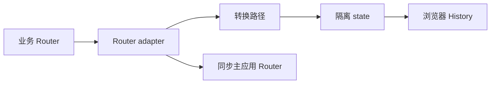

---

## 七、第一件事：转换路径

子应用只关心自己的业务路径：

```text
履约 Router：/orders
结算 Router：/batches
```

浏览器需要带上应用前缀：

```text
/fulfillment/orders
/settlement/batches
```

所以 micro-router 在两个方向上转换：

```text
进入子应用：
浏览器完整路径 - 应用 base = 子应用内部路径

子应用导航：
应用 base + 子应用内部路径 = 浏览器完整路径
```

**代码文件：micro-router 核心文件 `path.ts`**

```ts
toInternalLocation("/fulfillment/orders", "/fulfillment"); // /orders

toBrowserLocation("/orders", "/fulfillment"); // /fulfillment/orders
```

这一部分解决的是：

> 子应用路由表不用重复添加 `/fulfillment`、`/settlement` 前缀。

---

## 八、第二件事：隔离 history.state

主应用、Vue 子应用和 React 子应用共享同一个 `window.history`，但三个 Router 保存的 state 结构不同。

micro-router 在 `history.state` 中为每个子应用分配独立位置：

```ts
{
  // 主应用 Router 的 state 保留在顶层
  back: "/",
  current: "/fulfillment/orders",

  __MICRO_ROUTER__: {
    fulfillmentApp: {
      current: "/orders",
      position: 1,
    },

    settlementApp: {
      key: "react-key",
      idx: 1,
    },
  },
}
```

写入时只更新当前应用，保留其他数据：

**代码文件：micro-router 核心文件 `scoped-state.ts`**

```ts
return {
  ...sharedState,
  [MICRO_ROUTER_STATE_KEY]: {
    ...microStates,
    [appName]: scopedState,
  },
};
```

三个核心方法：

| 方法               | 作用                         |
| ------------------ | ---------------------------- |
| `readScopedState`  | 读取当前应用自己的 state     |
| `mergeScopedState` | 只更新当前应用，保留其他应用 |
| `writeScopedState` | 合并后写入浏览器 History     |

这一部分解决的是：

> Vue Router、React Router 和主应用 Router 不再互相覆盖路由数据。

---

## 九、第三件事：适配 Vue Router 和 React Router

路径转换和 state 分槽是通用能力，但 Vue Router 与 React Router 的接入方式不同。

### 1. Vue Router 使用自定义 History

Vue Router 允许传入一份自定义 `RouterHistory`。

**代码文件：micro-router Vue 适配入口 `index.ts`**

```ts
if (!embedded) {
  return options.standalone?.() ?? createWebHistory();
}

return createNativeVueHistory(options.appName, options.base, runtimeWindow);
```

`createNativeVueHistory` 可以简单理解：

> 它给 Vue Router 提供了一套“看起来属于子应用、实际上操作真实浏览器 History”的自定义 History。

它不是重新实现 Vue Router，也不负责路由表匹配和组件渲染。

```
路由表匹配、守卫、组件渲染
→ 仍由 Vue Router 负责

路径转换、state 隔离、浏览器 History、前进后退
→ createNativeVueHistory 负责
```

#### 为什么不能直接使用 `createWebHistory()`

假设履约子应用的基础路径是：

```
/fulfillment
```

子应用内部只认识：

```
/orders
```

浏览器实际需要显示：

```
/fulfillment/orders
```

如果直接使用 Vue Router 的 `createWebHistory()`，它就会直接操作真实的：

```
window.location
window.history
window.history.state
```

于是会遇到三个问题：

1. 子应用内部路径和浏览器完整路径不是同一个字符串。
2. 子应用会覆盖主应用的 `history.state`。
3. 子应用修改 URL 后，主应用 Router 不一定知道地址已经变化。

因此需要在 Vue Router 与浏览器之间放一层：

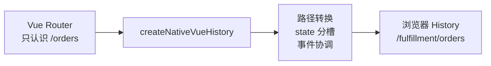

#### 为什么它能交给 Vue Router 使用

Vue Router 创建 Router 时并不强制要求使用官方的 `createWebHistory()`。

它需要的只是一个符合 `RouterHistory` 接口的对象，大致包含：

```
{
  location,
  state,
  push(),
  replace(),
  go(),
  listen(),
  createHref(),
  destroy()
}
```

`createNativeVueHistory()` 最后返回的正是这样一个对象。

因此 Vue Router 只知道：

```
我拿到了一套可以读取位置、跳转、监听前进后退的 History。
```

它并不知道这套 History 的背后还做了路径转换和 state 分槽。

这就是适配器模式：

```
Vue Router 需要 RouterHistory 接口
             ↑
createNativeVueHistory 实现这个接口
             ↓
内部协调真实浏览器 History
```

> `createNativeVueHistory` 是 Vue Router 与浏览器 History 之间的适配器。它返回了 Vue Router 提供标准的 `RouterHistory` 接口，让子应用只看到 `/orders` 这样的内部路径和自己的 state；对浏览器则转换成 `/fulfillment/orders` 这样的完整路径，并把子应用 state 合并到共享 `history.state` 的独立槽位。子应用主动跳转时，它负责写入真实 History 并通知主应用；浏览器前进后退或主应用跳转时，它又把真实 URL 转换回来，通知 Vue Router 更新页面。

```txt
createNativeVueHistory 的两个方向

Vue Router → 浏览器
内部路径 → 完整路径 → state 分槽 → 写入 History → 同步主应用

浏览器 → Vue Router
URL/popstate → 去掉 base → 读取自己的 state → 通知 Vue Router
```

### 2. React Router 使用代理 window

React Router 允许直接注入一份自定义 `window`，所以我们只需要给它一个代理 window，剩下的 History 逻辑继续使用 React Router 自己的实现。

**代码文件：micro-router React 适配入口 `index.ts`**

```ts
return createBrowserRouter(options.routes, {
  basename: normalizeBase(options.base),
  window: createScopedWindow(options.appName, options.base, runtimeWindow),
});
```

真正的适配逻辑是`createScopedWindow`，`createScopedWindow` 是一个 Proxy：

React Router 会继续使用自己原本的浏览器 History 实现。

我们只需要在它访问浏览器 API 时“动一点手脚”：

```
React Router
→ 访问代理 window
→ 代理 window 拦截关键操作
→ 其余操作交给真实 window
```

因此，不需要自己实现完整的 Router History。

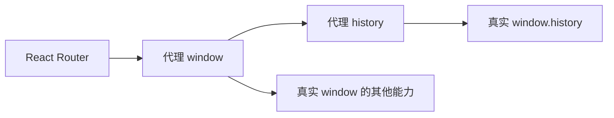

主要干了三层事情：

#### 第一层：代理 `window.history`

当 React Router 读取：

```
window.history.state
```

代理不会返回完整共享状态，而是：

```
readScopedState(history, appName)
```

只返回：

```
history.state.__MICRO_ROUTER__.settlementApp
```

所以 React Router 以为：

```
history.state = {
  key: "abc",
  idx: 2,
};
```

真实浏览器中其实是：

```
history.state = {
  // 主应用状态
  current: "/settlement/batches",
  position: 3,

  __MICRO_ROUTER__: {
    fulfillmentApp: {
      current: "/orders",
    },

    settlementApp: {
      key: "abc",
      idx: 2,
    },
  },
};
```

#### 第二层：拦截 `pushState()` 和 `replaceState()`

React Router 调用：

```
window.history.pushState(
  reactState,
  "",
  "/settlement/batches",
);
```

代理会改成：

```
读取真实共享 state
→ 把 reactState 合并到 settlementApp 槽位
→ 保留主应用和其他子应用的 state
→ 调用真实 history.pushState
→ 通知主应用 Router
```

核心代码是：

```
const nextState =
  mergeScopedState(history, appName, state);

history[property](nextState, unused, url);
```

所以 React Router 认为自己写入了：

```
{
  key: "abc",
  idx: 2,
}
```

实际写入的是合并后的共享结构。

#### 第三层：代理 `popstate` 监听

React Router 会注册：

```
window.addEventListener("popstate", listener);
```

React Router 会监听 `popstate`，用来处理浏览器前进和后退。但页面里有多个子应用，浏览器触发一次 `popstate`，所有 Router 都可能收到，所以 micro-router 会先判断当前 URL 属于哪个子应用，只通知对应的 Router。

如果是主应用主动跳转，`pushState` 不会触发 `popstate`，所以 micro-router 会给对应的 React Router 模拟一次 `popstate`，提醒它重新读取 URL、更新页面。

```txt
浏览器前进后退
→ 过滤 popstate
→ 只通知当前子应用

主应用主动跳转
→ 不会产生 popstate
→ micro-router 模拟一次
→ 通知对应子应用
```

简单来说，micro-router 在这里就是一个事件调度器：该通知谁就通知谁，缺少通知时就补一次。

---

## 十、第四件事：让主应用 Router 跟上地址变化

子应用跳转以后，浏览器地址已经变了，但主应用 Router 不一定知道。因为子应用调用的是 `history.pushState()`，它既没有调用主应用的 `router.push()`，也不会自动触发 `popstate`。
所以 micro-router 会在子应用跳转完成后**通知**主应用，主应用修正自己的路由状态，再模拟一次 `popstate`，让主应用 Router 重新读取当前地址。注意，这里不能再调用一次 `router.push()`，否则同一次跳转会产生两条历史记录。

流程大致如下：

```
子应用修改真实 URL
→ 通知主应用
→ 主应用修正自己的 state
→ 模拟 popstate
→ 主应用 Router 重新读取 URL
```

也就是micro-router 不仅负责让子应用写对地址，还负责让主应用知道地址已经变化。
这一部分没有新的路由原理，主要是事件通知和状态同步的工程代码。

### 1. 为什么需要同步

子应用导航时，最终调用的是：

```ts
window.history.pushState(state, "", "/fulfillment/orders");
```

它没有调用主应用的 `router.push`，而且 `pushState` 不会自动触发 `popstate`。

> 简单来说，子应用点击内部菜单以后，浏览器地址已经从 `/fulfillment` 变成了 `/fulfillment/orders`，子应用页面也成功切换到了订单页。但是主应用 Router 可能还认为当前页面是 `/fulfillment`。

这会产生一种“表面正常、内部不同步”的状态：

```text
浏览器：       /fulfillment/orders
履约 Router：  /orders
主应用 Router：/fulfillment
```

如果主应用继续按照 `/fulfillment` 处理历史记录，浏览器后退时就可能丢失 `/orders`。

短时间内页面看起来可能没有问题，但继续操作就容易出现：

- 主应用面包屑、菜单高亮和权限判断仍停留在旧地址。
- 主应用记录的返回地址不准确。
- 浏览器前进、后退时，主应用和子应用可能恢复到不同页面。
- 主应用再次跳转时，可能基于旧的路由状态处理 History。

### 2. 子应用怎样通知主应用

子应用和主应用运行在同一个页面，可以通过共同的 `window` 发送自定义事件。

**代码文件：导航事件文件 `navigation-event.ts`**

```ts
targetWindow.dispatchEvent(
  new CustomEvent(MICRO_ROUTER_NAVIGATION_EVENT, { detail }),
);
```

主应用安装一个监听器接收事件：

**代码文件：micro-router 主应用适配文件 `vue.ts`**

```ts
targetWindow.addEventListener(
  MICRO_ROUTER_NAVIGATION_EVENT,
  handleMicroNavigation,
);
```

代码中把这个监听和同步模块叫作 host adapter，也就是“主应用路由同步器”。

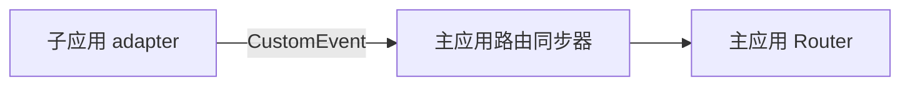

### 3. 主应用路由同步器做什么

它不再调用 `router.push`，否则会重复创建历史记录。

它只做三件事：

```text
修正当前浏览器历史记录中的主应用 state
→ 保存子应用最后访问的地址
→ 通知主应用 Router 重新读取 URL
```

主应用 Vue Router 通过 `popstate` 感知浏览器地址，因此同步器主动派发一个 `popstate`：

**代码文件：micro-router 主应用适配文件 `vue.ts`**

```ts
targetWindow.dispatchEvent(
  createSyntheticPopState(targetWindow, detail.appName),
);
```

这个事件不会让浏览器后退，只是通知主应用 Router：

```text
地址变了，请重新读取
```

最终：

```text
浏览器：       /fulfillment/orders
履约 Router：  /orders
主应用 Router：/fulfillment/orders
```

### 4. 代码中的 before 和 after

Vue 和 React adapter 会在 `pushState` 前后各发送一次导航事件：

```text
phase: "before"
→ 保存即将离开地址所需的路由信息

执行 pushState

phase: "after"
→ 保存刚进入地址所需的路由信息
→ 通知主应用 Router 更新
```

**代码文件：Vue 适配文件 `native-history.ts`**

```ts
dispatchMicroRouterNavigation({
  phase: "before",
});

// 此处执行 pushState
writeScopedState();

dispatchMicroRouterNavigation({
  phase: "after",
});
```

`before` 和 `after` 只是事件发生的时间，不是新的路由概念。

第一次学习只需要知道：

```text
子应用在修改地址前后各通知一次主应用同步器
```

不需要背诵两个阶段维护的具体 state 字段。

---

## 十一、一次导航的完整流程

以履约中心点击“订单任务”为例：

```text
1. 履约 Router 导航到内部路径 /orders

2. micro-router 转换成浏览器路径
   /fulfillment/orders

3. micro-router 合并 fulfillmentApp 的 state

4. 浏览器执行 pushState
   地址栏变成 /fulfillment/orders

5. 子应用通过 CustomEvent 通知主应用路由同步器

6. 主应用路由同步器通知主应用 Router 重新读取 URL
```

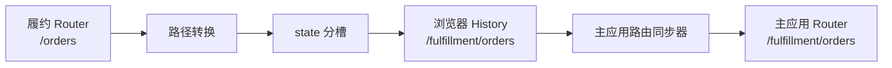

这条流程正好对应前面的四件事：

```text
→ 路径转换
→ state 隔离
→ Router adapter
→ 主应用同步
```

---

## 十二、micro-router 总结与 MicroApp 虚拟路由对比

### 1. 核心代码地图

| 主要工作   | 文件                  | 核心方法                                  |
| ---------- | --------------------- | ----------------------------------------- |
| 转换路径   | `path.ts`             | `toInternalLocation`、`toBrowserLocation` |
| 隔离 state | `scoped-state.ts`     | `readScopedState`、`mergeScopedState`     |
| Vue 适配   | `native-history.ts`   | `createNativeVueHistory`                  |
| React 适配 | `native-window.ts`    | `createScopedWindow`                      |
| 通知主应用 | `navigation-event.ts` | `dispatchMicroRouterNavigation`           |
| 同步主应用 | `vue.ts`              | `installVueMicroRouterHost`               |

### 2. 怎样理解我们实现的 micro-router

可以把 micro-router 理解成 Router 与浏览器之间的“翻译和协调层”。

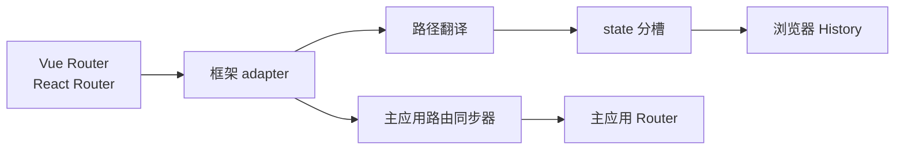

以履约中心进入订单页为例：

```text
业务 Router 说：我要去 /orders

路径翻译：
/orders → /fulfillment/orders

state 分槽：
只更新 fulfillmentApp
不覆盖主应用和结算中心

浏览器 History：
新增 /fulfillment/orders

主应用同步：
让主应用 Router 也知道当前是 /fulfillment/orders
```

所以 micro-router 主要完成：

```text
对业务 Router：
继续使用熟悉的内部路径和导航 API

对浏览器：
维护真实 URL 和共享 history.state

对主应用：
同步子应用造成的地址变化
```

### 3. 回想 MicroApp：我们其实在做同一件事

前面使用 MicroApp 时，子应用 Router 并不是毫无约束地直接操作浏览器，而是先经过 MicroApp 提供的虚拟路由层：


我们现在实现的 micro-router，也是把一个路由层放在子应用 Router 和浏览器之间：

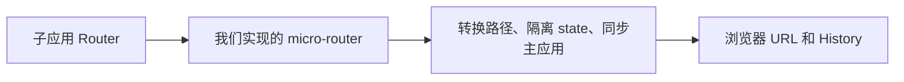

所以两者解决的是同一个问题，思路也是相同的：

```text
不要让多个 Router 直接争用浏览器路由
而是在 Router 和浏览器之间增加一层
由这一层负责隔离、转换和同步
```

当前方案最接近之前使用过的 MicroApp `native` 模式：子应用的业务路径最终会出现在真实地址栏中，因此刷新、复制链接和浏览器前进后退仍然可以围绕真实 URL 工作。

---

## 十三、micro-router 完成后还要做什么

micro-router 解决路由隔离和同步后，还要完成三件事：

1. 记录每个子应用最后访问的页面，再次进入时恢复该页面。
2. 切换子应用时保留组件实例和页面状态。
3. 限制缓存数量，并在退出登录时清除缓存和路由记录。

---

## 十四、路由保持的原理

路由保持就是记录每个子应用最后访问的完整路径：

```ts
{
  fulfillmentApp: "/fulfillment/orders",
  settlementApp: "/settlement/batches",
}
```

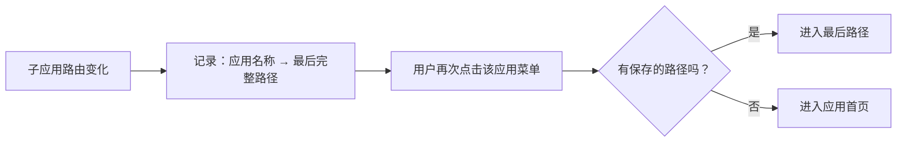

路径保存在 `sessionStorage` 中，所以刷新页面后仍然存在；关闭标签页后由浏览器清理。

涉及文件：

| 文件                   | 作用                     |
| ---------------------- | ------------------------ |
| `route-store.ts`       | 保存、读取和清除最后路由 |
| `micro-router-host.ts` | 连接路由同步器与路由仓库 |
| `App.vue`              | 生成主应用菜单的目标地址 |

路由保持只恢复访问位置，不会保留组件实例。组件状态需要由下一章的 Keep Alive 解决。

---

## 十五、为什么普通 qiankun 自动注册不能保留组件状态

常见的自动注册方式是：

```ts
registerMicroApps(apps);
start();
```

qiankun 根据 `activeRule` 自动管理：

```text
地址匹配 → mount
地址不匹配 → unmount
```

子应用卸载时：

```text
Vue：app.unmount()
React：root.unmount()
```

组件树、DOM 和内存状态都会被销毁。

所以只保存最后路径不能保留：

- 未提交的表单；
- 组件局部 state；
- 展开和折叠状态；
- 页面滚动位置；
- 已经创建的组件实例。

真正的应用级 Keep Alive 要做到：

```text
第一次进入：加载并挂载
切走应用：隐藏，不卸载
再次进入：显示原来的实例
缓存淘汰：才真正卸载
```

---

## 十六、Keep Alive 管理器怎样工作

### 1. 使用 loadMicroApp 手动控制实例

`loadMicroApp` 是 qiankun 提供的 API。

**代码文件：主应用 `micro-apps.ts`**

```ts
const instance = loadMicroApp(
  {
    name: definition.appName,
    entry: definition.entry,
    container: definition.container,
  },
  {
    singular: false,
    sandbox: true,
  },
);
```

它返回一个可管理的微应用实例，主要包含：

```text
mountPromise
unmount()
getStatus()
```

主应用把实例存进缓存：

**代码文件：主应用 `micro-apps.ts`**

```ts
const cache = new Map<string, CachedMicroApp>();
```

以后再次进入相同应用，不再调用 `loadMicroApp`，而是复用 Map 中的实例。

### 2. 为什么 singular 必须是 false

**代码文件：主应用 `micro-apps.ts`**

```ts
start({
  prefetch: false,
  singular: false,
});
```

`singular: false` 允许多个微应用保持已挂载状态。

页面上仍然只显示当前活动应用；其他应用虽然已经挂载，但容器处于隐藏状态。

### 3. 每个应用必须有独立持久容器

主应用提供两个始终存在的容器：

**代码文件：主应用 `App.vue`**

```html
<main v-show="route.meta.microApp">
  <section id="micro-app-fulfillment"></section>

  <section id="micro-app-settlement"></section>
</main>
```

为什么不能共用一个容器？

```text
如果履约中心没有卸载
结算中心就不能覆盖履约中心仍在使用的 DOM 容器
```

切换时只改变 `hidden`：

```text
进入履约中心：
显示 fulfillment 容器
隐藏 settlement 容器

进入结算中心：
隐藏 fulfillment 容器
显示 settlement 容器
```

隐藏容器不会销毁里面的 DOM 和组件树。

### 4. 第一次进入应用

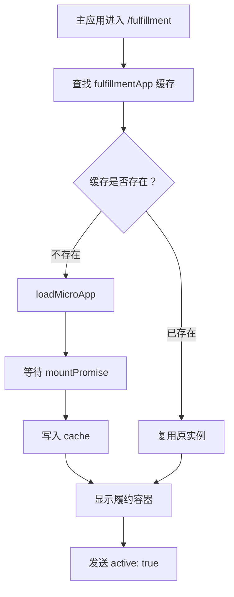

### 5. 切走再回来

```text
从履约切到结算
  → 履约收到 active: false
  → 隐藏履约容器
  → 加载或显示结算实例
  → 结算收到 active: true

再次回到履约
  → 从缓存取得原来的履约实例
  → 显示履约容器
  → 履约收到 active: true
```

整个过程没有再次执行：

```text
createApp
createRoot
unmount
```

因此表单内容能够保留。

### 6. 只想保留一个表单，需要保活整个子应用吗

可能会。只需要恢复少量表单字段时，通常应该先保存草稿，而不是直接保活整个子应用。

应用级 Keep Alive 保留的是整个子应用：

```text
一个表单的数据
+ 当前已挂载的组件树和应用外壳
+ 子应用的全局 Store
+ Router
+ 事件监听器、定时器和运行时数据
```

它不会把尚未进入的所有页面都创建出来，已经下载的静态资源也不会因为卸载而从浏览器缓存中消失。真正需要评估的是当前已挂载应用占用的内存和持续运行的任务。

如果大型子应用中只有一个表单需要恢复，为了这个表单长期保留整个应用，保留范围仍然可能大于实际需求。

这时应该先判断真正要保留的是什么：

| 实际需求                         | 更合适的方案                           |
| -------------------------------- | -------------------------------------- |
| 只保留表单字段                   | 保存表单草稿，不保活整个子应用         |
| 多个页面都要保留，且应用切换频繁 | 使用应用级 Keep Alive，并限制缓存数量  |
| 某个功能长期需要独立保活         | 评估是否把它拆成更小、边界清楚的子应用 |

#### 方案一：保存表单草稿

表单内容变化时，把真正需要恢复的字段保存下来；再次进入页面时重新读取草稿。


草稿可以保存在：

```text
sessionStorage：只要求当前标签页临时恢复
IndexedDB：本地草稿较大或结构较复杂
后端草稿接口：要求跨设备恢复、多人协作或可靠保存
```

企业项目中的重要业务表单通常优先使用后端草稿接口。浏览器本地存储更适合教学演示或非敏感的临时数据。

#### 方案二：应用级 Keep Alive

只有在下面这些条件成立时，才适合保活整个子应用：

```text
多个页面都有难以重建的临时状态
用户会频繁地在多个子应用之间切换
重新挂载应用的成本较高
内存占用经过评估并且有缓存淘汰策略
```

因此，本课程使用应用级 Keep Alive，是为了完整演示微应用实例如何保留和复用；真实项目不能看到一个表单需要保留，就默认缓存整个大型子应用。

---

## 十七、隐藏应用仍然会运行

`hidden` 只是不显示容器，并不会暂停子应用中的 JavaScript：

```text
组件实例仍然存在
Router 仍然存在
事件监听器仍然存在
```

因此，主应用在切换子应用时，除了显示和隐藏容器，还会通知 Vue 路由适配器当前应用是否处于活动状态：

**代码文件：主应用 `micro-apps.ts`**

```ts
dispatchMicroRouterActivity(window, {
  appName: "fulfillmentApp",
  active: false,
});
```

Vue 路由适配器收到 `active: false` 后，暂时不响应浏览器的 `popstate`；收到 `active: true` 后，再读取一次当前地址，使 Router 与地址栏保持一致。

```text
切走应用
→ 隐藏容器
→ 通知路由适配器暂停响应

再次进入
→ 显示原来的容器和组件实例
→ 通知路由适配器重新读取当前地址
```

React 路由适配器采用路径范围过滤：只有当前地址属于 `/settlement`，才把 `popstate` 交给结算中心的 Router。

例如当前地址是 `/settlement/batches`：

```text
结算 Router：地址属于 /settlement，处理这次变化
履约 Router：地址不属于 /fulfillment，直接忽略
```

所以：

```text
hidden：只控制页面是否可见
活动状态或路径过滤：控制 Router 是否应该响应
```

---

## 十八、缓存为什么需要淘汰

Keep Alive 会保留 DOM、组件实例、监听器和内存数据，不能无限缓存。

当前配置：

**代码文件：主应用 `micro-apps.ts`**

```ts
const maxCacheSize = 2;
```

缓存记录：

**代码文件：主应用 `micro-apps.ts`**

```ts
interface CachedMicroApp {
  definition: KeepAliveAppDefinition;
  instance: MicroApp;
  lastActiveAt: number;
}
```

每次激活应用都会更新 `lastActiveAt`。

缓存超过上限后，按照 LRU 思路淘汰。

LRU 是 **Least Recently Used** 的缩写，意思是“最近最少使用”。它不是统计哪个应用总访问次数最少，而是比较哪个应用距离上次使用的时间最久。

可以把缓存理解成只有两个座位：

```text
先访问 A，再访问 B
→ 两个座位是 A、B

后来又访问一次 A
→ A 刚刚被使用，B 变成最久未使用的应用

此时再访问 C
→ 座位不够，淘汰 B，保留 A、C
```

代码中的 `lastActiveAt` 就是每个应用“上次被使用的时间”。具体淘汰流程是：

```text
找出所有非活动应用
  → 按最后激活时间排序
  → 选择最久未使用的应用
  → 发送 active: false
  → 调用 unmount()
  → 从 cache 删除
  → 清理对应容器
```

活动应用不能被淘汰。

再看一个没有重复访问的例子。假设以后增加了第三个子应用，缓存上限仍为 2：

```text
依次访问 A、B、C
当前活动应用是 C
A 最久没有使用
```

结果：

```text
保留 B、C
卸载 A
```

下次进入 A 时重新加载。

---

## 十九、退出登录为什么要同时清理两类状态

退出登录不能只删除 Token。

Keep Alive 中可能仍然保留：

- 前一个用户打开的页面；
- 未提交表单；
- 接口返回结果；
- 组件内存状态；
- 最后访问的业务地址。

完整退出顺序：

**代码文件：主应用 `App.vue`**

```ts
async function logout() {
  clearSession();
  clearMicroAppRoutes();
  await clearMicroAppCache();
  await router.push("/login");
}
```

对应职责：

| 方法                    | 清理内容                          |
| ----------------------- | --------------------------------- |
| `clearSession`          | 登录凭证和用户信息                |
| `clearMicroAppRoutes`   | sessionStorage 与内存中的最后路由 |
| `clearMicroAppCache`    | 已挂载的 Vue、React 实例及其容器  |
| `router.push('/login')` | 回到统一登录页                    |

执行顺序也很重要：

```text
先清会话和路由记录
  → 在业务容器仍存在时卸载缓存应用
  → 最后进入登录页
```

这样可以避免下一个用户看到上一个用户留下的页面状态。

---

## 课程总结

整套实现分成三层：


### micro-router

```text
转换内部路径与浏览器路径
按应用隔离 history.state
适配 Vue Router 和 React Router
让主应用 Router 跟上地址变化
```

### 路由保持

```text
记录每个应用最后访问的完整路径
再次点击应用菜单时恢复该路径
```

### Keep Alive

```text
使用 loadMicroApp 手动管理实例
切换时隐藏而不是卸载
使用独立容器、活动状态和 LRU 管理缓存
退出登录时清理路由记录和应用实例
```

最终目标不是单独实现某个 API，而是让用户获得完整体验：

```text
路由跳转正确
浏览器前进后退正确
再次进入应用时回到原页面
切换应用后表单状态仍然存在
退出登录后不残留旧用户数据
```
