# 使用通信让独立的应用协作

## 效果展示

### 主题同步

```text
履约子应用切换深色主题
  -> 主应用同步变为深色
  -> React 结算子应用保持深色

结算子应用切换浅色主题
  -> 主应用同步变为浅色
  -> Vue 履约子应用同步变为浅色
```

### 履约与结算协作

```text
结算中心创建履约核实任务
  -> 主应用显示通知
  -> 履约中心显示新的待办数量
  -> 履约子应用加载新的核实任务

履约中心完成核实
  -> 主应用显示完成通知
  -> 结算子应用重新加载结算批次
```

当前平台包含三个独立应用：

```text
portal-shell      Vue 主应用
fulfillment-app   Vue 履约子应用
settlement-app    React 结算子应用
```

独立应用拥有各自的组件、页面和业务数据，但主题、通知和跨业务协作需要在应用之间传递。

---

## 两种不同的通信需求

主题同步和业务通知看起来都属于“通信”，但它们要传递的信息并不相同。

### 第一种需求：其他应用需要知道当前值

主应用已经切换为深色主题，此时结算子应用还没有加载：

```text
  -> 主应用切换为深色
  -> 结算子应用稍后加载
  -> 结算子应用需要知道：当前是深色
```

系统必须保存一个当前值：

```ts
{
  theme: "dark",
}
```

`theme` 表示用户选择的主题，`dark` 表示深色。

后来加载的应用读取这个值，就能应用正确主题。

这种“多个应用共同读取的当前值”称为**共享状态**。

```text
共享：多个应用都可以读取
状态：描述系统现在是什么样
```

主题是共享状态，因为它描述“平台现在使用什么主题”。

待办数量也是共享状态，因为它描述“平台现在有多少条待办”。

### 第二种需求：其他应用需要知道刚刚发生了一件事

结算中心创建了一条履约核实任务，需要通知履约应用：

```text
一条履约核实任务已经创建
```

这不是一个长期保存的当前值，而是一次已经发生的动作。

这种一次性消息称为**业务事件**。

```text
业务：消息来自具体业务操作
事件：表示某件事已经发生
```

下面都是业务事件：

```text
履约核实任务已经创建
履约核实任务已经完成
订单履约已经完成
```

### 为什么必须区分

如果主题只发送一次消息：

```text
  -> 主应用发送“主题变成深色”
  -> 结算应用还没有加载
  -> 消息发送结束
  -> 结算应用加载后收不到过去的消息
```

因此主题需要保存当前值。

如果把“创建核实任务”当作当前值长期保存：

```ts
{
  lastMessage: "创建了履约核实任务",
}
```

新加载的应用无法判断：

```text
这条消息是否已经处理？
是否需要再次执行？
什么时候清除？
连续创建两条任务时怎样区分？
```

因此业务动作应该作为一次性消息发送。

### 这一区分会决定通信器怎样设计

| 信息         | 含义                   | 处理方式     |
| ------------ | ---------------------- | ------------ |
| 当前主题     | 平台现在使用什么主题   | 保存共享状态 |
| 当前待办数   | 平台现在有多少条待办   | 保存共享状态 |
| 创建核实任务 | 刚刚发生了一次业务动作 | 发送业务事件 |
| 完成核实任务 | 刚刚发生了一次业务动作 | 发送业务事件 |

```text
共享状态保存当前值
业务事件发送一次消息
```

后面虽然会把两种能力封装到同一个通信对象中，但“同一个对象”不等于“使用同一种处理方式”。这个对象内部仍然必须保留两条不同的通信线：

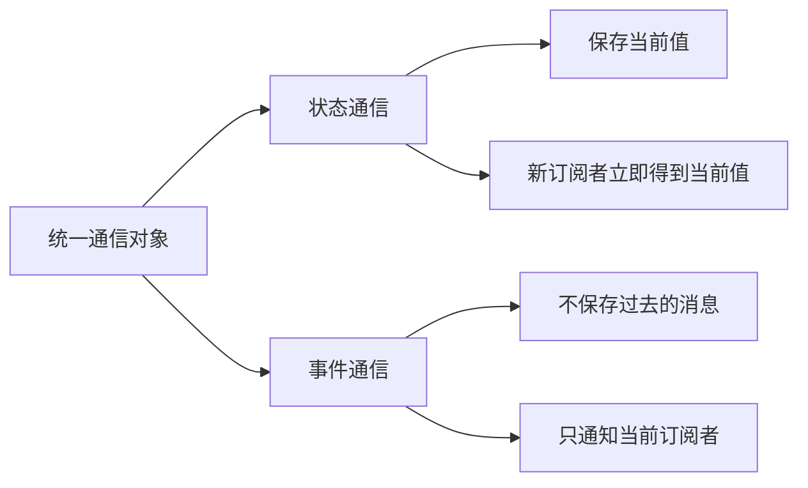

```text
主题同步要求：能保存当前值，晚加载的应用也能读取
业务通知要求：能按消息名称通知，但不能把过去的动作重新执行
```

有了这两个明确要求，接下来才能判断 qiankun 提供的通信入口能覆盖哪一部分，还缺少哪一部分。

---

## 从通信需求选择 qiankun 入口

前面已经确定了两种通信需求：

```text
当前主题、当前待办数      -> 需要保存当前值
核实任务已经创建或完成  -> 需要发送一次消息
```

下一步不是立刻编写通信代码，而是先判断 qiankun 能为每种信息提供什么。

### 入口一：qiankun 全局状态（当前项目没有使用）

qiankun 提供了一组全局状态 API：

```text
initGlobalState          初始化平台状态
onGlobalStateChange      监听状态变化
setGlobalState           修改状态
offGlobalStateChange     取消监听
```

如果选择 qiankun 内置方案，主应用可以初始化当前主题，子应用再读取和修改同一份状态：

```ts
const actions = initGlobalState({ theme: "light" });

actions.onGlobalStateChange((state) => {
  applyTheme(state.theme);
}, true);

actions.setGlobalState({ theme: "dark" });
```

第二个参数 `true` 表示注册监听时立即执行一次。因此，稍后加载的子应用不仅能收到以后的主题变化，也能立即得到当前主题。

这组 API 可以满足“多个应用都需要知道当前值”的需求，但上面的代码只是 qiankun 能力说明，**不是当前项目的实现代码**。

当前代码中没有调用 `initGlobalState`、`onGlobalStateChange` 或 `setGlobalState`。

为什么没有使用它？

如果只需要同步主题，`initGlobalState` 已经足够。但当前项目还要发送履约、结算业务消息，而 qiankun 全局状态没有提供按消息名称进行 `publish/subscribe` 的能力。

如果主题使用 `initGlobalState`，业务消息再使用另一套事件机制，项目中就会同时存在两套通信接口。因此当前项目继续向下设计一个统一通信对象，让它同时处理共享状态和业务消息。这个对象会在下一节正式定义。

### 入口二：生命周期 props 传递“能力”

主应用加载子应用时，可以通过 `props` 传入普通数据：

```ts
loadMicroApp({
  name: "settlementApp",
  entry: "//localhost:5175",
  container: "#micro-app-settlement",
  props: {
    initialTheme: "dark",
  },
});
```

也可以传入函数。比如主应用希望结算应用在创建核实任务后通知自己：

```ts
props: {
  onVerificationCreated(verification) {
    showNotification(verification);
  },
},
```

子应用可以在 `mount(props)` 中取得这些内容：

```ts
export async function mount(props) {
  console.log(props.initialTheme);
  // 核实任务创建成功后，可以调用 props.onVerificationCreated(...)
}
```

这说明 `props` 不仅能传初始化数据，还能把主应用提供的函数或对象交给子应用。

但 qiankun 只负责“传进去”，不会继续规定这些函数怎样命名、业务消息怎样分类、订阅怎样取消。每增加一种业务通知就增加一个回调，`props` 会逐渐变成一张越来越长的函数清单。

qiankun 解决的是“主应用怎样把状态或能力交给子应用”，但不会替项目决定：

```text
有哪些业务消息
消息携带什么数据
谁可以发送和接收
订阅怎样取消
子应用独立运行时怎么办
```

这些仍然需要项目自己设计。

---

## 为什么还要封装通信桥

一种可行做法是：主题直接使用 qiankun 全局状态，每一个业务动作再通过 `props` 传一个回调。

```ts
props: {
  onVerificationCreated(data) {},
  onVerificationResolved(data) {},
  onFulfillmentCompleted(data) {},
}
```

业务很少时，这样可以工作。随着消息增加，回调名称、参数类型、错误处理和清理逻辑会散落在三个应用中；主题使用一套 API，业务通知又使用另一套 API，React 与 Vue 还可能各写一份包装代码。

因此本项目把两种通信能力放到一个统一对象中：

```text
读取、修改、订阅平台当前值
发送、订阅一次性业务消息
```

这个统一对象就是**通信桥**，代码中的名称是 `platformBridge`。

先不要急着看它的方法。可以先把 `platformBridge` 想成放在三个应用中间的一个“公共通信站”：

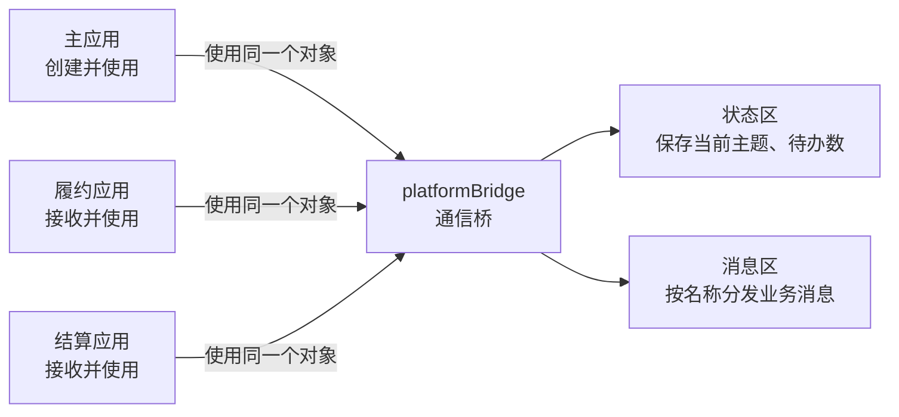

图中最重要的不是“桥”这个名字，而是下面两件事：

```text
1. platformBridge 是主应用创建的一个普通 JavaScript 对象
2. 主应用通过 qiankun props，把同一个对象交给两个子应用
```

拿到这个对象以后，三个应用都可以使用它的两块能力：

```text
状态区：像一块公共白板
        一个应用修改主题，其他正在监听的应用会收到最新主题

消息区：像一个按消息名称工作的广播站
        一个应用发布消息，通信桥找到订阅同名消息的应用并执行回调
```

例如，结算应用创建核实任务后，不需要找到履约应用并调用它的方法。它只把消息交给中间的 `platformBridge`：

```text
  -> 结算应用
  -> 发布 settlement.verification-created
  -> platformBridge 按消息名称查找订阅者
  -> 履约应用的订阅回调执行
```

因此，后文反复出现的“使用通信桥”，都可以先理解为：**应用拿到这个公共对象，通过它共享当前状态，或者收发业务消息。**

不过关键要知道为啥需要这个通信桥，子应用之间能不能直接传递信息

### 子应用之间能不能直接传递

技术上可以把履约应用的方法挂到 `window`，再由结算应用调用它。

但 qiankun 没有给结算应用提供“取得履约应用实例并调用它”的入口。qiankun 建立的是主应用与子应用之间的装载关系，不是两个子应用之间的调用关系。

如果项目自己让结算应用直接调用履约应用：

```text
结算应用 -> 履约应用.refreshVerificationList()
```

结算应用就必须知道三个细节：

```text
履约应用现在是否已经加载
履约应用把方法放在哪里
履约应用的方法叫什么名字
```

只要履约应用尚未加载，或者以后修改了方法名称，这次调用就会失败。结算应用也因此依赖了履约应用的内部实现。

应用增加以后，直接连接还会不断增加：

```text
两个子应用：A <-> B
三个子应用：A <-> B、A <-> C、B <-> C
四个子应用：还要继续增加更多连接
```

所以问题不是“技术上能不能直接传”，而是“直接传以后，子应用还能不能保持独立”。

也可以让结算应用发送浏览器 `CustomEvent`，履约应用通过 `window` 监听。这样虽然没有直接调用履约应用的方法，但 `window` 已经充当了公共消息通道，并不是真正的子应用直连。

```text
结算应用 -> window -> 履约应用
```

既然仍然需要一个公共通信器，就没有必要让业务代码到处直接使用全局 `window`。项目把通信能力封装成了有明确接口和 TypeScript 类型的 `platformBridge`，同时处理当前主题和一次性业务消息。

按照前面的想法，结算应用只能直接依赖履约应用的方法：

```text
结算应用 -> 履约应用.refreshVerificationList()
```

有了中间的通信桥之后，可以使用发布订阅模式，发送和接收变成两个互相独立的动作：

```ts
// 下面只表示调用方向，完整消息结构在后文展开

// 结算应用只负责说明发生了什么
bridge.publish({
  type: "settlement.verification-created",
  // 省略其他消息字段
});

// 履约应用自己决定收到消息后做什么
bridge.subscribe("settlement.verification-created", () => {
  void loadData(true);
});
```

通信桥按消息名称把二者匹配起来：

```text
结算应用 ──发布消息──> platformBridge ──执行订阅函数──> 履约应用
```

### 为什么通信桥由主应用创建

主应用是两个子应用共同且稳定的上层：

```text
主应用负责加载和卸载履约应用
主应用负责加载和卸载结算应用
子应用切换时，主应用仍然存在
```

因此，由主应用创建唯一的通信桥，再把它交给所有子应用，通信器的生命周期最稳定。

这里的“经过主应用”并不是让主应用收到消息后，再手工转发给履约应用：

```text
错误理解：
结算应用 -> 主应用收到 -> 主应用调用履约应用

实际过程：
结算应用 -> platformBridge -> 所有订阅这条消息的应用
```

主应用只是通信桥的创建者和管理者。消息发布后，通信桥会直接执行所有订阅者的回调。主应用可以订阅它，履约应用也可以订阅它，二者互不依赖。

这样既利用了主应用稳定的生命周期，又没有让主应用承担逐条编写转发代码的工作。

---

## 整体通信结构：主应用注入统一通信桥

主应用创建唯一的 `platformBridge`，再通过 qiankun `props` 把同一个对象传给两个子应用：

```text
  -> 主应用创建 platformBridge
  -> props 传给履约应用
  -> props 传给结算应用
  -> 三个应用连接到同一个通信器
```

必须传递同一个对象。如果三个应用各自创建一个通信器，它们只会修改和监听自己的实例，消息仍然无法跨应用传递。

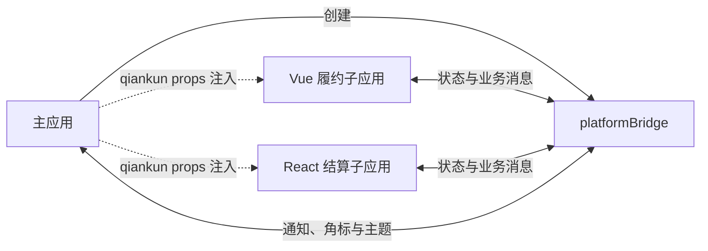

到这里，方案的推导过程才完整：

```text
  -> 先区分当前值与一次性消息
  -> 再选择 qiankun 能提供的入口
  -> 发现项目还缺少统一的业务通信规则
  -> 用通信桥封装规则
  -> 由主应用创建并通过 props 注入
  -> 子应用通过中介协作，不直接依赖彼此
```

---

## Monorepo 中怎样组织通信代码

通信代码放在独立工作区包中：

```text
packages/micro-bridge
├─ src/contracts.ts
├─ src/bridge.ts
├─ src/theme-sync.ts
├─ src/standalone.ts
├─ src/index.ts
└─ tests/bridge.test.ts
```

三个应用统一依赖：

```json
{
  "@supply-chain/micro-bridge": "workspace:*"
}
```

### 通信包共享什么

```text
通信器的使用接口
主题、角标的数据结构
业务消息名称和数据结构
框架无关的通信实现
```

依赖方向：

```text
portal-shell ───────┐
fulfillment-app ────┼──> micro-bridge
settlement-app ─────┘
```

---

## micro-bridge 怎样使用

把 `micro-bridge` 当作一个已经完成的工具包，只看三个应用怎样使用它。看懂使用过程以后，再研究实现。

### 第一步：主应用创建通信桥

主应用调用 `createMicroBridge`，创建平台中唯一的通信桥：

文件：`apps/portal-shell/src/platform-communication.ts`

```ts
import { createMicroBridge } from "@supply-chain/micro-bridge";

const initialTheme = getStoredTheme();

export const platformBridge = createMicroBridge({
  initialState: {
    theme: initialTheme,
    resolvedTheme: resolveTheme(initialTheme),
    badges: {
      fulfillment: 0,
      settlement: 0,
    },
  },
});
```

`initialState` 是平台启动时的初始状态。创建完成后，`platformBridge` 会一直保存当前状态，并管理所有消息订阅。

### 第二步：主应用把同一个通信桥交给子应用

主应用通过 qiankun `props` 注入：

文件：`apps/portal-shell/src/micro-apps.ts`

```ts
loadMicroApp({
  name: definition.appName,
  entry: definition.entry,
  container: definition.container,
  props: {
    platformBridge,
  },
});
```

履约应用和结算应用收到的都是主应用刚才创建的同一个 `platformBridge`。

### 第三步：子应用接收通信桥

子应用在 qiankun 的 `mount(props)` 中接收：

履约应用文件：`apps/fulfillment-app/src/main.ts`

结算应用对应文件：`apps/settlement-app/src/main.tsx`

子应用保存通信桥的文件：`apps/fulfillment-app/src/platform-bridge.ts`、`apps/settlement-app/src/platform-bridge.ts`

```ts
interface MicroAppProps {
  platformBridge?: MicroBridge;
}

function render(props: MicroAppProps = {}) {
  activatePlatformBridge(props.platformBridge);
  // 继续创建并挂载当前子应用
}

export async function mount(props: MicroAppProps) {
  render(props);
}
```

`activatePlatformBridge` 将主应用传入的通信桥保存到子应用中。之后，业务组件通过 `getPlatformBridge()` 取得它，不需要层层传递 `props`。

### 第四步：应用使用通信桥

前面三步已经把通信桥送到了应用里。这一步不再关心它是怎样传进来的，业务代码只做一件事：

```ts
const bridge = getPlatformBridge();
```

拿到 `bridge` 后，根据需求选择下面一种用法：

```text
需要保存一个“当前值”     -> 使用共享状态
需要通知“刚刚发生了一件事” -> 使用业务消息
```

先分别看清楚这两种用法，不需要提前背通信桥的全部方法。

#### 用法一：同步主题——调用项目已经封装好的函数

主题同步这部分，应用代码**没有直接调用** `getState()`、`setState()` 或 `subscribeState()`。

因为三个应用需要执行完全相同的主题同步逻辑，项目已经把它封装成了 `connectThemeToBridge()`。应用只调用这个函数：

```ts
const disconnectTheme = connectThemeToBridge(bridge);

// 应用卸载时执行
disconnectTheme();
```

这段代码可以直译为：

> 把当前应用的主题功能连接到通信桥；应用卸载时，再断开连接。

主题状态怎样写入通信桥、状态变化后怎样更新页面，都藏在 `packages/micro-bridge/src/theme-sync.ts` 中。它的核心代码是：

```ts
// 通信桥中的主题变化了，就更新当前应用的页面主题
const unsubscribeState = bridge.subscribeState((state) => {
  applyTheme(state.theme);
});

// 当前应用切换了主题，就把最新主题写入通信桥
const handleThemeChange = (event: CustomEvent<ThemeChangeDetail>) => {
  bridge.setState({
    theme: event.detail.theme,
    resolvedTheme: event.detail.resolvedTheme,
  });
};
```

#### 用法二：业务消息——接收方先订阅，发送方再发布

现在看一个完整场景：

```text
  -> 结算应用创建核实任务
  -> 发出“核实任务已创建”的消息
  -> 履约应用收到消息
  -> 履约应用重新加载自己的数据
```

这里没有需要长期保存的“当前值”，只是要通知其他应用某件事刚刚发生了，所以使用业务消息。

**第 1 步：履约应用先订阅消息。**

文件：`apps/fulfillment-app/src/views/FulfillmentLayout.vue`

```ts
onMounted(() => {
  unsubscribeVerificationCreated = getPlatformBridge().subscribe(
    "settlement.verification-created",
    () => void loadData(true),
  );
});
```

这段代码可以直译为：

> 当收到 `settlement.verification-created` 消息时，执行 `loadData(true)`。

执行 `subscribe()` 时不会立刻调用 `loadData(true)`。通信桥只是先把这个函数保存起来，等同名消息到达后再执行。

**第 2 步：结算应用发布消息。**

文件：`apps/settlement-app/src/SettlementContext.tsx`

```ts
getPlatformBridge().publish(
  createBusinessEvent({
    type: "settlement.verification-created",
    source: "settlementApp",
    target: "fulfillmentApp",
    payload: {
      verificationId: verification.id,
      fulfillmentId: verification.fulfillmentId,
      settlementBatchId: batch.id,
      batchNo: batch.batchNo,
      orderNo,
    },
  }),
);
```

这里真正负责“发送”的是 `publish()`。`createBusinessEvent()` 只是把消息内容整理成统一格式。

先只关注三个字段：

| 字段      | 直白解释                                 |
| --------- | ---------------------------------------- |
| `type`    | 消息名称，必须与接收方订阅的名称完全相同 |
| `source`  | 谁发出的消息                             |
| `payload` | 随消息一起交给接收方的业务数据           |

因此，通信桥实际做的事情很简单：

```text
履约应用 subscribe("settlement.verification-created", loadData)
  -> 通信桥先保存 loadData

结算应用 publish({ type: "settlement.verification-created", ... })
  -> 通信桥按 type 找到 loadData
  -> 执行 loadData
```

注意：消息不会被通信桥保存。如果发布消息时接收方还没有订阅，这条消息不会在接收方以后挂载时重新发送。这也是为什么演示时要先打开履约页面完成订阅，再到结算页面触发操作。

**第 3 步：页面卸载时取消订阅。**

```ts
onBeforeUnmount(() => unsubscribeVerificationCreated?.());
```

如果不取消，旧的 `loadData` 会一直留在通信桥里。页面进入三次就可能保存三个回调，下一条消息到来时会重复加载三次。

到这里，只需要记住本节代码中真正出现的三个调用：

| 想做什么                   | 本节代码怎样做                 |
| -------------------------- | ------------------------------ |
| 让应用参与主题同步         | `connectThemeToBridge(bridge)` |
| 告诉其他应用“发生了一件事” | `publish(...)`                 |
| 收到指定消息后执行代码     | `subscribe(...)`               |

`connectThemeToBridge()` 和 `subscribe()` 都会返回一个清理函数。应用或组件卸载时调用它，取消之前建立的监听。

---

## micro-bridge 的实现主线

前面已经会使用 `platformBridge`，现在只需要回答一个问题：它为什么能把三个应用连接起来？

先把 `platformBridge` 看成一个普通 JavaScript 对象。主应用创建它，三个应用拿到的是同一个对象：

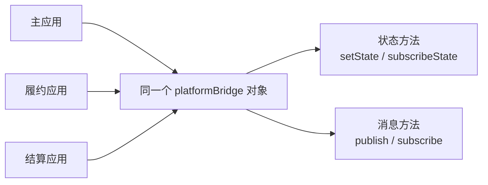

这个对象不会自动理解主题、履约和结算业务。它只完成一个非常朴素的动作：

```text
  -> 先把订阅函数保存起来
  -> 状态变化或消息到达
  -> 找到应该执行的订阅函数
  -> 执行这些函数
```

例如履约应用执行：

```ts
bridge.subscribe("settlement.verification-created", () => {
  void loadData(true);
});
```

此时通信桥不会执行 `loadData`，只是保存这个函数。结算应用以后发布同名消息时，通信桥才会执行它：

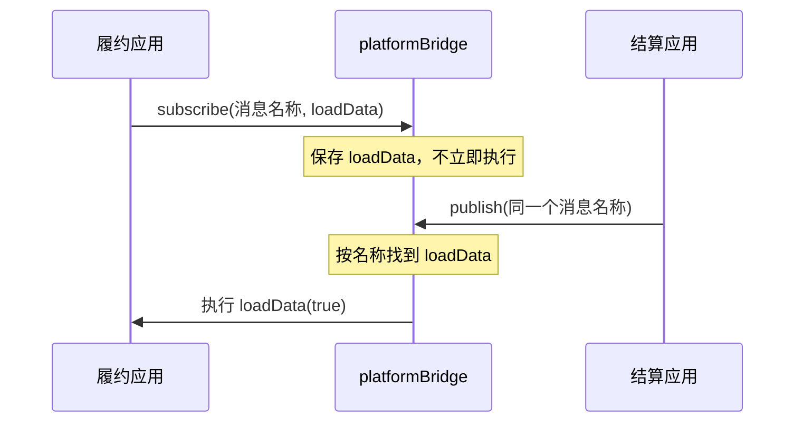

理解“订阅就是保存函数”，后面的 `Set` 和 `Map` 就容易理解了：它们只是用来保存和查找这些函数的数据结构。

`micro-bridge` 看起来有很多类型和方法，核心其实只有两部分：

```text
一个 state                         保存平台当前值
一组 stateListeners               通知状态订阅者

一个 eventListeners Map           按消息名称保存业务消息订阅者
一组 allEventListeners            保存需要接收全部消息的订阅者
```

可以把整个通信桥理解成“状态容器 + 消息分发器”：

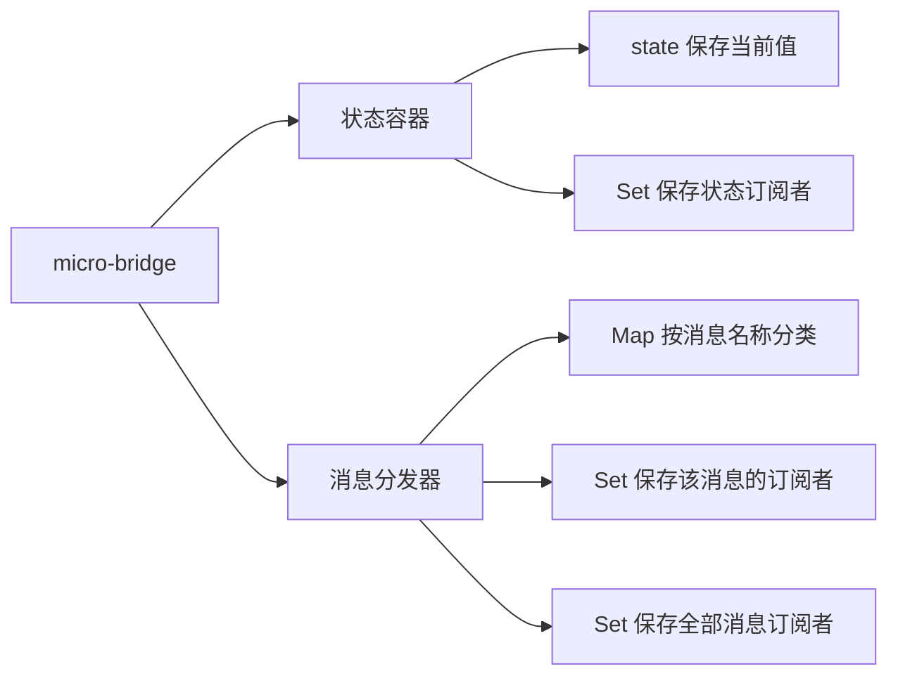

### 先认识五个文件的分工

| 文件            | 只负责什么                           |
| --------------- | ------------------------------------ |
| `contracts.ts`  | 定义可以传递的状态、消息和通信器接口 |
| `bridge.ts`     | 实现状态通信和业务消息通信           |
| `theme-sync.ts` | 把现有主题切换功能连接到通信桥       |
| `standalone.ts` | 子应用独立运行时创建备用通信桥       |
| `index.ts`      | 统一导出其他应用可以使用的函数和类型 |

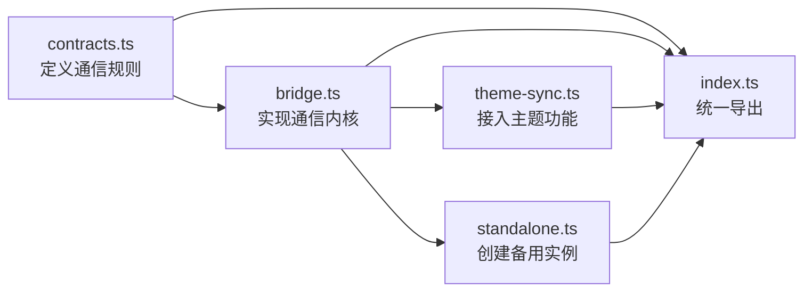

真正的核心只有两个文件：

```text
contracts.ts  决定“可以传什么”
bridge.ts     决定“怎样传递”
```

其他三个文件都在解决“怎样把通信桥接入现有项目”。

### 第一条线：共享状态怎样工作

`bridge.ts` 内部保存一个 `state` 和一组状态订阅者：

```ts
let state = cloneState(options.initialState);
const stateListeners = new Set<StateListener>();
```

运行一段时间以后，它们在内存中大致是这样：

```text
state = {
  theme: "dark",
  resolvedTheme: "dark",
  badges: {
    fulfillment: 3,
    settlement: 1
  }
}

stateListeners = Set {
  主应用应用主题的函数,
  履约应用应用主题的函数,
  结算应用应用主题的函数
}
```

`state` 回答“平台现在是什么状态”，`stateListeners` 回答“状态改变后需要通知谁”。

`Set` 是一个集合。这里使用 `Set`，是因为所有状态订阅者都会收到同一份新状态，不需要再按照名称分类。

调用 `setState` 时只做三件事：

```text
  -> 合并新状态
  -> 保存新的 state
  -> 依次通知 stateListeners 中的订阅者
```

调用 `subscribeState` 时也只做三件事：

```text
  -> 把回调加入 stateListeners
  -> 立即把当前 state 交给新订阅者
  -> 返回一个取消订阅函数
```

“立即把当前值交给新订阅者”非常重要。结算应用即使晚于主应用加载，也能立刻获得当前主题。

下面这张图表示“先切换主题，后加载结算应用”的过程：

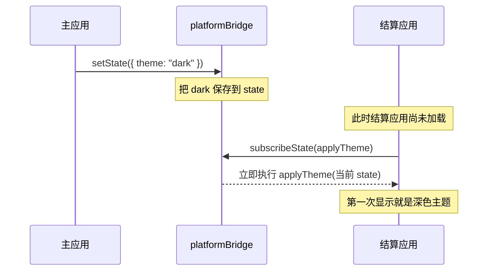

另一个应用再次切换主题时，`setState` 会通知当前已经保存的所有状态订阅函数：

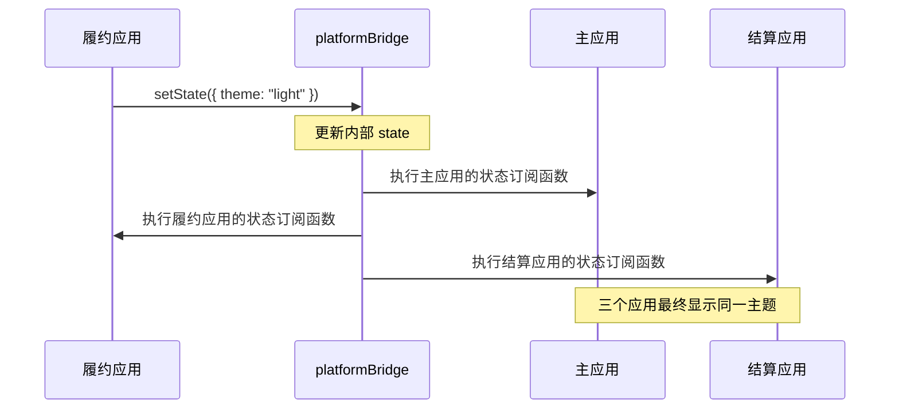

因此状态通信的核心不是复杂的框架，而是：

```text
一个变量保存当前值
一个 Set 保存谁关心这个值
```

### 第二条线：业务消息怎样工作

业务消息不保存当前值，只需要根据消息名称找到订阅者。因此 `bridge.ts` 使用一个 `Map`：

```ts
const eventListeners = new Map<BusinessEventType, Set<EventListener>>();
const allEventListeners = new Set<EventListener>();
```

`Map` 可以理解为一张“根据键查找值”的表：

```text
Map {
  消息名称 A -> 订阅函数集合 A,
  消息名称 B -> 订阅函数集合 B
}
```

状态只有一类订阅者，所以一个 `Set` 就够了；业务消息有多个名称，必须先用 `Map` 按名称分类，每个名称下面再使用一个 `Set` 保存订阅函数。

`Map` 的键是消息名称，值是关心这条消息的所有订阅函数：

```text
"settlement.verification-created"
  -> 履约应用的刷新函数

"fulfillment.verification-resolved"
  -> 结算应用的刷新函数

allEventListeners
  -> 主应用的统一通知函数
```

这表示：

- 履约应用只订阅“结算创建了核实任务”。
- 结算应用只订阅“履约完成了核实任务”。
- 主应用使用 `subscribeAll` 订阅全部消息，用于统一显示平台通知。

调用 `subscribe`：

```text
  -> 根据消息名称找到对应的 Set
  -> 把订阅函数放入 Set
  -> 返回取消订阅函数
```

调用 `publish`：

```text
  -> 读取 event.type
  -> 在 Map 中找到同名消息的 Set
  -> 依次执行其中的订阅函数
  -> 再通知 allEventListeners 中的订阅者
```

主应用通过 `subscribeAll` 加入 `allEventListeners`，因此无论哪个业务消息发生，都可以统一显示平台通知。

完整执行过程如下：

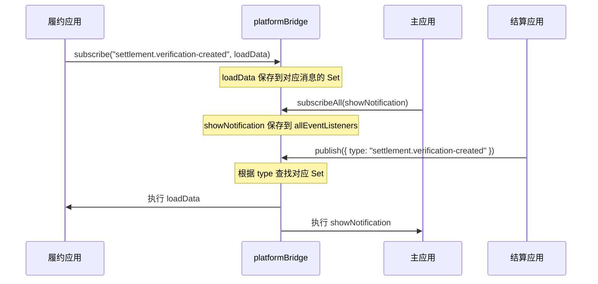

所以发送方和接收方能够协作，不是因为它们互相认识，而是因为它们使用了同一个消息名称。

共享状态和业务消息的差别可以集中到一张表中：

| 对比         | 共享状态                     | 业务消息                   |
| ------------ | ---------------------------- | -------------------------- |
| 保存什么     | 保存一个当前 `state`         | 不保存已经发送过的消息     |
| 订阅者结构   | 一个 `Set`                   | 一个 `Map<消息名称, Set>`  |
| 通知方式     | 状态变化后通知全部状态订阅者 | 按消息名称通知对应订阅者   |
| 新订阅者加入 | 立即得到当前 `state`         | 只接收订阅以后发布的新消息 |
| 对应方法     | `setState / subscribeState`  | `publish / subscribe`      |

### 两条通信线为什么都要取消订阅

`subscribeState` 和 `subscribe` 都会把函数保存到通信桥中。如果组件卸载时不删除，旧函数仍然存在：

```text
第一次进入页面：保存订阅函数 A
离开页面：没有删除 A
再次进入页面：又保存订阅函数 B
收到一条消息：A 和 B 都会执行
```

因此两个订阅方法都返回一个取消函数：

```ts
const unsubscribe = bridge.subscribe(...);

// 组件卸载时执行
unsubscribe();
```

“挂载时订阅，卸载时取消”是整套通信实现中必须成对出现的生命周期规则。

### 主题同步和独立运行不属于通信内核

`theme-sync.ts` 没有重新实现通信，它只是使用 `setState` 和 `subscribeState`，把已有的主题切换功能接到通信桥。

`standalone.ts` 也没有重新实现通信，它只是在没有主应用注入时调用 `createMicroBridge`，给独立运行的子应用创建一个本地实例。

这两个文件体现了同一个设计原则：

```text
bridge.ts 只提供通用通信能力
具体业务通过独立模块接入通信能力
```

### 阅读详细实现时抓住这条顺序

```text
先看 contracts.ts
  -> 明白状态和消息长什么样

再看 bridge.ts 的 state + stateListeners
  -> 明白共享状态怎样保存和通知

再看 bridge.ts 的 eventListeners
  -> 明白业务消息怎样发布和订阅

最后看主应用注入和子应用接收
  -> 明白同一个通信桥怎样连接三个应用
```

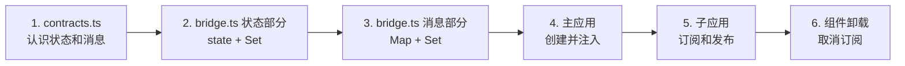

后面的详细实现可以按四组阅读：

| 详细小节       | 要解决的问题                       |
| -------------- | ---------------------------------- |
| 实现一至实现三 | 通信数据和接口怎样定义             |
| 实现四至实现五 | 状态通信和业务消息通信怎样实现     |
| 实现六至实现七 | 主应用和子应用怎样接入同一个通信桥 |
| 实现八至实现十 | 主题与履约、结算业务怎样使用通信桥 |

掌握上面两条核心通信线以后，后面的代码只是把类型、错误处理、主题同步和业务场景逐步补完整。

---

## 从课堂实现走向完整的企业级方案

当前 `micro-bridge` 已经解决了一个明确问题：同一浏览器页面中，主应用、Vue 子应用和 React 子应用可以共享主题，并发送即时业务消息。

它是一套合格的**页面内通信基础设施**，但不能直接等同于企业级消息系统。因为它的数据和订阅函数都保存在浏览器内存中：

```text
页面刷新       -> 内存中的消息和订阅全部消失
应用尚未挂载   -> 收不到此前发送的一次性消息
打开另一个页面 -> 两个页面默认不共享同一个通信桥
换一台设备     -> 完全无法收到当前页面的消息
```

企业级建设不是简单地再引入几个技术名词，而是根据业务要求逐层补齐下面的能力。

### 第一步：解决“不同版本的应用同时运行”的兼容问题

这里讨论的是 `micro-bridge` 中定义的**通信契约**，也就是：

```text
消息叫什么名字
payload 中有哪些字段
每个字段是什么类型
```

当前三个应用都在一个 Monorepo 中，并共同依赖 `@supply-chain/micro-bridge`。一起修改、一起检查时，TypeScript 能发现发送方和接收方写错了字段。

问题出现在三个应用开始**独立部署**以后。独立部署表示它们不一定在同一天更新：

```text
星期一：主应用发布，此时使用第 1 版消息格式
星期三：消息格式发生修改，结算应用发布了新版本
星期四：用户打开页面，同时运行了旧主应用和新结算应用
```

例如，第 1 版契约使用 `batchNo`：

```ts
// 旧主应用按照第 1 版格式生成平台通知
const message = `${event.payload.orderNo} · ${event.payload.batchNo}`;
```

后来发送方把字段改成了 `batchNumber`：

```ts
// 新结算应用按照第 2 版格式发送
payload: {
  batchNumber: batch.batchNo,
}
```

两个应用单独构建时都可能通过类型检查，因为它们构建时使用的是各自当时看到的契约版本。但是浏览器真正运行时，TypeScript 类型已经被删除：

```text
  -> 新结算应用发送 { batchNumber: "B-1001" }
  -> 旧主应用仍然读取 payload.batchNo
  -> 得到 undefined
```

最终可能影响：

- 页面通知显示 `undefined`。
- 接收方使用错误字段请求接口，找不到对应批次。
- 接收方继续调用字符串方法时直接报错。
- 消息虽然发送成功，但后续业务刷新或跳转没有正确完成。

所以这里真正要解决的不是“`micro-bridge` 包能不能单独存在”，而是：

> 当发送方和接收方不是同一时间发布时，新版消息怎样保证旧版应用仍然看得懂？

“让通信契约可以独立演进”指的就是：修改消息格式时，不要求三个应用必须在同一秒发布，也不能让新应用一上线就破坏旧应用。

为此，需要逐步补充四项能力：

| 能力                         | 解决什么问题                                               |
| ---------------------------- | ---------------------------------------------------------- |
| 消息版本和兼容规则           | 告诉接收方当前是哪一版，并规定新旧版本怎样共存             |
| JSON Schema、Zod 等运行时校验 | 消息真正到达浏览器时，再检查字段是否完整、类型是否正确     |
| 契约测试                     | 发布前验证发送方产生的数据能否被接收方解析                 |
| 包版本、变更记录和评审       | 让所有应用知道契约发生了什么变化，阻止随意删除或改名字段   |

当前代码已经在消息中放入了 `version` 字段，但这只是第一步。真正独立发布时，还要约定：旧版本支持多久、哪些字段只能新增不能改名，以及什么时候可以停止兼容旧版本。

最后记住这一句即可：

```text
TypeScript 检查“这次构建时有没有写错”；
运行时校验和版本规则解决“新旧应用在同一页面运行时能不能互相理解”。
```

### 第二步：让通信过程可以被观察和排查

消息没有报错，不代表业务链路正确。生产环境至少需要知道：

```text
谁发送了消息
消息何时发生
哪些订阅者执行成功
哪个订阅者失败
处理耗时多长
同一业务链路经过了哪些消息
```

当前消息结构中的 `id`、`source`、`occurredAt`、`correlationId`，就是为这些能力预留的信息。下一步应该把它们接入统一日志、指标和链路追踪。

`onError` 也不能只执行 `console.error`，还应该上报应用名称、消息名称、消息 ID 和异常信息。这样线上出现“通知显示了但页面没有刷新”时，才能定位是消息没有发送、没有订阅，还是订阅函数执行失败。

### 第三步：重要消息不能只依赖浏览器内存

当前业务消息是“即时提醒”：接收方没有挂载时，这条消息就不会被补发。如果需求升级为下面这些情况：

```text
通知不能丢失
必须记录已读和未读
操作需要审计
失败后必须重试
用户下次登录仍然要看到
```

就不能继续只依赖 `platformBridge`。这些消息必须先由服务端可靠保存。

更完整的链路是：

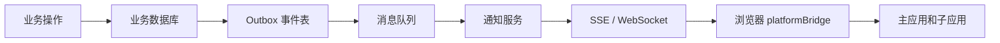

各层职责不同：

- 数据库和 Outbox 保证业务操作与消息记录不会一边成功、一边失败。
- 消息队列负责重试、削峰和跨服务传递。
- 通知服务保存用户通知、已读状态和权限范围。
- SSE 或 WebSocket 把服务端消息实时推送到浏览器。
- `platformBridge` 继续负责当前页面内把消息分发给主应用和子应用。

服务端保证可靠，浏览器端负责即时协作。

### 第四步：消费方必须能够处理重复和恢复

同一条消息可能因为重试被重复发送，接收方要根据消息 `id` 避免重复执行。连续处理失败的消息先单独保存并报警，修复后再重新处理，避免它影响其他正常消息。

### 第五步：覆盖跨标签页、跨设备和离线场景

不同范围需要不同通道：

```text
同一页面内                 platformBridge
同一浏览器的多个标签页     BroadcastChannel
同一用户的多台设备         服务端存储 + SSE / WebSocket
用户离线后再次登录         服务端通知记录 + 未读查询
```

主题也一样。如果只要求当前页面统一，通信桥已经足够；如果要求用户在不同设备上保持相同主题，就需要用户偏好接口，并在登录后读取和保存。

选择通信技术前，先明确消息需要跨越的范围，而不是默认所有问题都由一个全局事件总线解决。

### 第六步：补齐安全控制

消息中的 `source` 和 `target` 只是元数据，不代表发送方真的拥有权限。浏览器中的任何子应用代码都可能尝试构造消息。

生产环境还需要：

- 主应用只向可信子应用注入通信能力。
- 对敏感操作继续由服务端进行身份认证和权限校验。
- 消息只携带页面协作需要的最少字段，避免传播敏感数据。
- 对动态加载的子应用设置来源白名单、资源完整性和内容安全策略。
- 对日志中的订单号、用户信息等字段进行脱敏。

必须记住：

```text
前端通信契约可以约束代码协作，但不能替代服务端安全边界。
```

### 企业级演进的正确顺序

不是每个项目一开始都需要消息队列和 WebSocket。应该根据风险逐步演进：

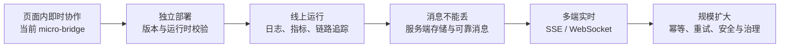

---

下面十个“实现”小节保留完整代码和推导过程，适合作为课后阅读。阅读时按照前面的四组顺序即可，不需要一次逐行看完。

---

## 实现一：定义平台当前值

文件：`packages/micro-bridge/src/contracts.ts`

```ts
export interface PlatformState {
  theme: Theme;
  resolvedTheme: ResolvedTheme;
  badges: {
    fulfillment: number;
    settlement: number;
  };
}
```

字段含义：

| 字段                 | 含义                                             |
| -------------------- | ------------------------------------------------ |
| `theme`              | 用户选择的主题，可以是 `light`、`dark`、`system` |
| `resolvedTheme`      | 页面最终应用的主题，只可能是 `light` 或 `dark`   |
| `badges.fulfillment` | 当前履约待办数                                   |
| `badges.settlement`  | 当前结算待办数                                   |

为什么同时有 `theme` 和 `resolvedTheme`？

```text
theme = system
  -> 表示用户选择“跟随系统”

resolvedTheme = dark
  -> 表示系统当前解析后的实际结果是深色
```

---

## 实现二：定义业务消息

文件：`packages/micro-bridge/src/contracts.ts`

### 消息名称

```ts
export interface BusinessEventPayloadMap {
  /** 履约中心完成订单履约，通知平台和结算中心可以进入后续处理。 */
  "fulfillment.completed": {
    fulfillmentId: string;
    orderNo: string;
  };

  /** 结算中心创建履约核实任务，通知履约中心刷新待核实任务。 */
  "settlement.verification-created": {
    verificationId: string;
    fulfillmentId: string;
    settlementBatchId: string;
    batchNo: string;
    orderNo: string;
  };

  /** 履约中心完成核实任务，通知结算中心刷新对应结算批次。 */
  "fulfillment.verification-resolved": {
    verificationId: string;
    settlementBatchId: string;
    batchNo: string;
    orderNo: string;
  };
}
```

这些字符串不是 qiankun 内置名称，而是项目自己定义的业务消息名称。

命名规则：

```text
业务域.业务对象-动作
```

`settlement.verification-created` 可以拆成：

```text
settlement    消息来自结算业务
verification  消息与履约核实任务有关
created       核实任务已经创建
```

它表达的完整中文含义是：

```text
结算中心已经创建了一条履约核实任务
```

`fulfillment.verification-resolved` 表达：

```text
履约中心已经完成了一条核实任务
```

### 消息携带的数据

```ts
{
  verificationId: string;
  fulfillmentId: string;
  settlementBatchId: string;
  batchNo: string;
  orderNo: string;
}
```

消息只携带关联 ID 和通知展示需要的字段，不携带完整任务对象。

### 消息的统一外层结构

```ts
export interface BusinessEventEnvelope<TType, TPayload> {
  id: string;
  type: TType;
  version: 1;
  source: MicroAppName;
  target?: MicroAppName;
  occurredAt: string;
  correlationId?: string;
  payload: TPayload;
}
```

| 字段         | 含义                   |
| ------------ | ---------------------- |
| `id`         | 这一次消息的唯一编号   |
| `type`       | 消息名称               |
| `version`    | 消息结构版本           |
| `source`     | 哪个应用发送           |
| `target`     | 主要发送给哪个应用     |
| `occurredAt` | 消息发生时间           |
| `payload`    | 当前消息携带的业务数据 |

---

## 实现三：定义通信器接口

```ts
export interface MicroBridge {
  getState(): Readonly<PlatformState>;
  setState(patch: Partial<PlatformState>): void;
  subscribeState(listener: StateListener): () => void;

  publish(event: BusinessEvent): void;
  subscribe(type, listener): () => void;
  subscribeAll(listener): () => void;
}
```

两组方法分别对应两种需求：

```text
getState / setState / subscribeState
  -> 读取、修改、监听平台当前值

publish / subscribe
  -> 发送、接收一次业务消息
```

---

## 实现四：保存和更新平台当前值

文件：`packages/micro-bridge/src/bridge.ts`

### 保存当前值与订阅函数

```ts
let state = cloneState(options.initialState);
const stateListeners = new Set<StateListener>();
```

`state` 是通信器当前保存的平台值。

`stateListeners` 保存所有希望在平台值变化时得到通知的函数。

### 修改当前值

```ts
setState(patch) {
  const previousState = cloneState(state)
  const nextState = {
    ...state,
    ...patch,
    badges: patch.badges ? { ...patch.badges } : { ...state.badges },
  }

  if (!stateChanged(state, nextState)) return

  state = nextState
  const currentStateCopy = cloneState(state)

  for (const listener of stateListeners) {
    listener(currentStateCopy, previousState)
  }
}
```

执行过程：

```text
接收要修改的字段
  -> 与原来的值合并
  -> 没有变化则结束
  -> 保存新的当前值
  -> 通知所有订阅者
```

代码中的 `currentStateCopy` 是当前值的一份副本。

发送副本可以避免外部代码直接修改通信器内部保存的对象。

### 订阅平台值

```ts
subscribeState(listener) {
  stateListeners.add(listener)

  const currentStateCopy = cloneState(state)
  listener(currentStateCopy, currentStateCopy)

  return () => stateListeners.delete(listener)
}
```

订阅完成后立即调用一次 `listener`，让新加载的应用直接得到当前值。

以后状态再次变化时，`listener` 还会继续执行。

---

## 实现五：发送和接收业务消息

### 按消息名称保存订阅者

```ts
const eventListeners = new Map<BusinessEventType, Set<EventListener>>();
const allEventListeners = new Set<EventListener>();
```

例如：

```text
settlement.verification-created
  -> 履约应用的处理函数

fulfillment.verification-resolved
  -> 结算应用的处理函数
```

### 订阅消息

```ts
subscribe(type, listener) {
  const listeners = eventListeners.get(type) ?? new Set()
  listeners.add(listener)
  eventListeners.set(type, listeners)

  return () => {
    listeners.delete(listener)
    if (listeners.size === 0) eventListeners.delete(type)
  }
}
```

`subscribe()` 返回一个取消订阅函数，用于应用卸载时清理。

### 发送消息

```ts
publish(event) {
  if (event.version !== 1) return

  const listeners = eventListeners.get(event.type) ?? new Set()

  for (const listener of [...listeners, ...allEventListeners]) {
    try {
      listener(event)
    } catch (error) {
      reportError(error, event)
    }
  }
}
```

处理过程：

```text
读取消息名称
  -> 找到订阅这种消息的函数
  -> 依次执行
```

一个订阅者执行失败，不会阻止其他订阅者继续处理消息。

---

## 实现六：主应用创建并传递通信器

文件：`apps/portal-shell/src/platform-communication.ts`

```ts
const initialTheme = getStoredTheme();

export const platformBridge = createMicroBridge({
  initialState: {
    theme: initialTheme,
    resolvedTheme: resolveTheme(initialTheme),
    badges: { fulfillment: 0, settlement: 0 },
  },
});
```

主应用只创建一个 `platformBridge`。

文件：`apps/portal-shell/src/micro-apps.ts`

```ts
loadMicroApp(
  {
    name: definition.appName,
    entry: definition.entry,
    container: definition.container,
    props: { platformBridge },
  },
  {
    singular: false,
    sandbox: true,
  },
);
```

两个子应用得到同一个通信器引用。

---

## 实现七：子应用接入通信器

履约和结算应用都提供了 `platform-bridge.ts`。

### 接入主应用传入的通信器

```ts
export function activatePlatformBridge(nextBridge?: MicroBridge) {
  disconnectTheme?.();
  bridge = nextBridge ?? createStandaloneBridge();
  disconnectTheme = connectThemeToBridge(bridge);
}
```

### 子应用独立运行

直接访问 `5174` 或 `5175` 时，没有主应用传入的 `platformBridge`：

```ts
bridge = nextBridge ?? createStandaloneBridge();
```

`createStandaloneBridge()` 创建一个只在当前子应用中使用的本地通信器。

子应用自身主题和业务仍然可以运行，只是没有跨应用通知。

### 子应用卸载

```ts
export function deactivatePlatformBridge() {
  disconnectTheme?.();
  disconnectTheme = null;
  bridge = createStandaloneBridge();
}
```

挂载时连接，卸载时断开，避免重复监听和内存泄漏。

---

## 实现八：主题同步过程

### 主题模块应用样式

文件：`packages/design-tokens/theme.ts`

```ts
export const THEME_CHANGE_EVENT = "supply-chain:theme-change";
```

`supply-chain:theme-change` 不是浏览器或 qiankun 内置名称，而是项目自己定义的主题变化消息名称。

```text
supply-chain   项目前缀，避免与其他事件重名
theme-change   表示主题发生变化
```

主题按钮调用：

```ts
export function applyTheme(theme: Theme, persist = true) {
  const resolvedTheme = resolveTheme(theme);

  document.documentElement.classList.toggle("dark", resolvedTheme === "dark");
  document.documentElement.dataset.theme = theme;

  if (persist) localStorage.setItem(THEME_STORAGE_KEY, theme);

  window.dispatchEvent(
    new CustomEvent(THEME_CHANGE_EVENT, {
      detail: { theme, resolvedTheme },
    }),
  );
}
```

### 主题模块与通信器连接

文件：`packages/micro-bridge/src/theme-sync.ts`

平台当前主题变化时，页面应用新主题：

```ts
const unsubscribeState = bridge.subscribeState((state) => {
  if (
    document.documentElement.dataset.theme === state.theme &&
    getResolvedTheme() === state.resolvedTheme
  )
    return;

  applyTheme(state.theme, persistStateChanges);
});
```

任意主题按钮操作后，通信器更新当前主题：

```ts
const handleThemeChange = (event: Event) => {
  const detail = (event as CustomEvent<ThemeChangeDetail>).detail;

  bridge.setState({
    theme: detail.theme,
    resolvedTheme: detail.resolvedTheme,
  });
};
```

完整过程：

```text
用户点击任意主题按钮
  -> 页面应用新主题
  -> 发送 supply-chain:theme-change
  -> platformBridge 保存当前主题
  -> 其他应用得到当前主题
```

---

## 实现九：结算通知履约

### 结算完成后端操作

文件：`apps/settlement-app/src/SettlementContext.tsx`

```ts
const verification = await request(
  `settlements/batches/${batch.id}/verifications`,
  { method: "POST", body: JSON.stringify(details) },
);
```

后端成功创建履约核实任务后，结算应用发送消息：

```ts
getPlatformBridge().publish(
  createBusinessEvent({
    type: "settlement.verification-created",
    source: "settlementApp",
    target: "fulfillmentApp",
    payload: {
      verificationId: verification.id,
      fulfillmentId: verification.fulfillmentId,
      settlementBatchId: batch.id,
      batchNo: batch.batchNo,
      orderNo,
    },
  }),
);
```

先请求后端，再发送消息，可以避免其他应用收到一条实际创建失败的任务消息。

### 主应用显示通知并刷新待办数

```ts
platformBridge.subscribeAll((event) => {
  pushPlatformNotification(notificationFor(event));
  void refreshMicroAppBadges();
});
```

主应用收到消息后：

```text
显示全局通知
重新请求履约、结算汇总
更新当前待办数
```

消息本身不直接执行 `待办数 + 1`，因为页面刷新、消息重复或其他用户操作都可能导致本地数字不准确。

### 履约应用加载新任务

```ts
onMounted(() => {
  unsubscribeVerificationCreated = getPlatformBridge().subscribe(
    "settlement.verification-created",
    () => void loadData(true),
  );
});

onBeforeUnmount(() => unsubscribeVerificationCreated?.());
```

履约应用收到消息后重新请求自己的接口，获取完整核实任务。

---

## 实现十：履约通知结算

履约完成核实后发送：

```ts
getPlatformBridge().publish(
  createBusinessEvent({
    type: "fulfillment.verification-resolved",
    source: "fulfillmentApp",
    target: "settlementApp",
    payload: {
      verificationId: verification.id,
      settlementBatchId: verification.settlementBatch.id,
      batchNo: verification.settlementBatch.batchNo,
      orderNo: verification.salesOrder.orderNo,
    },
  }),
);
```

`fulfillment.verification-resolved` 的中文含义：

```text
履约中心已经完成了一条核实任务
```

结算应用订阅消息：

```ts
useEffect(() => {
  const unsubscribe = bridge.subscribe(
    "fulfillment.verification-resolved",
    () => void loadData(),
  );

  return unsubscribe;
}, [loadData]);
```

完整业务链路：

```text
React 结算发送“核实任务已创建”
  -> Vue 履约重新查询任务

Vue 履约发送“核实任务已完成”
  -> React 结算重新查询批次
```

---

## 本节总结

1. 微前端应用保持独立，但平台状态和业务变化仍然需要通信。
2. 共享状态表示多个应用共同使用的当前值。
3. 业务事件表示已经发生的一次业务动作。
4. qiankun `props` 负责把主应用创建的通信器注入子应用。
5. 子应用发布业务事实，不直接调用另一个子应用的页面方法。
6. 通信器由生命周期稳定的主应用创建，子应用只依赖 `MicroBridge` 接口。
7. Monorepo 共享通信契约和框架无关实现，不共享子应用内部状态。
8. 所有订阅都要在应用卸载时清理，单个订阅者失败不能阻断其他应用。
9. `micro-bridge` 负责页面内即时协作；可靠投递、跨设备同步、安全和审计需要继续建设服务端能力。
