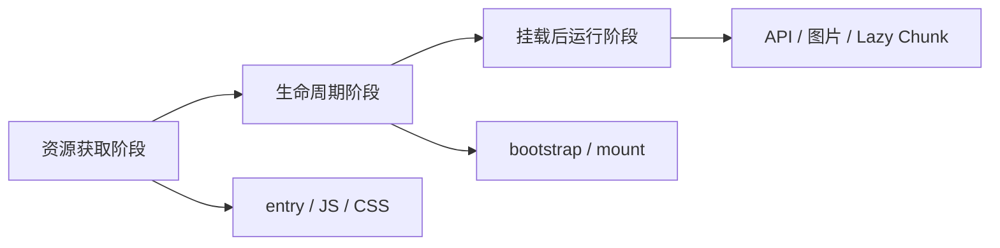

# 资源加载、故障隔离与恢复

---

## 一、为什么 qiankun 挂载成功后，子应用仍然可能出错

**qiankun 的 `mount` 成功，只能证明子应用完成了启动，不能证明它后续一直可用。** 子应用启动前后还会加载不同资源，错误发生的阶段不同，负责处理错误的层级也不同。

### 1. 从进入路由到页面可用

用户点击“履约中心”以后，会经历：

```text
主应用识别 /fulfillment
        ↓
qiankun 请求 entry HTML
        ↓
解析 HTML 中的 script 和 link
        ↓
请求入口 JavaScript、CSS 等首屏资源
        ↓
执行代码，取得 bootstrap、mount、unmount
        ↓
执行 bootstrap 和 mount
        ↓
Vue 创建组件、Router 和页面
        ↓
页面继续请求接口、图片和异步路由 Chunk
```

失败至少可能发生在三个阶段：



### 2. qiankun 只负责加载和生命周期，不持续监控运行状态

主应用调用 `loadMicroApp()` 后会立即得到实例，但此时子应用可能还没有挂载完成：

```ts
const instance = loadMicroApp({
  name: "fulfillmentApp",
  entry: "//localhost:5174",
  container: "#micro-app-fulfillment",
});
await instance.mountPromise;
```

```text
mountPromise fulfilled
→ 本次加载和 mount 已经完成
→ 主应用结束 Loading

mountPromise rejected
→ 本次加载或生命周期执行失败
→ 主应用显示微应用错误页
```

`mountPromise` 一旦 fulfilled，后面发生错误也不会重新变成 rejected。因此责任以 mount 成功为界：

```text
mount 成功前
→ 主应用通过 mountPromise 处理 Loading 和加载错误

mount 成功后
→ 接口、组件、表单和图片错误由子应用处理
→ Chunk 等错误影响整个微应用时，主应用补充监听和恢复入口
```

> `mountPromise` 只能证明子应用成功启动过，不能证明它之后一直正常运行。

---

## 二、为什么子应用嵌入后会请求错资源地址

这部分只解决一个微前端特有的问题：**子应用独立运行时资源正常，嵌入主应用后，为什么同一个地址可能请求到主应用服务器。**

### 1. 问题原因：根路径属于主应用

履约子应用独立运行在 `http://localhost:5174`，嵌入后浏览器当前文档却属于主应用 `http://localhost:5173`。如果子应用手写：

```html

```

浏览器会向 `http://localhost:5173/images/warehouse.png` 发起请求，而不是向 5174 请求。因为以 `/` 开头的地址始终相对于当前页面的 Origin，浏览器并不知道这行代码来自哪个工程。

因此，子应用独立运行正常，不代表嵌入主应用后资源地址仍然正确。

### 2. 处理方式：模块导入配合动态 publicPath

业务图片使用模块导入，让 webpack 接管资源地址：

```ts
import fulfillmentWarehouse from "../assets/fulfillment-warehouse.jpg";
```

```vue

```

子应用还要在 `main.ts` 最前面导入 `public-path.ts`：

```ts
import "./public-path";
```

```ts
if (qiankunWindow.__POWERED_BY_QIANKUN__) {
  __webpack_public_path__ =
    qiankunWindow.__INJECTED_PUBLIC_PATH_BY_QIANKUN__ ?? "/";
}
```

`publicPath` 是 webpack 加载资源时使用的基准地址。qiankun 会把子应用入口地址注入进来，因此 webpack 管理的图片和异步 Chunk 仍然会从子应用服务器加载。

完整关系可以概括为：

```text
模块导入 → webpack 接管资源 → 动态 publicPath 指向子应用服务器
```

**注意**，qiankun 和 `publicPath` 都无法修复业务代码中手写的 `/images/...`、`fetch("/api")` 等字符串，因为这些地址没有经过 webpack。

例如，履约子应用虽然运行在 5174，但下面的地址是直接写在 HTML 中的：

```html

```

嵌入主应用后，浏览器会按照当前页面地址请求：

```text
http://localhost:5173/images/logo.png
```

它不会自动变成 `http://localhost:5174/images/logo.png`。因为这个字符串没有经过 webpack，`publicPath` 没有机会为它补上子应用地址。

接着临时把 `HomeView.vue` 中的：

```vue

```

改为：

```vue

```

通过主应用刷新后，请求会落到 5173，图片无法显示。观察完成后恢复模块导入即可。

**只有交给构建工具管理的资源，才能继续使用子应用的 `publicPath`。**

---

## 三、为什么主应用要统一管理子应用状态

子应用加载不是一瞬间完成的，它要依次经历入口请求、脚本执行、`bootstrap` 和 `mount`。在这段时间里，用户可能切换应用、触发超时或点击重试，先前的加载结果也可能稍后才返回。

例如：用户打开履约中心，加载较慢，于是切换到了结算中心；这时履约中心的 `mount` 才执行成功。如果没有统一的状态管理，这个已经过期的结果可能把当前页面改成“履约中心加载成功”，覆盖结算中心的状态。

只使用 `isLoading`、`hasError` 等互不相关的布尔变量也容易产生矛盾：同一个应用可能同时显示“加载中”和“加载失败”，主应用不知道应该显示骨架屏、错误页还是正常内容。

所以主应用使用**状态机**管理每个微应用。状态机不是某个特殊框架，它只是规定：一个应用当前只能处于一种明确状态，并且状态只能按照允许的方向变化。

> 状态机就是：**用一个变量表示当前处于哪个阶段。**
>
> ```
> status = "loading"
> ```
>
> 它同一时间只能有一个值，所以不可能既是 `loading` 又是 `error`。
>
> 而多个布尔值可以同时为 `true`：
>
> ```
> isLoading = true
> hasError = true // 矛盾
> ```
>
> 再规定状态只能按合法路线变化：
>
> ```
> idle → loading → mounted
>            ├──→ timeout
>            └──→ error
> mounted → inactive
> error / timeout → loading（重试）
> ```
>
> 这就是状态机：**单一状态 + 限制状态怎么变化。**

这样做带来四个直接好处：

1. **页面显示不会冲突**：`loading` 显示骨架屏或者loading状态，`error` 显示错误页，`mounted` 显示子应用。
2. **旧结果不会覆盖新页面**：每次加载都有自己的 `attempt`（尝试编号），只有当前编号的结果才能更新状态。
3. **能正确区分隐藏和销毁**：`inactive` 表示 KeepAlive 实例还在，只是暂时不可见，不能当成已经卸载。
4. **超时后仍能继续观察结果**：`timeout` 只表示等待时间超过体验阈值，不代表底层加载已经被取消。

本项目最终使用以下状态：

| 状态       | 主应用应该怎样理解           |
| ---------- | ---------------------------- |
| `idle`     | 还没有开始加载               |
| `loading`  | 正在等待入口、资源和挂载完成 |
| `mounted`  | 已经挂载并且正在显示         |
| `inactive` | KeepAlive 实例仍在，但被隐藏 |
| `error`    | 本次加载或运行失败           |
| `timeout`  | 等待过久，但任务未必失败     |

除了当前状态，主应用还会记录尝试编号、重试次数、加载耗时和失败类型：尝试编号用来阻止旧的异步结果覆盖当前页面，其余信息用来判断应用为什么失败、失败了几次以及慢在哪里，方便日志记录和问题排查。

由于入口脚本执行之前子应用自己还不能工作，所以入口加载、`bootstrap` 和 `mount` 的状态由主应用管理；进入子应用后的接口请求和业务提交，仍由子应用自己管理。

相关代码位于：

```text
apps/portal-shell/src/micro-app-runtime.ts
```

---

## 四、为什么加载超时后不能直接创建新实例

要解决的不是“怎样显示超时提示”，而是**超时以后应该怎样安全恢复**。

本项目等待子应用挂载时设置了 3.5 秒的体验阈值：超过这个时间，主应用先显示超时页面。但这里的超时只是主应用不再继续等待，qiankun 原来的资源请求和 `mount` 仍可能在后台执行。

如果此时直接点击重试并创建一个新实例，旧实例稍后也可能挂载成功。新旧两个实例就会争用同一个容器，还可能重复注册路由、事件监听和全局订阅。

因此，本项目采用不同的恢复方式：

```text
明确失败：旧任务已经结束 → 清理失败实例后重新加载
等待超时：旧任务可能仍在运行 → 刷新整个页面，结束旧执行环境
```

这就是区分 `error` 和 `timeout` 的实际意义：不是为了多定义一个状态，而是为了避免一次超时演变成两个子应用实例同时运行。3.5 秒也只是本项目的示例值，生产环境应根据真实加载耗时确定。

现实中的慢加载可能来自弱网、跨地域 CDN、入口体积过大、CDN 回源、DNS/TLS 建连或首屏依赖过多。

---

## 五、为什么要区分错误发生在哪个阶段

同样是“子应用打不开”，原因可能完全不同：入口地址 404 说明资源没有取到，`mount` 报错说明应用初始化失败，页面打开后 Chunk 404 则说明运行中的资源版本可能不一致。如果全部只显示“加载失败”，用户不知道该刷新还是重试，开发人员也不知道应该检查发布地址、生命周期代码还是缓存。

所以错误分类的真实目的不是增加几个专业名词，而是解决三个问题：

1. **给用户正确提示**：说明是网络资源、应用初始化还是运行中的页面发生了问题。
2. **提供合适的恢复操作**：资源失败可以重新加载；生命周期失败应先清理实例；运行时 Chunk 失败通常需要刷新并重新获取当前版本资源。
3. **让开发人员快速定位**：入口问题检查部署和 CDN，生命周期问题检查配置与主子应用契约，运行时问题检查 Chunk、缓存和版本发布。

本项目按照错误发生的阶段分成四类：

| 类型        | 说明                           | 排查重点                       |
| ----------- | ------------------------------ | ------------------------------ |
| `resource`  | entry、首屏 JS 或 CSS 获取失败 | 地址、404、网络、CORS 和 CDN   |
| `lifecycle` | `bootstrap` 或 `mount` 执行失败 | 配置、依赖、Router 和应用契约  |
| `runtime`   | 挂载成功后动态资源加载失败     | Chunk、浏览器缓存和发布版本    |
| `unknown`   | 现有信息无法判断阶段           | 保留原始错误，继续补充监控信息 |

浏览器、构建工具和 qiankun 没有统一的错误格式，因此本项目暂时根据错误信息中的关键字进行判断：

```ts
function classifyLoadFailure(error: unknown): MicroAppFailureKind {
  const detail =
    error instanceof Error ? `${error.name} ${error.message}` : String(error);

  return /fetch|network|404|script|chunk|stylesheet|imported module/i.test(
    detail,
  )
    ? "resource"
    : "lifecycle";
}
```

这种判断只能用于我们现在的项目，因为浏览器错误文案可能变化。生产系统应在 entry 请求、脚本执行、`bootstrap`、`mount` 和动态导入的边界直接记录阶段，让监控信息明确告诉我们错误发生在哪里。

相关代码：

```text
apps/portal-shell/src/micro-app-runtime.ts
apps/portal-shell/src/micro-apps.ts
```

真实原因包括服务离线、应用注册表地址过期、CDN/DNS/网关故障、entry 返回 404/500/登录页、CORS 缺失或用户网络不可达。

排查顺序：

```text
先看请求是否发出
再看 Request URL
再看状态码、响应内容和 CORS
entry 成功后才进入生命周期排查
```

---

## 六、为什么服务恢复后“重新加载”仍可能失败

第一次加载失败后，qiankun 和它的资源加载器可能把这次失败的 Promise 缓存在内存中。即使服务已经恢复，如果重试仍使用相同的应用名和资源 URL，就可能再次取得旧的失败结果，浏览器甚至不会重新发送请求。

这不是浏览器 HTTP 缓存，而是当前页面 JavaScript 内存中的加载结果缓存。

解决时需要绕过整条旧加载链：

1. 删除项目 KeepAlive 缓存中的失败实例，并清空容器残留内容。
2. 为本次重试生成新的 `attempt`（尝试编号），同时更新 qiankun 实例名以及 entry、script、style 的 URL，使它们不再命中旧缓存。
3. 只允许有限次数的应用级重试；多次失败后刷新整个页面，彻底释放当前页面中的缓存。

```text
第一次：fulfillmentApp__attempt_1
第二次：fulfillmentApp__attempt_2

第一次：main.js?__micro_attempt=1
第二次：main.js?__micro_attempt=2
```

对应的核心代码是：

```ts
const runtimeName = `${definition.appName}__attempt_${attempt}`;
const entry = appendAttemptQuery(definition.entry, attempt);

getTemplate: (template) =>
  refreshTemplateResourceUrls(template, attempt, entry),
```

简单来说，**重新加载不是再次使用旧地址执行同一句代码，而是使用新的实例标识和资源地址重新建立一次加载过程。**

---

## 七、快速切换为什么会产生竞态

```text
进入履约 → 履约慢加载 → 切到结算 → 履约迟到后才完成
```

代码位置：

```text
apps/portal-shell/src/micro-apps.ts
activateMicroApp()
```

`activateMicroApp()` 使用“生成快照，异步完成后再校验”的方式阻止迟到任务提交状态。

### 1. 开始激活时保存导航版本

每次进入主应用路由都会递增全局版本，并把当前值保存到本次调用中：

```ts
const currentVersion = ++navigationVersion;
const nextAppName = definition?.appName ?? null;
activeAppName = nextAppName;
```

例如：

```text
进入履约：currentVersion = 1，navigationVersion = 1
切到结算：currentVersion = 2，navigationVersion = 2
```

履约任务仍然持有自己的快照 `currentVersion = 1`。

### 2. 等待 mount 时不提交最终界面状态

```ts
const attempt = beginMicroAppAttempt(definition.appName, retry);
// 创建或取得实例
await cached.instance.mountPromise;
```

异步等待期间，用户可以继续导航。代码不会假设 await 返回时目标应用仍然活跃。

### 3. mount 完成后校验结果是否仍可提交

先检查 `attempt`，确认结果仍属于该子应用最新一次激活或重试：

```ts
if (!isCurrentMicroAppAttempt(definition.appName, attempt)) return;
```

再检查平台导航版本和当前活跃应用：

```ts
if (
  currentVersion !== navigationVersion ||
  activeAppName !== definition.appName
) {
  markMicroAppInactive(definition.appName, attempt);
  return;
}
```

三个值的职责不同：

| 校验                | 防止的问题                           |
| ------------------- | ------------------------------------ |
| `attempt`           | 同一子应用上一次加载或重试的结果迟到 |
| `navigationVersion` | 用户已经发生新的平台导航             |
| `activeAppName`     | 当前目标已经不是这个子应用           |

只有全部校验通过，才提交可见性、路由活跃状态和运行状态：

```ts
setContainerVisible(definition, true);
setAppActivity(definition.appName, true);
markMicroAppMounted(definition.appName, attempt);
```

因此，迟到的履约任务即使 mount 成功，也只会被标记为 `inactive`，不会重新显示履约容器或覆盖结算中心。

---

## 八、为什么开发环境正常还要验证生产构建

`pnpm dev` 使用的是开发服务器，它会帮助处理模块转换、资源地址和热更新。真正发布的是 `pnpm build` 生成的文件，因此微前端接入完成后还必须验证一次构建产物：

```bash
pnpm build
pnpm preview
```

预览地址是：

```text
主应用：http://localhost:6173
履约中心：http://localhost:6174
结算中心：http://localhost:6175
```

构建后可能会出现下面的问题：

### 1. 主应用只有外壳，中间没有路由内容

原因是主应用的核心路由页面被拆成了异步 Chunk，同时 qiankun 启动太早，影响了 Vue Router 的首次渲染。

处理方式是先等待 Vue Router 完成首次导航，再加载 qiankun；体积较小的主应用核心页面则直接静态导入：

```ts
createApp(App).use(router).mount('#app')

await router.isReady()
await nextTick()

const { startMicroApps } = await import('./micro-apps')
startMicroApps(router)
```

### 2. 结算子应用的资源请求落到了主应用

结算应用构建后的代码原本请求 `/assets/...`。这个根路径会按照当前页面解析，所以嵌入后请求发给了主应用 6173，而不是结算应用 6175。

处理方式是在 Vite 构建配置中明确结算应用的资源基准地址：

```ts
base: env.VITE_SETTLEMENT_PUBLIC_BASE ?? 'http://localhost:6175/'
```

真实项目不会写死 localhost，而是在构建时通过环境变量传入正式地址。

## 九、Monorepo 为什么仍然可以独立发布

Monorepo 只是把主应用、子应用和公共包放在同一个仓库中管理，不代表它们必须一起发布。构建完成后，可以在下面三个目录中看到三份独立产物：

```text
apps/portal-shell/dist
apps/fulfillment-app/dist
apps/settlement-app/dist
```

主应用通过 `entry` 找到已经部署的子应用。因此，履约中心修改后可以只构建和发布履约中心，出现问题时也可以只回滚履约中心。

公共 `packages` 不会作为另一个网站单独运行。`ui-vue`、`api-client`、`micro-bridge` 等代码会进入使用它们的应用产物；`eslint-config`、`typescript-config` 等配置只在开发和构建阶段使用。

所以公共包修改后，只需要重新发布受到影响的应用。例如修改 `ui-vue` 会影响主应用和履约中心，不影响没有使用它的结算中心。已经上线的应用仍然运行构建时包含的旧版公共代码，不会因为仓库后来发生变化而自动更新。

```text
代码放在一起管理  ≠  所有应用一起发布
公共包被应用使用  =  构建时进入该应用的产物
```

## 十、为什么独立发布以后必须考虑版本兼容

独立发布以后，线上可能同时运行不同版本：

```text
主应用 2.0
履约中心 1.6
结算中心 3.1
```

因此主应用和子应用之间的通信约定不能随意修改。事件名称、数据字段、函数参数和生命周期 props 等共同约定，统称为**契约**。

例如，原来的事件类型是：

```ts
type OrderEvent = {
  orderId: string
}
```

新增一个可选字段通常不会影响旧应用：

```ts
type OrderEvent = {
  orderId: string
  operatorName?: string
}
```

但直接删除 `orderId` 或改变它的含义，旧应用就可能无法处理。新版本仍能和暂时没有升级的旧版本一起工作，称为**向后兼容**。

独立发布带来了单独升级和回滚的能力，也要求团队为通信契约保留兼容和迁移时间。

## 十一、项目上线后还需要哪些基本规则

下面这些内容是真实微前端项目必须提前约定。

### 1. 隐藏或卸载应用时清理副作用

事件监听、定时器、轮询、WebSocket 和通信订阅等持续影响外部环境的操作，称为**副作用**。KeepAlive 只隐藏应用，并不会停止这些操作；qiankun 执行 `unmount` 时，也不会自动清理所有业务代码创建的副作用。

```text
addEventListener ↔ removeEventListener
setInterval      ↔ clearInterval
subscribe        ↔ unsubscribe
connect          ↔ disconnect
```

否则应用多次进入后，可能出现重复请求、事件重复执行和内存持续增长。

### 2. 错误被兜住以后还要能够定位

错误页保护的是用户体验，日志和监控解决的是开发人员怎样找到原因。能够从外部判断系统内部状态的能力，称为**可观测性**。

微前端错误至少要记录：子应用名称、主子应用版本、当前路由、entry、失败阶段、资源地址和加载耗时。这样才能判断问题属于部署、生命周期、业务服务还是主应用平台。

### 3. 多团队必须统一边界和责任

微前端允许不同团队独立开发，但接入协议、通信契约、发布流程、监控标准和责任归属必须统一。每个应用还应该有明确的 **Owner**，也就是负责维护、升级和处理故障的团队或负责人。

```text
技术实现可以不同
平台规则必须统一
应用故障必须有人负责
```
