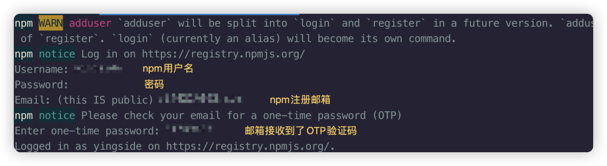

## 发布到npm

当然，首先你需要在 **[npmjs](https://www.npmjs.com/)** 官网注册账号

常用命令：

- `npm whoami`  检测当前登录状态
- `npm config ls`  显示当前 npm 配置信息
- `npm addUser` 、`npm login`  登录
- `npm config set registry 链接地址` 切换源地址
- `npm publish` 发布

> **注意1：**必须使用npm源镜像才能发布，如果使用的是阿里源等镜像，需要切换成源镜像才能发布 `https://registry.npmjs.org/`
>
> **注意2：**发布名称读取的是**package.json中的name**，并且，npmjs上已经有很多很多内容，**package不能重名**。所以名字尽量不要太简单，不然发布会报403错误

